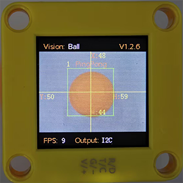
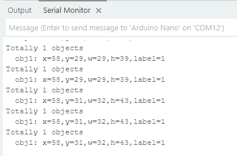
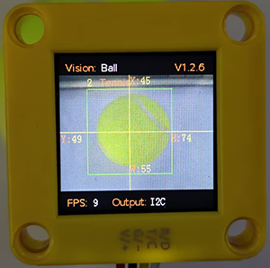
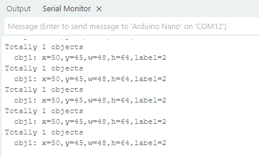
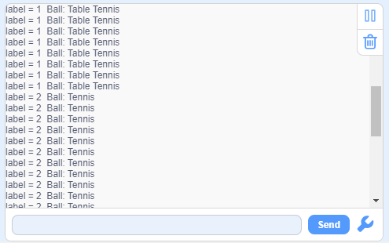

# 4.3 Ball Recognition

## 4.3.1 Algorithm



It determines whether there is an orange ping-pong ball or a green tennis ball in the image. If yes, it returns their coordinates, size and label value.

----------

## 4.3.2 Classification Label

| Label ID |     Definition     |
| :------: | :----------------: |
|    1     | ping pong (orange) |
|    2     |   tennis (green)   |

Ping pong:



Tennis:



---------------

## 4.3.3 Returned Values

When the controller acquires the recognition result, the algorithm will return the followings:

|  Parameters  |         Definition         |
| :----------: | :------------------------: |
|   kXValue    | label central coordinate x |
|   kYValue    | label central coordinate y |
| kWidthValue  |       label width w        |
| kHeightValue |       label height h       |
|    kLabel    |          label ID          |

Code:

```c
    // Traverse all the detected labels
    for (int i = 1; i <= obj_num; ++i) {
      // Get detailed information about each object
      int x = sengo.GetValue(VISION_TYPE, kXValue, i);      // x-coordinate
      int y = sengo.GetValue(VISION_TYPE, kYValue, i);      // y-coordinate
      int w = sengo.GetValue(VISION_TYPE, kWidthValue, i);  // Width
      int h = sengo.GetValue(VISION_TYPE, kHeightValue, i); // Height
      int l = sengo.GetValue(VISION_TYPE, kLabel, i);       // Label(object type)
      
      // Output object information to the serial port
      Serial.print("  obj");
      Serial.print(i);
      Serial.print(": ");
      Serial.print("x=");
      Serial.print(x);
      Serial.print(",y=");
      Serial.print(y);
      Serial.print(",w=");
      Serial.print(w);
      Serial.print(",h=");
      Serial.print(h);
      Serial.print(",label=");
      Serial.println(l);
    }
```

----------

## 4.3.4 Test Code

```c
#include <Arduino.h>
#include <Sentry.h>  // Import the Sentry vision sensor library

typedef Sengo2 Sengo;  // Create an alias Sengo for the Sengo1 type to simplify subsequent usage

// Communication method (currently enabled I2C)
#define SENGO_I2C
// #define SENGO_UART   // UART alternative options (annotated)

#ifdef SENGO_I2C
#include <Wire.h>  // Libraries required for I2C communication
#endif

#ifdef SENGO_UART
#include <SoftwareSerial.h>
#define TX_PIN 11  // Customize the TX pin
#define RX_PIN 10       // Customize the RX pin
SoftwareSerial mySerial(RX_PIN, TX_PIN);  // Create a soft serial port object
#endif

#define VISION_TYPE Sengo::kVisionAprilTag  // Enable AprilTag detection mode
Sengo sengo;  // Create a Sengo sensor object

void setup() {
  sentry_err_t err = SENTRY_OK;  // Error status variable

  Serial.begin(9600);  // Initialize the serial port for debugging the output
  Serial.println("Waiting for sengo initialize...");

// Initialize the sensor according to the selected communication method
#ifdef SENGO_I2C
  Wire.begin();  // Initialize the I2C bus
  // Keep trying to connect until succeed
  while (SENTRY_OK != sengo.begin(&Wire)) {
    yield();  // Allow other tasks to run while waiting
  }
#endif

#ifdef SENGO_UART
  mySerial.begin(9600);
  while (SENTRY_OK != sengo.begin(&mySerial)) {
    yield();
  }
#endif

  Serial.println("Sengo begin Success.");
  
  // ============== AprilTag Detection Configuration ==============
  
  // Set the AprilTag family type to 16H5 (Standard Tag Set)
  err = sengo.VisionSetMode(VISION_TYPE, Sengo::kVisionModeFamily16H5);
  
  // Set the detection level to speed priority (sacrificing accuracy to speed up)
  err = sengo.VisionSetLevel(VISION_TYPE, kLevelSpeed);
  
  if (err) {
    Serial.print("sengo.VisionSetMode Error: 0x");
    Serial.println(err, HEX);  // Output error code
  }
  
  // Activate the AprilTag visual recognition
  err = sengo.VisionBegin(VISION_TYPE);
  Serial.print("sengo.VisionBegin(kVisionAprilTag) ");
  if (err) {
    Serial.print("Error: 0x");
  } else {
    Serial.print("Success: 0x");
  }
  Serial.println(err, HEX);  // Output the initialization result
}

void loop() {
  // Read the number of detected Apriltags
  int obj_num = sengo.GetValue(VISION_TYPE, kStatus);
  
  if (obj_num > 0) {  // If AprilTag is detected
    Serial.print("Totally ");
    Serial.print(obj_num);
    Serial.println(" tags detected");
    
    // Traverse all the detected labels
    for (int i = 1; i <= obj_num; ++i) {
      // Get its center position
      int x = sengo.GetValue(VISION_TYPE, kXValue, i);
      int y = sengo.GetValue(VISION_TYPE, kYValue, i);
      
      // Obtain the size of the label bounding box
      int w = sengo.GetValue(VISION_TYPE, kWidthValue, i);
      int h = sengo.GetValue(VISION_TYPE, kHeightValue, i);
      
      // Obtain the tag label ID (unique identifier)
      int tag_id = sengo.GetValue(VISION_TYPE, kLabel, i);
      
      // Format and output the detection results
      Serial.print("  Tag #");
      Serial.print(i);
      Serial.print(": ");
      Serial.print("ID=");
      Serial.print(tag_id);
      Serial.print(", Position=(");
      Serial.print(x);
      Serial.print(",");
      Serial.print(y);
      Serial.print("), Size=");
      Serial.print(w);
      Serial.print("x");
      Serial.print(h);
      Serial.println();
    }
  }
  
  delay(100);  // Delay appropriately to reduce the refresh rate
}
```

-----------

## 4.3.5 Test Result

After uploading the code, the module will detect the area captured by the camera. If an orange ping pong or a green tennis is detected, it will be recognized, and its coordinate x and y, width, height and the label value will be displayed on the serial monitor.



