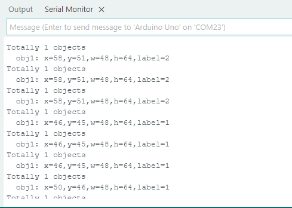

# 4.3 Ball Recognition

## 4.3.1 Algorithm


It determines whether there is an orange ping-pong ball or a green tennis ball in the image. If yes, it returns their coordinates, size and label value.

----------

## 4.3.2 Classification Label

| Label ID |     Definition     |
| :------: | :----------------: |
|    1     | ping pong (orange) |
|    2     |   tennis (green)   |

Ping pong:


Tennis:


---------------

## 4.3.3 Returned Values

When the controller acquires the recognition result, the algorithm will return the followings:

|  Parameters  |         Definition         |
| :----------: | :------------------------: |
|   kXValue    | label central coordinate x |
|   kYValue    | label central coordinate y |
| kWidthValue  |       label width w        |
| kHeightValue |       label height h       |
|    kLabel    |          label ID          |

Code:

```c
    // Traverse all the detected labels
    for (int i = 1; i <= obj_num; ++i) {
      // Get detailed information about each object
      int x = sengo.GetValue(VISION_TYPE, kXValue, i);      // x-coordinate
      int y = sengo.GetValue(VISION_TYPE, kYValue, i);      // y-coordinate
      int w = sengo.GetValue(VISION_TYPE, kWidthValue, i);  // Width
      int h = sengo.GetValue(VISION_TYPE, kHeightValue, i); // Height
      int l = sengo.GetValue(VISION_TYPE, kLabel, i);       // Label(object type)
      
      // Output object information to the serial port
      Serial.print("  obj");
      Serial.print(i);
      Serial.print(": ");
      Serial.print("x=");
      Serial.print(x);
      Serial.print(",y=");
      Serial.print(y);
      Serial.print(",w=");
      Serial.print(w);
      Serial.print(",h=");
      Serial.print(h);
      Serial.print(",label=");
      Serial.println(l);
    }
```

----------

## 4.3.4 Test Code

```c
#include <Arduino.h>      // Arduino library
#include <Sentry.h>       // Sengo vision sensor library

// Create an alias Sengo for the Sengo1 type to simplify subsequent usage
typedef Sengo1 Sengo;

// Communication method (currently enabled I2C)
#define SENGO_I2C
// #define SENGO_UART   // UART alternative options (annotated)

// Include the corresponding libraries according to the selected communication method
#ifdef SENGO_I2C
#include <Wire.h>         // Arduino I2C library
#endif

#ifdef SENGO_UART
#include <SoftwareSerial.h> // Software serial port library (for non-hardware serial ports)
#define TX_PIN 11         // Define the serial port sending pin of the software
#define RX_PIN 10         // Define the serial port transmitting pin of the software
SoftwareSerial mySerial(RX_PIN, TX_PIN); // Create a software serial port object
#endif

// Define the visual recognition type as ball detection
#define VISION_TYPE Sengo::kVisionBall
Sengo sengo;              // Create a Sengo sensor object

// Initialization
void setup() {
  sentry_err_t err = SENTRY_OK; // Error status variable

  // Initialize the serial port for debugging the output
  Serial.begin(9600);
  Serial.println("Waiting for sengo initialize...");

  // Initialize the sensor according to the selected communication method
#ifdef SENGO_I2C
  Wire.begin();           // Initialize the I2C bus
  // Keep trying to connect until succeed
  while (SENTRY_OK != sengo.begin(&Wire)) { 
    yield();              // Give up CPU time during the waiting period to prevent the watchdog from resetting
  }
#endif  // SENGO_I2C

#ifdef SENGO_UART
  mySerial.begin(9600);   // Initialize the software serial port
  // Try to initialize the sensor until it succeeds
  while (SENTRY_OK != sengo.begin(&mySerial)) { 
    yield();
  }
#endif  // SENGO_UART

  Serial.println("Sengo begin Success."); // The sensor is initialized

  // Set the visual recognition mode to ball detection
  err = sengo.VisionBegin(VISION_TYPE);
  Serial.print("sengo.VisionBegin(kVisionBall) ");
  
  // Check if the settings are set and output the results
  if (err) {
    Serial.print("Error: 0x");
  } else {
    Serial.print("Success: 0x");
  }
  Serial.println(err, HEX); // Output the error code in hexadecimal format
}

// loop
void loop() {
  // Obtain the number of detected objects
  int obj_num = sengo.GetValue(VISION_TYPE, kStatus);
  
  // If an object is detected
  if (obj_num) {
    Serial.print("Totally ");
    Serial.print(obj_num);
    Serial.println(" objects");
    
    // Traverse all the detected labels
    for (int i = 1; i <= obj_num; ++i) {
      // Get detailed information about each object
      int x = sengo.GetValue(VISION_TYPE, kXValue, i);      // X-coordinate
      int y = sengo.GetValue(VISION_TYPE, kYValue, i);      // Y-coordinate
      int w = sengo.GetValue(VISION_TYPE, kWidthValue, i);  // Width
      int h = sengo.GetValue(VISION_TYPE, kHeightValue, i); // Height
      int l = sengo.GetValue(VISION_TYPE, kLabel, i);       // Label
      
      // Output object information to the serial port
      Serial.print("  obj");
      Serial.print(i);
      Serial.print(": ");
      Serial.print("x=");
      Serial.print(x);
      Serial.print(",y=");
      Serial.print(y);
      Serial.print(",w=");
      Serial.print(w);
      Serial.print(",h=");
      Serial.print(h);
      Serial.print(",label=");
      Serial.println(l);
    }
  }
  
}
```

-----------

## 4.3.5 Test Result

After uploading the code, the module will detect the area captured by the camera. If an orange ping pong or a green tennis is detected, it will be recognized, and its coordinate x and y, width, height and the label value will be displayed on the serial monitor.



