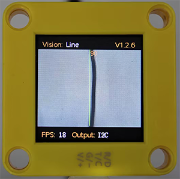
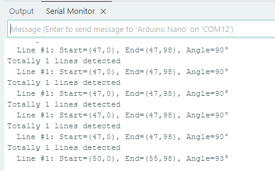

# 4.4 Line Detection

## 4.4.1 Algorithm



It will determine whether there are line segments in the image. If there are, it will return the coordinates of the two endpoints of the line segment and the inclination angle. If it is a curve, it will return the inclination angle of the straight line formed by the connection of the starting and the ending point of the curve.

-----------

## 4.4.2 Returned Values

When the controller acquires the recognition result, the algorithm will return the followings:

|  Parameter   |                          Definition                          |
| :----------: | :----------------------------------------------------------: |
|   kXValue    | x-coordinate of the end point (distal end) of the line segment |
|   kYValue    | y-coordinate of the end point (distal end) of the line segment |
| kWidthValue  | x-coordinate of the starting point (proximal end) of the line segment |
| kHeightValue | y-coordinate of the starting point (proximal end) of the line segment |
|    kLabel    |            inclination angle of the line segment             |

<span style="color:red;font-size:20px;">Note: The inclination angle increases counterclockwise. When it is horizontally tilted to the right, the angle is 0°; when it is vertically tilted upwards, it is 90°; and when it is horizontally tilted to the left, it is 180°. The algorithm does not detect the angle downward.</span>

Code:

```c
    // Traverse all the detected lines
    for (int i = 1; i <= obj_num; ++i) {
      // Obtain the coordinates of the line endpoints
      int x1 = sengo.GetValue(VISION_TYPE, kXValue, i);      // x-coordinate of the starting point
      int y1 = sengo.GetValue(VISION_TYPE, kYValue, i);      // y-coordinate of the starting point
      int x2 = sengo.GetValue(VISION_TYPE, kWidthValue, i);  // x-coordinate of the end point
      int y2 = sengo.GetValue(VISION_TYPE, kHeightValue, i);  // y-coordinate of the end point
      
      // Obtain the line angle (0-180 degrees)
      int degree = sengo.GetValue(VISION_TYPE, kLabel, i);
      
      // Format and output the detection results
      Serial.print("  Line #");
      Serial.print(i);
      Serial.print(": ");
      Serial.print("Start=(");
      Serial.print(x1);
      Serial.print(",");
      Serial.print(y1);
      Serial.print("), End=(");
      Serial.print(x2);
      Serial.print(",");
      Serial.print(y2);
      Serial.print("), Angle=");
      Serial.print(degree);
      Serial.println("°");
    }
```

---------------

## 4.4.3 Tips of Line Detection Algorithm

1. Do not use glossy maps to avoid reflect light which may lead to detection failure.
2. The line boundaries should be clear and with obvious color differences from background, such as a white background with black lines;
3. The background should be as simple as possible, for example, containing a single color. If it is messy, lines of the background may be detected.
4. The thickness of the lines should be moderate. Both being too thin and too wide will affect the detection.
5. When traversing, the first line segment is always the one first detected at the bottom of the screen.

--------------

## 4.4.4 Test Code

```c
#include <Arduino.h>
#include <Sentry.h>  // Introduce the Sentry machine vision sensor library

typedef Sengo1 Sengo;  // Create an alias Sengo for the Sengo1 type to simplify subsequent usage

// Communication method (currently enabled I2C)
#define SENGO_I2C
// #define SENGO_UART   // UART alternative options (annotated)

#ifdef SENGO_I2C
#include <Wire.h>  // Libraries required for I2C communication
#endif

#ifdef SENGO_UART
#include <SoftwareSerial.h>
#define TX_PIN 11  // Customize the TX pin
#define RX_PIN 10  // Customize the RX pin
SoftwareSerial mySerial(RX_PIN, TX_PIN);  // Create a soft serial port object
#endif

#define VISION_TYPE Sengo::kVisionLine  // line detection mode
Sengo sengo;  // Create a Sengo sensor object

void setup() {
  sentry_err_t err = SENTRY_OK;  // Error status variable

  Serial.begin(9600);  // Initialize the serial port for debugging the output
  Serial.println("Waiting for sengo initialize...");

// Initialize the sensor according to the selected communication method
#ifdef SENGO_I2C
  Wire.begin();  // Initialize the I2C bus
  // Keep trying to connect until succeed
  while (SENTRY_OK != sengo.begin(&Wire)) { 
    yield();  // Allow other tasks to run while waiting
  }
#endif

#ifdef SENGO_UART
  mySerial.begin(9600);
  while (SENTRY_OK != sengo.begin(&mySerial)) { 
    yield();
  }
#endif

  Serial.println("Sengo begin Success.");  
  // Activate line visual recognition
  err = sengo.VisionBegin(VISION_TYPE);
  Serial.print("sengo.VisionBegin(kVisionLine) ");
  if (err) {
    Serial.print("Error: 0x");
  } else {
    Serial.print("Success: 0x");
  }
  Serial.println(err, HEX);
}

void loop() {
  // Read the detected lines
  int obj_num = sengo.GetValue(VISION_TYPE, kStatus);
  
  if (obj_num > 0) {  // If a line is detected
    Serial.print("Totally ");
    Serial.print(obj_num);
    Serial.println(" lines detected");
    
    // Traverse all the detected lines
    for (int i = 1; i <= obj_num; ++i) {
      // Obtain the coordinates of the line endpoints
      int x1 = sengo.GetValue(VISION_TYPE, kXValue, i);      // x-coordinate of the starting point
      int y1 = sengo.GetValue(VISION_TYPE, kYValue, i);      // y-coordinate of the starting point
      int x2 = sengo.GetValue(VISION_TYPE, kWidthValue, i);  // x-coordinate of the end point
      int y2 = sengo.GetValue(VISION_TYPE, kHeightValue, i);  // y-coordinate of the end point
      
      // Obtain the line angle (0-180 degrees)
      int degree = sengo.GetValue(VISION_TYPE, kLabel, i);
      
      // Format and output the detection results
      Serial.print("  Line #");
      Serial.print(i);
      Serial.print(": ");
      Serial.print("Start=(");
      Serial.print(x1);
      Serial.print(",");
      Serial.print(y1);
      Serial.print("), End=(");
      Serial.print(x2);
      Serial.print(",");
      Serial.print(y2);
      Serial.print("), Angle=");
      Serial.print(degree);
      Serial.println("°");
    }
  }
  
  delay(100);  // Delay appropriately to reduce the refresh rate
}
```

--------------------

## 4.4.5 Test Result

After uploading the code, the module will detect the area captured by the camera. If there is a line, it will be recognized and its starting and ending coordinates and its angle will be printed in the serial monitor (the angle is 90 degrees for vertical lines and 180 degrees for horizontal lines).


