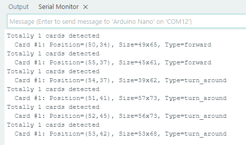

# 4.5 Card Recognition

## 4.5.1 Algorithm


It can identify whether there are corresponding traffic cards in the image. If yes, it will return information including the coordinates, size, and label values of the cards.

## 4.5.2 Classification Label

| Label | Definition  |           Pic           |
| :---: | :---------: | :---------------------: |
|   1   | go forward  |  |
|   2   |  turn left  |  |
|   3   | turn right  |  |
|   4   | turn around |  |
|   5   |    stop     |  |

Note: The algorithm can only recognize one card at a time. The card can still be recognized within a certain rotation, deflection and pitch angle. When using, please make the card face the camera as directly as possible for better recognition.

----------------------

## 4.5.3 Returned Values

When the controller acquires the recognition result, the algorithm will return the followings:

|  Parameter   |        Definition         |
| :----------: | :-----------------------: |
|   kXValue    | Card central coordinate x |
|   kYValue    | Card central coordinate y |
| kWidthValue  |       Card width w        |
| kHeightValue |       Card height h       |
|    kLabel    |     Card label value      |

Code:

```c
   // Traverse all the detected cards
    for (int i = 1; i <= obj_num; ++i) {
      // Obtain the coordinate and size of the card in the image
      int x = sengo.GetValue(VISION_TYPE, kXValue, i);      // Card central coordinate x
      int y = sengo.GetValue(VISION_TYPE, kYValue, i);      // Card central coordinate y
      int w = sengo.GetValue(VISION_TYPE, kWidthValue, i);  // Card width
      int h = sengo.GetValue(VISION_TYPE, kHeightValue, i); // Card height
      
      // Card label value (Corresponding to the card_classes array index)
      int card_type = sengo.GetValue(VISION_TYPE, kLabel, i);
      
      // Ensure that the card type is within a valid range (to prevent array out-of-bounds)
      if (card_type < 0) card_type = 0;
      if (card_type >= sizeof(card_classes)/sizeof(card_classes[0])) 
        card_type = 0;
      
      // Print the detailed information of the card
      Serial.print("  Card #");
      Serial.print(i);
      Serial.print(": ");
      Serial.print("Position=(");
      Serial.print(x);
      Serial.print(",");
      Serial.print(y);
      Serial.print("), Size=");
      Serial.print(w);
      Serial.print("x");
      Serial.print(h);
      Serial.print(", Type=");
      Serial.println(card_classes[card_type]);  // Use the mapping table to obtain the type name
    }
```

------------

## 4.5.4 Test Code

```c
#include <Arduino.h>          // Arduino core library
#include <Sentry.h>           // Sentry machine vision sensor library

// Create an alias Sengo for the Sengo1 type to simplify subsequent usage
typedef Sengo1 Sengo;

// Communication method (currently enabled I2C).
#define SENGO_I2C             
// #define SENGO_UART         // UART serial communication solution (annotated as disabled)

// Include the corresponding library according to the selected communication mode
#ifdef SENGO_I2C
#include <Wire.h>             // Libraries required for I2C communication
#endif

#ifdef SENGO_UART
#include <SoftwareSerial.h>   // Soft serial library
#define TX_PIN 11  // Customize the TX pin
#define RX_PIN 10  // Customize the RX pin
SoftwareSerial mySerial(RX_PIN, TX_PIN);  // Create a soft serial port object
#endif

// Define the visual processing type as a machine card recognition mode
#define VISION_TYPE Sengo::kVisionCard    

// Create a Sengo sensor object
Sengo sengo;

// Card type name mapping table (Index corresponding to card label values)
const char* card_classes[] = {
  "unknown",      // 0: Unknown card type
  "forward",      // 1: Forward
  "left",         // 2: Turn left
  "right",        // 3: Turn right
  "turn_around",  // 4: Turn around
  "park",         // 5: Stop
  // Note: The size of the array should match the actual number of card types
};

void setup() {
  sentry_err_t err = SENTRY_OK;  // Define the error state variable and initialize it to be error-free

  Serial.begin(9600);            // Initialize the serial port for debugging the output
  Serial.println("Waiting for sengo initialize...");  // Print the initialization prompt

// Initialize the sensor according to the selected communication mode
#ifdef SENGO_I2C
  Wire.begin();  // Initialize the I2C bus
  // Keep trying to connect until succeed
  while (SENTRY_OK != sengo.begin(&Wire)) { 
    yield();  // Allow other tasks to run while waiting
  }
#endif  // SENGO_I2C

#ifdef SENGO_UART
  mySerial.begin(9600);           // Initialize the soft serial port with a baud rate of 9600
  // Keep trying to connect until succeed
  while (SENTRY_OK != sengo.begin(&mySerial)) { 
    yield();  // Allow other tasks to run while waiting
  }
#endif  // SENGO_UART

  Serial.println("Sengo begin Success.");  // Print the successful initialization information of the sensor
  
  // Activate the machine card recognition function
  err = sengo.VisionBegin(VISION_TYPE);
  
  // Print the initialization result of c recognition
  Serial.print("sengo.VisionBegin(kVisionCard) ");
  if (err) {
    Serial.print("Error: 0x");    // If an error occurs, print the error prefix
  } else {
    Serial.print("Success: 0x");  // If successful, print the success prefix
  }
  Serial.println(err, HEX);       // Print the error code in hexadecimal format
}

void loop() {
  // Obtain the detected cards
  int obj_num = sengo.GetValue(VISION_TYPE, kStatus);
  
  // If at least one card is detected
  if (obj_num > 0) {
    // Print the total number of detected cards
    Serial.print("Totally ");
    Serial.print(obj_num);
    Serial.println(" cards detected");
    
   // Traverse all the detected cards
    for (int i = 1; i <= obj_num; ++i) {
      // Obtain the coordinate and size of the card in the image
      int x = sengo.GetValue(VISION_TYPE, kXValue, i);      // Card central coordinate x
      int y = sengo.GetValue(VISION_TYPE, kYValue, i);      // Card central coordinate y
      int w = sengo.GetValue(VISION_TYPE, kWidthValue, i);  // Card width
      int h = sengo.GetValue(VISION_TYPE, kHeightValue, i); // Card height
      
      // Card label value (Corresponding to the card_classes array index)
      int card_type = sengo.GetValue(VISION_TYPE, kLabel, i);
      
      // Ensure that the card type is within a valid range (to prevent array out-of-bounds)
      if (card_type < 0) card_type = 0;
      if (card_type >= sizeof(card_classes)/sizeof(card_classes[0])) 
        card_type = 0;
      
      // Print the detailed information of the card
      Serial.print("  Card #");
      Serial.print(i);
      Serial.print(": ");
      Serial.print("Position=(");
      Serial.print(x);
      Serial.print(",");
      Serial.print(y);
      Serial.print("), Size=");
      Serial.print(w);
      Serial.print("x");
      Serial.print(h);
      Serial.print(", Type=");
      Serial.println(card_classes[card_type]);  // Use the mapping table to obtain the type name
    }
  }
  
  delay(200);
}
```

## 4.5.5 Test Result

After uploading the code, the AI vision module will scan the area captured by the camera. If there is a card, it will recognize the card and print its type (forward, turn around, turn left, turn right, and stop) in the serial monitor. 


