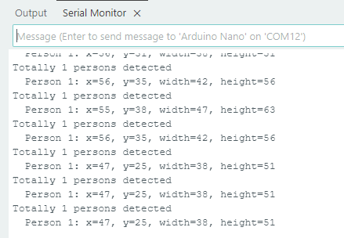

# 4.6 Body Detection

## 4.6.1 Algorithm


It determines whether there is a person in the image according to the outlines of the head and shoulders. If yes, it returns its coordinates and size.

---------------

## 4.6.2 Returned Values

When the controller acquires the recognition result, the algorithm will return the followings:

|  Parameter   |      Definition      |
| :----------: | :------------------: |
|   kXValue    | Central coordinate x |
|   kYValue    | Central coordinate y |
| kWidthValue  |       Width w        |
| kHeightValue |       Height h       |

Code:

```c
// If a body is detected
  if (obj_num) {
    Serial.print("Totally ");
    Serial.print(obj_num);
    Serial.println(" persons detected");
    
    // Traverse all the detected bodies
    for (int i = 1; i <= obj_num; ++i) {
      // Obtain detailed information about each human body
      int x = sengo.GetValue(VISION_TYPE, kXValue, i);      // x-coordinate (central position of the human body)
      int y = sengo.GetValue(VISION_TYPE, kYValue, i);      // y-coordinate (central position of the human body)
      int w = sengo.GetValue(VISION_TYPE, kWidthValue, i);  // The width of the human body detection box
      int h = sengo.GetValue(VISION_TYPE, kHeightValue, i); // The height of the human body detection box
      
      // Output human body information to the serial port
      Serial.print("  Person ");
      Serial.print(i);
      Serial.print(": ");
      Serial.print("x=");
      Serial.print(x);
      Serial.print(", y=");
      Serial.print(y);
      Serial.print(", width=");
      Serial.print(w);
      Serial.print(", height=");
      Serial.print(h);
    }
```

----------

## 4.6.3 Tips of Body Algorithm

1. Compared with a human facing from the side and back, the detection results will be more accurate when the person faces Sengo1 head-on.
2. The detection results will be more accurate when the color of the background is simple and obviously difference from that of the body dress.

-------

## 4.6.4 Test Code

```c
#include <Arduino.h>      // Arduino core library
#include <Sentry.h>       // Sentry machine vision sensor library

// Create an alias Sengo for the Sengo1 type to simplify subsequent usage
typedef Sengo1 Sengo;

// Communication method (choose one).
#define SENGO_I2C             
// #define SENGO_UART         // UART serial communication solution (here annotated as disabled)

// Include the corresponding library according to the selected communication mode
#ifdef SENGO_I2C
#include <Wire.h>         // Arduino I2C library
#endif

#ifdef SENGO_UART
#include <SoftwareSerial.h> // Soft serial library
#define TX_PIN 11  // Customize the TX pin
#define RX_PIN 10  // Customize the RX pin
SoftwareSerial mySerial(RX_PIN, TX_PIN);  // Create a soft serial port object
#endif

// Define the type of visual recognition as human body detection
#define VISION_TYPE Sengo::kVisionBody
Sengo sengo;              // Create a Sengo sensor object

// Initialization function - Runs once when the device starts up
void setup() {
  sentry_err_t err = SENTRY_OK; // Define the error state variable and initialize it to be error-free

  // Initialize the serial port for debugging the output
  Serial.begin(9600);
  Serial.println("Waiting for sengo initialize...");

  // Initialize the sensor according to the selected communication mode
#ifdef SENGO_I2C
  Wire.begin();           // Initialize the I2C bus
  // Keep trying to connect until succeed
  while (SENTRY_OK != sengo.begin(&Wire)) { 
    yield();              // Give up CPU time during the waiting period to prevent the watchdog from resetting
  }
#endif  // SENGO_I2C

#ifdef SENGO_UART
  mySerial.begin(9600);   // Initialize the soft serial port
  // Keep trying to connect until succeed
  while (SENTRY_OK != sengo.begin(&mySerial)) { 
    yield();
  }
#endif  // SENGO_UART

  Serial.println("Sengo begin Success."); // sensor initialization

  // Set the visual recognition mode to human body detection
  err = sengo.VisionBegin(VISION_TYPE);
  Serial.print("sengo.VisionBegin(kVisionBody) ");
  
  // Check if the Settings are successful and output the results
  if (err) {
    Serial.print("Error: 0x");
  } else {
    Serial.print("Success: 0x");
  }
  Serial.println(err, HEX); // Print the error code in hexadecimal format
}

// The main loop function - runs repeatedly after initialization
void loop() {
  // Obtain the number of detected human bodies
  int obj_num = sengo.GetValue(VISION_TYPE, kStatus);
  
  // If a body is detected
  if (obj_num) {
    Serial.print("Totally ");
    Serial.print(obj_num);
    Serial.println(" persons detected");
    
    // Traverse all the detected bodies
    for (int i = 1; i <= obj_num; ++i) {
      // Obtain detailed information about each human body
      int x = sengo.GetValue(VISION_TYPE, kXValue, i);      // x-coordinate (central position of the human body)
      int y = sengo.GetValue(VISION_TYPE, kYValue, i);      // y-coordinate (central position of the human body)
      int w = sengo.GetValue(VISION_TYPE, kWidthValue, i);  // The width of the human body detection box
      int h = sengo.GetValue(VISION_TYPE, kHeightValue, i); // The height of the human body detection box
      
      // Output human body information to the serial port
      Serial.print("  Person ");
      Serial.print(i);
      Serial.print(": ");
      Serial.print("x=");
      Serial.print(x);
      Serial.print(", y=");
      Serial.print(y);
      Serial.print(", width=");
      Serial.print(w);
      Serial.print(", height=");
      Serial.println(h);
    }
  } 
}
```

-----------

## 4.6.5 Test Result

After uploading the code, the AI vision module will scan the area captured by the camera. If there is a human body, it will be recognized and its coordinates, width and height will be printed on the monitor.




