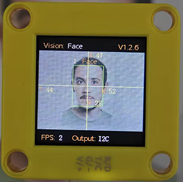
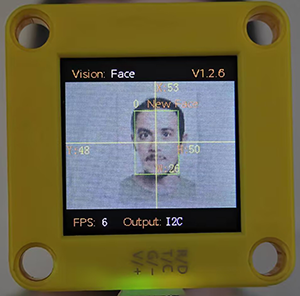
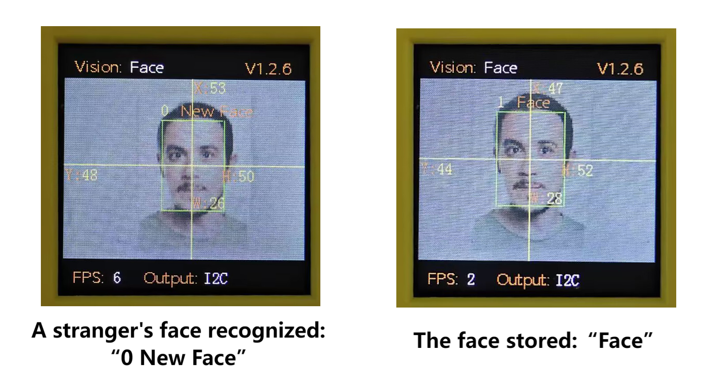
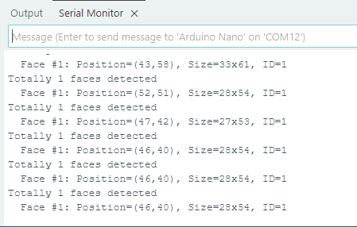

# 4.7 Face Recognition

## 4.7.1 Algorithm



It detects and recognizes human face in the image. Users can train to store or delete facial data by the function button. Sengo1 can store 10 faces at most.

-----------------

## 4.7.2 Classification Label

Sengo1 defines 11 classification labels for human faces:

| Label value | Meaning  | Label value |                Meaning                 |
| :---------: | :------: | :---------: | :------------------------------------: |
|      0      | New face |    1-10     | Classification number for stored faces |

New face (label value 0):



Stored face (label value 1-10):


---------------

## 4.7.3 Save Data

After enabling the face recognition algorithm, point the camera at the face, press the function button for 5 seconds and then release it. Sengo1 will start recording the face. After about 3 frames of data, the current facial data in the image will be saved in Flash and assigned an ID number.

The smallest number among the currently available numbers will be assigned to the label value. If there are no vacant numbers, Sengo1 will prompt a storage failure.



----------------

## 4.7.4 Delete Data

After storing, press the function button for about 10 seconds and then release it to delete the data just stored. Press it again for 10 seconds, and all the stored faces will be cleared. If no face has been stored after enabling the algorithm, all storage of faces will be directly cleared when you press the function button for 10 seconds.

------------------

## 4.7.5 Returned Values

When the controller acquires the recognition result, the algorithm will return the followings:

|  Parameter   |        Definition         |
| :----------: | :-----------------------: |
|   kXValue    | Face central coordinate x |
|   kYValue    | Face central coordinate y |
| kWidthValue  |       Face width w        |
| kHeightValue |       Face height h       |
|    kLabel    |     Face label value      |

Code:

```c
    // Traverse all the detected faces
    for (int i = 1; i <= face_count; ++i) {
      // Obtain the coordinate and size of the face in the image
      int face_x = sengo.GetValue(VISION_TYPE, kXValue, i);      // Face central coordinate x
      int face_y = sengo.GetValue(VISION_TYPE, kYValue, i);      // Face central coordinate y
      int face_width = sengo.GetValue(VISION_TYPE, kWidthValue, i);  // Face width
      int face_height = sengo.GetValue(VISION_TYPE, kHeightValue, i); // Face height
      
      // Obtain the face label (usually representing the face ID in face detection, used to track different people)
      int face_id = sengo.GetValue(VISION_TYPE, kLabel, i);
      
      // Print the detailed information of the face
      Serial.print("  Face #");
      Serial.print(i);
      Serial.print(": ");
      Serial.print("Position=(");
      Serial.print(face_x);
      Serial.print(",");
      Serial.print(face_y);
      Serial.print("), Size=");
      Serial.print(face_width);
      Serial.print("x");
      Serial.print(face_height);
      Serial.print(", ID=");
      Serial.println(face_id);
      
    }
```

---------------

## 4.7.6 Tips of Face Recognition Algorithm

1. When the ambient light is sufficient, the complete face is directly facing the camera and occupies a large field of view, the module can recognize it much better.
2. When wearing glasses or covered by hair/masks, the human face may not be detected.

----------------

## 4.7.7 Test Code

```c
#include <Arduino.h>          // Arduino core library
#include <Sentry.h>           // Sentry machine vision sensor library

// Create an alias Sengo for the Sengo1 type to simplify subsequent usage
typedef Sengo1 Sengo;

// Communication method (currently enabled I2C).
#define SENGO_I2C             
// #define SENGO_UART         // UART serial communication solution (annotated as disabled)

// Include the corresponding library according to the selected communication mode
#ifdef SENGO_I2C
#include <Wire.h>             // Libraries required for I2C communication
#endif

#ifdef SENGO_UART
#include <SoftwareSerial.h>   // Soft serial library
#define TX_PIN 11  // Customize the TX pin
#define RX_PIN 10  // Customize the RX pin
SoftwareSerial mySerial(RX_PIN, TX_PIN);  // Create a soft serial port object
#endif

// Define the visual processing type as a machine face recognition mode
#define VISION_TYPE Sengo::kVisionFace  

// Create a Sengo sensor object
Sengo sengo;

void setup() {
  sentry_err_t err = SENTRY_OK;  // Define the error state variable and initialize it to be error-free

  Serial.begin(9600);            // Initialize the serial port for debugging the output
  Serial.println("Waiting for sengo initialize...");  // Print the initialization prompt

// Initialize the sensor according to the selected communication mode
#ifdef SENGO_I2C
  Wire.begin();                   // Initialize the I2C bus
  // Keep trying to connect until succeed
  // The yield() function allows ESP8266/ESP32 to handle background tasks during the waiting period
  while (SENTRY_OK != sengo.begin(&Wire)) { 
    yield();  
  }
#endif  // SENGO_I2C

#ifdef SENGO_UART
  mySerial.begin(9600);           // Initialize the soft serial port with a baud rate of 9600
  // Keep trying to connect until succeed
  while (SENTRY_OK != sengo.begin(&mySerial)) { 
    yield();  
  }
#endif  // SENGO_UART

  Serial.println("Sengo begin Success.");  // Print the successful initialization information of the sensor
  
  // Activate the machine face recognition function
  err = sengo.VisionBegin(VISION_TYPE);
  
  // Print the initialization result of face recognition
  Serial.print("sengo.VisionBegin(kVisionFace) ");
  if (err) {
    Serial.print("Error: 0x");    // If an error occurs, print the error prefix
  } else {
    Serial.print("Success: 0x");  // If succeed, print the success prefix
  }
  Serial.println(err, HEX);       // Print the error code in hexadecimal format
  
}

void loop() {
  // Obtain the detected faces
  int face_count = sengo.GetValue(VISION_TYPE, kStatus);
  
  // If at least one face is detected
  if (face_count > 0) {
    // Print the total number of detected faces
    Serial.print("Totally ");
    Serial.print(face_count);
    Serial.println(" faces detected");
    
    // Traverse all the detected faces
    for (int i = 1; i <= face_count; ++i) {
      // Obtain the coordinate and size of the face in the image
      int face_x = sengo.GetValue(VISION_TYPE, kXValue, i);      // Face central coordinate x
      int face_y = sengo.GetValue(VISION_TYPE, kYValue, i);      // Face central coordinate y
      int face_width = sengo.GetValue(VISION_TYPE, kWidthValue, i);  // Face width
      int face_height = sengo.GetValue(VISION_TYPE, kHeightValue, i); // Face height
      
      // Obtain the face label (usually representing the face ID in face detection, used to track different people)
      int face_id = sengo.GetValue(VISION_TYPE, kLabel, i);
      
      // Print the detailed information of the face
      Serial.print("  Face #");
      Serial.print(i);
      Serial.print(": ");
      Serial.print("Position=(");
      Serial.print(face_x);
      Serial.print(",");
      Serial.print(face_y);
      Serial.print("), Size=");
      Serial.print(face_width);
      Serial.print("x");
      Serial.print(face_height);
      Serial.print(", ID=");
      Serial.println(face_id);
    }
  }
  
  delay(200);
}
```

--------------------

## 4.7.8 Test Result

After uploading the code, press and hold the function button for 5 seconds, and then the module will starts to learn and record the face on the screen. When encountering new faces, prompts will be given on it.




