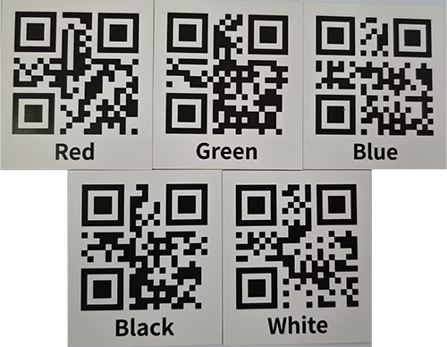
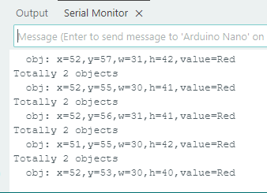

# 4.8 QR Code Recognition

## 4.8.1 Algorithm


It can recognize a simple QR code and return its coordinates, size and text content, but the QR code information should not exceed 10 bytes. ASCII code characters can be displayed on the screen. Note that if it is a Chinese QR code, it cannot be displayed, but the recognition result can still be read by the main control.

-------------

## 4.8.2 Returned Values

The algorithm will return: One is attribute information, and the other is the decoded characters. Each group of results contains 5 characters.

| Results |        Attribute information        |      | Results |  Character data  |
| :-----: | :---------------------------------: | ---- | :-----: | :--------------: |
|    1    |    QR code central coordinate x     |      |    1    | Character 1 code |
|    2    |    QR code central coordinate y     |      |    2    | Character 2 code |
|    3    |           QR code width w           |      |    3    | Character 3 code |
|    4    |          QR code height h           |      |    4    | Character 4 code |
|    5    | The number of characters in QR code |      |    5    | Character 5 code |

Code:

```c
    // Obtain the coordinate and size of QR code
    int x = sengo.GetValue(VISION_TYPE, kXValue);      // QR code upper-left coordinate x
    int y = sengo.GetValue(VISION_TYPE, kYValue);      // QR code upper-left coordinate y
    int w = sengo.GetValue(VISION_TYPE, kWidthValue);  // QR code width
    int h = sengo.GetValue(VISION_TYPE, kHeightValue); // QR code height
    
    // Obtain the text content of QR code (character string)
    char* c = sengo.GetQrCodeValue();
    
    // Print the detailed information of the QR code
    Serial.print("  obj");
    Serial.print(": ");
    Serial.print("x=");
    Serial.print(x);
    Serial.print(",y=");
    Serial.print(y);
    Serial.print(",w=");
    Serial.print(w);
    Serial.print(",h=");
    Serial.print(h);
    Serial.print(",value=");
    Serial.println(c);  // Print the content of QR code
  }	
```

----------

## 4.8.3 Generate a QR Code

We provide 5 paper QR code cards, with the contents of “Red”, “Green”, “Blue”, “White”, “Black” respectively.



If these QR codes do not meet your needs, you can search for “QR code generation for free” in your browser. There will be many links for generating QR codes online. Just find the one you like and use it. Here we also provide a generator:

[Online QR code generator](https://www.qrcode-monkey.com/#text)

After entering the link:

① Select the TEXT format

② Input the text to be generated (no Chinese characters, no more than 10 characters)

③ Click to generate a QR code

④ Download the QR code image


------------

## 4.8.4 Test Code

```c
#include <Arduino.h>          // Arduino core library
#include <Sentry.h>           // Sentry machine vision sensor library

// Create an alias Sengo for the Sengo1 type to simplify subsequent usage
typedef Sengo1 Sengo;

// Communication method (currently enabled I2C).
#define SENGO_I2C             
// #define SENGO_UART         // UART serial communication solution (annotated as disabled)

// Include the corresponding library according to the selected communication mode
#ifdef SENGO_I2C
#include <Wire.h>  // Libraries required for I2C communication
#endif
#ifdef SENGO_UART
#include <SoftwareSerial.h>
#define TX_PIN 11  // Customize the TX pin
#define RX_PIN 10  // Customize the RX pin
SoftwareSerial mySerial(RX_PIN, TX_PIN);  // Create a soft serial port object
#endif

// Define the visual processing type as QR code recognition mode
#define VISION_TYPE Sengo::kVisionQrCode
Sengo sengo;  // Create a Sengo sensor object

// Initialization
void setup() {
  sentry_err_t err = SENTRY_OK;  // error state variable

  Serial.begin(9600);  // Initialize the serial port for debugging the output
  Serial.println("Waiting for sengo initialize...");

  // I2C initialization
#ifdef SENGO_I2C
  Wire.begin();  // Initialize the I2C bus
  // Keep trying to connect until succeed
  while (SENTRY_OK != sengo.begin(&Wire)) { 
    yield();  // Give up CPU control during the waiting period
  }
#endif  // SENGO_I2C

  // UART initialization (disabled currently)
#ifdef SENGO_UART
  mySerial.begin(9600);
  while (SENTRY_OK != sengo.begin(&mySerial)) { 
    yield();
  }
#endif  // SENGO_UART

  Serial.println("Sengo begin Success.");
  
  // Activate the QR code recognition
  err = sengo.VisionBegin(VISION_TYPE);
  
  // Print the initialization result
  Serial.print("sengo.VisionBegin(kVisionQrCode) ");
  if (err) {
    Serial.print("Error: 0x");
  } else {
    Serial.print("Success: 0x");
  }
  Serial.println(err, HEX);  // Print the error code in hexadecimal format
}

// loop
void loop() {
  // Obtain the number of detected QR codes (kStatus is the query status)
  int obj_num = sengo.GetValue(VISION_TYPE, kStatus);
  
  if (obj_num) {  // If QR code is detected
    Serial.print("Totally ");
    Serial.print(obj_num);
    Serial.println(" objects");
    
    // Obtain the coordinate and size of QR code
    int x = sengo.GetValue(VISION_TYPE, kXValue);      // QR code upper-left coordinate x
    int y = sengo.GetValue(VISION_TYPE, kYValue);      // QR code upper-left coordinate y
    int w = sengo.GetValue(VISION_TYPE, kWidthValue);  // QR code width
    int h = sengo.GetValue(VISION_TYPE, kHeightValue); // QR code height
    
    // Obtain the text content of QR code (character string)
    char* c = sengo.GetQrCodeValue();
    
    // Print the detailed information of the QR code
    Serial.print("  obj");
    Serial.print(": ");
    Serial.print("x=");
    Serial.print(x);
    Serial.print(",y=");
    Serial.print(y);
    Serial.print(",w=");
    Serial.print(w);
    Serial.print(",h=");
    Serial.print(h);
    Serial.print(",value=");
    Serial.println(c);  // Print the content of QR code
  }
}
```

-------

## 4.8.5 Test Result

After uploading the code, the AI vision module will detect the area captured by the camera. If there is a QR code, it will be recognized and its size and content will be printed on the serial monitor.


