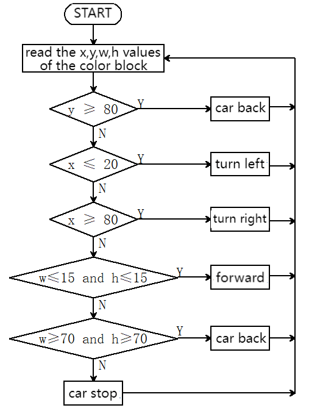

# 5.3 Color Block Following Car

## 5.3.1 Overview

In this project, we build a color block following car. Herein, the AI vision module locks a certain color block and detects its coordinates x and y, and width and height, and then it controls the car to move left, right, forward to track this color block.

## 5.3.2 Code Flow



## 5.3.3 Test Code

```c
#include <Arduino.h>
#include <Sentry.h>

typedef Sengo1 Sengo;

#define SENGO_I2C
// #define SENGO_UART

#ifdef SENGO_I2C
#include <Wire.h>
#endif
#ifdef SENGO_UART
#include <SoftwareSerial.h>
#define TX_PIN 11
#define RX_PIN 10
SoftwareSerial mySerial(RX_PIN, TX_PIN);
#endif

#define VISION_TYPE Sengo::kVisionBlob
Sengo sengo;

const char* blob_classes[] = {
  "UNKNOWN", "BLACK", "WHITE", "RED", "GREEN", "BLUE", "YELLOW"
};

int x, y, w, h;

#define ML 4
#define ML_PWM 6
#define MR 2
#define MR_PWM 5

void setup() {
  sentry_err_t err = SENTRY_OK;

  Serial.begin(9600);

  Serial.println("Waiting for sengo initialize...");
#ifdef SENGO_I2C
  Wire.begin();
  while (SENTRY_OK != sengo.begin(&Wire)) { yield(); }
#endif  // SENGO_I2C
#ifdef SENGO_UART
  mySerial.begin(9600);
  while (SENTRY_OK != sengo.begin(&mySerial)) { yield(); }
#endif  // SENGO_UART
  Serial.println("Sengo begin Success.");
  sengo.SetParamNum(VISION_TYPE,1);
  sentry_object_t param = { 0 };
  /* Set minimum blob size(pixel) */
  param.width = 5;
  param.height = 5;
  /* Set blob1 color */
  param.label = Sengo::kColorRed;
  err = sengo.SetParam(VISION_TYPE, &param);
  Serial.print("sengo.SetParam[");
  Serial.print(blob_classes[param.label]);
  if (err) {
    Serial.print("] Error: 0x");
  } else {
    Serial.print("] Success: 0x");
  }
  Serial.println(err, HEX);

  err = sengo.VisionBegin(VISION_TYPE);
  Serial.print("sengo.VisionBegin(kVisionBlob) ");
  if (err) {
    Serial.print("Error: 0x");
  } else {
    Serial.print("Success: 0x");
  }
  Serial.println(err, HEX);

  pinMode(ML, OUTPUT); //Set the left motor direction control pin to output
  pinMode(ML_PWM, OUTPUT);  //Set the left motor pwm pin to output
  pinMode(MR, OUTPUT); //Set the right motor direction control pin to output
  pinMode(MR_PWM, OUTPUT);  //Set the left motor pwm pin to output
}

void loop() {
  int obj_num = sengo.GetValue(VISION_TYPE, kStatus);
  if (obj_num) {
    for (int i = 1; i <= obj_num; ++i) {
      x = sengo.GetValue(VISION_TYPE, kXValue, i);
      y = sengo.GetValue(VISION_TYPE, kYValue, i);
      w = sengo.GetValue(VISION_TYPE, kWidthValue, i);
      h = sengo.GetValue(VISION_TYPE, kHeightValue, i);
    }
 
    if (y >= 80) {
      //the car moves backward
      car_back();
    } else if (x <= 20) {
      //the car turns left
      car_left();
    } else if (x >= 80) {
      //the car turns right
      car_right();
    } else if (w <= 15 && h <= 15) {
      car_forward();
    } else if (w >= 70 && h >= 70) {
      car_back();
    } else {
      car_stop();
    }
  } else {
    car_stop();
  }
}


//the car moves forward
void car_forward() {
  digitalWrite(ML, LOW);
  analogWrite(ML_PWM, 100);
  digitalWrite(MR, LOW);
  analogWrite(MR_PWM, 100);
}

//the car moves backward
void car_back() {
  digitalWrite(ML, HIGH);
  analogWrite(ML_PWM, 150);
  digitalWrite(MR, HIGH);
  analogWrite(MR_PWM, 150);
}

//the car turns left
void car_left() {
  digitalWrite(ML, HIGH);
  analogWrite(ML_PWM, 165);
  digitalWrite(MR, LOW);
  analogWrite(MR_PWM, 90);
}

//the car turns right
void car_right() {
  digitalWrite(ML, LOW);
  analogWrite(ML_PWM, 90);
  digitalWrite(MR, HIGH);
  analogWrite(MR_PWM, 165);
}

//the car stops
void car_stop() {
  digitalWrite(ML, LOW);
  analogWrite(ML_PWM, 0);
  digitalWrite(MR, LOW);
  analogWrite(MR_PWM, 0);
}

```

## 5.3.4 Test Result

After uploading the code, the AI vision module will detect the captured image to determine if there is a red block. If there is, it will control the movement of the car based on the x, y, w, and h values of this color block. For example, if the red block is close to the right side of the display, the car will turn right; if it is in the left, the car will turn left; and if it is at the lower part of display, the car will move backward. (Please use the color cards we provide.)

