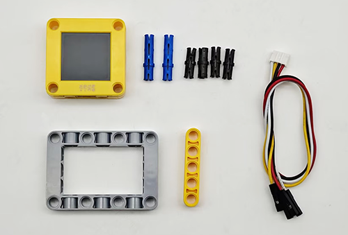

# 5.5 Smart Stone Thrower

## 5.5.1 Overview

In this project, we build an interesting stone thrower car with automatic recognition by the AI vision module. We first need to mount the module on the car to enable its recognition function. If a human body is detected, the buzzer will emit a countdown beeping from three and then the car will perform a throw. After that, the throwing arm will slowly lower down to wait for the next recognition of a body.

## 5.5.2 Mount the AI module to the stone thrower car

<p style="color:red;font-size:25px;">Note: Please install the "Stone Thrower" first according to the robot car tutorial, and then follow the installation steps below.</p>

**Required Parts**



**Step 1**


**Step 2**


**Step 3**


**Step 4**

| AI vision module | Car interface |
| :--------------: | :-----------: |
|   T/C (yellow)   |      SCL      |
|   R/D (white)    |      SDA      |
|    V/+ (red)     |      5V       |
|   G/- (black)    |       G       |


**Completed**


## 5.5.3 Code Flow


## 5.5.4 Test Code

```c
#include <Arduino.h>  // Arduino core library
#include <Sentry.h>   // Sengo vision sensor library
// Servo control library
#include <Servo.h>

Servo servo;  // Create a servo object to control the servo system

#define BUZZER_PIN 3  // buzzer pin

// Create an alias Sengo for the Sengo1 type to simplify subsequent usage
typedef Sengo1 Sengo;

// Communication method (currently enabled I2C)
#define SENGO_I2C
// #define SENGO_UART  // UART is annotated as disabled

// Include the corresponding library according to the selected communication mode
#ifdef SENGO_I2C
#include <Wire.h>  // Arduino I2C library
#endif

#ifdef SENGO_UART
#include <SoftwareSerial.h>               // Software serial port library (for non-hardware serial ports)
#define TX_PIN 11     // Software serial port transmitting pin
#define RX_PIN 10     // Software serial port receiving pin
SoftwareSerial mySerial(RX_PIN, TX_PIN);  // Create a soft serial port object
#endif

// Define the visual processing type as body recognition mode
#define VISION_TYPE Sengo::kVisionBody
Sengo sengo;  // Create a Sengo sensor object

// Initialization
void setup() {
  sentry_err_t err = SENTRY_OK;  // error state variable

  // Initialize the serial port for debugging the output
  Serial.begin(9600);
  Serial.println("Waiting for sengo initialize...");

  // I2C initialization
#ifdef SENGO_I2C
  Wire.begin();  // Initialize the I2C bus
    // Wait in a loop for the successful initialization of the sensor
  while (SENTRY_OK != sengo.begin(&Wire)) {
    yield();  // Give up CPU time during the waiting period to prevent the watchdog from resetting
  }
#endif  // SENGO_I2C

#ifdef SENGO_UART
  mySerial.begin(9600);  // Initialize the software serial port
  // Try to initialize the sensor until it succeeds
  while (SENTRY_OK != sengo.begin(&mySerial)) {
    yield();
  }
#endif  // SENGO_UART

  Serial.println("Sengo begin Success.");  // The sensor initialization succeed

  // Define the visual recognition mode as body recognition mode
  err = sengo.VisionBegin(VISION_TYPE);
  Serial.print("sengo.VisionBegin(kVisionBody) ");

  // Check if the settings are successful and output the results
  if (err) {
    Serial.print("Error: 0x");
  } else {
    Serial.print("Success: 0x");
  }
  Serial.println(err, HEX);  // Print the error code in hexadecimal format
    // Servo angle initialization
  servo.attach(A0);
  servo.write(35);
  // Set the pin to output mode
  pinMode(BUZZER_PIN, OUTPUT);
}

// loop
void loop() {
  // Obtain the number of detected human bodies
  int obj_num = sengo.GetValue(VISION_TYPE, kStatus);

  if (obj_num) {  // If a human body is detected
    // Countdown for throwing
    countdown(3);
    // Throw
    servo.write(90);
    delay(1000);
    // Slowly put down the arm
    for (int j = 90; j > 35; j--) {
      servo.write(j);
      delay(15);
    }
    delay(500);
  }
}

void countdown(int seconds) {
  for (int i = seconds; i > 0; i--) {
    // Countdown beeping
    tone(BUZZER_PIN, 800, 100);
    delay(200);
    noTone(BUZZER_PIN);
    // Interval time
    delay(800);
  }
}
```

## 5.5.5 Test Result

After uploading the code, the AI vision module will activate the “Body” mode and then recognize the captured images to determine if there is a human. If yes, it will perform a throw. Before the throw, there will be three prompt sounds as a countdown. Once the countdown ends, the throw will proceed. After that, the throwing arm will slowly fall back to wait for the next instruction.

