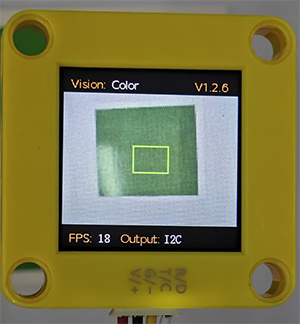

# 4.1 Color Recognition

## 4.1.1 Algorithm

It will specify one or more recognition areas, whose positions and sizes can be set as needed, and then it will return the color label of this area as well as the red component value R, green component value G and blue component value B.

## 4.1.2 Color Label

Sengo1 defines 7 colors of labels:

| Label value | Meaning | Label value | Meaning |
| :---------: | :-----: | :---------: | :-----: |
|      1      |  Black  |      2      |  White  |
|      3      |   Red   |      4      |  Green  |
|      5      |  Blue   |      6      | Yellow  |
|      0      | Unknown |             |         |

Note: Common colors not listed in the table, such as purple, cyan(blue-green), orange, and gray, have relatively low color discrimination and are easily misidentified as the colors in the table. Therefore, they are classified as unknown ones. If you need to recognize the above colors, you can make your own judgment based on the returned RGB values.

Sample 1:

The serial port outputs the label values: (the recognition box outputs 3, corresponding to the label values in the table.)

Sample 2:

The serial port outputs the label values: (The output label values correspond to that in the color label table.)

-------------------------

## 4.1.3 代码块介绍

1.  sets the communication mode of Sengo1. Click `port` to select `I2C`, `Serial`, `Serial2`.
2.  sets the function code for running the AI vision module. Click `algo` to select the desired function: `Color`, `Blob`, `Ball`, `Line`, `Card`, `Body`, `Face`, `QrCode`.
3.  sets the coordinates of the recognition area and the size of the recognition box. If no new parameters are specified, it will run with the default values as follows:

| Parameter |                  Definition                  | Default |
| :-------: | :------------------------------------------: | :-----: |
|  x-coord  | Central coordinate x of the recognition area |   50    |
|  y-coord  | Central coordinate y of the recognition area |   50    |
|   width   |       Width w of the recognition area        |    3    |
|  height   |       Height h of the recognition area       |    4    |

5.  returns the number of results recognized by the AI vision module in each functional mode.
6.  returns the recognized color label values (corresponding to the table in `4.1.2 Color Label`).
7.  determines whether the set color is detected. If it is, it returns 1; if not, it returns 0.

--------------------

## 4.1.5 Tips of Color Recognition Algorithm

1. When the recognition area is relatively small, such as 2x2, although the recognition speed is fast, there will be an impact on results due to the small number of pixels, thus with low credibility. It is only suitable for scenarios with a single controllable background.
2. When the recognition area is large, such as 20x20 with the large number of pixels, the interference of variegated colors will be filtered out, resulting in a relatively high credibility, but the recognition speed is slow.
3. Within the recognition area, when the areas occupied by different colors are approximately the same, the results may repeatedly change.

-----------------------

## 4.1.6 Test Code

1. In the code start-up, set the serial port baud rate to `9600`, and then set the communication mode of the AI vision module to `I2C`, and finally set it to run in `Color` mode.

2. Set the recognition parameters of the module, and then set the position of the recognition box to X of 50 and Y of 50, and width and height to both 20.

3. The if block judges the number of detections and only outputs the color label value when the number is greater than 0.

4. Print string `label = `, “label” value of the color, and string `  Color: ` in sequence in the serial monitor without wrapping.

5. Determine the recognized colors and print them on the serial monitor

**Complete code:**

----------------

## 4.1.7 Test Result

After uploading the code, a recognition box will appear on the AI vision module. Their corresponding color names and label values will be printed on the serial monitor.

