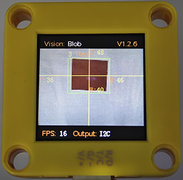
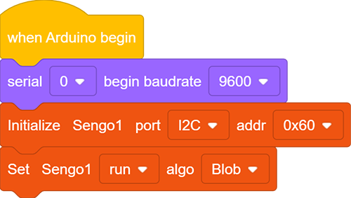
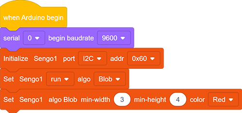
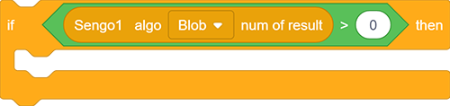
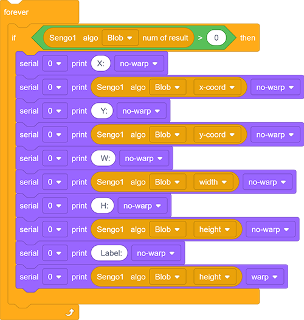
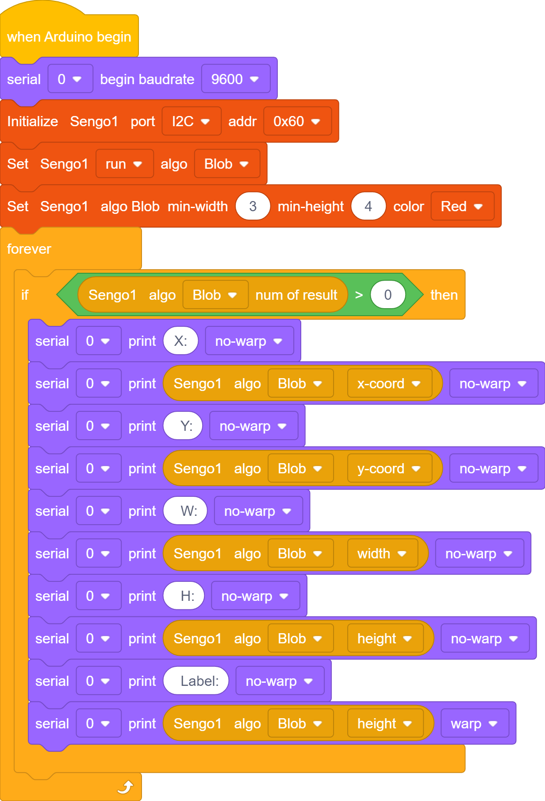
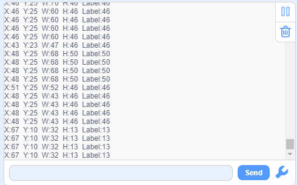

# 4.2 Color Block Detection

## 4.2.1 Algorithm

We specify a certain color, and it will determine whether there is a block of that color in the image. If yes, it will return its coordinates and size. The color label is the same as that in color recognition algorithm.

Color babel table:

| Label value | Meaning | Label value | Meaning |
| :---------: | :-----: | :---------: | :-----: |
|      1      |  Black  |      2      |  White  |
|      3      |   Red   |      4      |  Green  |
|      5      |  Blue   |      6      | Yellow  |
|      0      | Unknown |             |         |

---------------------------

## 4.2.2 Code Blocks

1.  sets the minimum size of the detected color block and the detected color. Only one color block can be specified for recognition at a time.
2.  returns the current position (y, z) and size (w, h) of the detected object on the screen, as well as the label. Before using it, we need to choose a function(Blob, Ball, Card…).

| Formal parameter |            Definition            |
| :--------------: | :------------------------------: |
|     x-coord      | color block central coordinate x |
|     y-coord      | color block central coordinate y |
|      width       |       color block width w        |
|      height      |       color block height h       |
|      Libel       |           color label            |

---------------------

## 4.2.3 Test Code

1. In the code start-up, set the serial port baud rate to `9600`, and then set the communication mode of the AI vision module to `I2C`, and finally set it to run in `Blob` mode.

2. Set the minimum size of the recognized color block as well as the recognized color.

3. The if block determines the number of detections. Only when the number of detections is greater than 0 will the color block data be output. Note to choose `Blob`.

4. The serial port outputs various data of the recognized color blocks.

**Complete code:**

----------------------------

## 4.2.4 Test Result

After uploading the code, the module will detect the area captured by the camera. If there is a red block, it will be selected and marked. Then, its position coordinates x and y, width, height, and color label value will be printed on the serial monitor.

