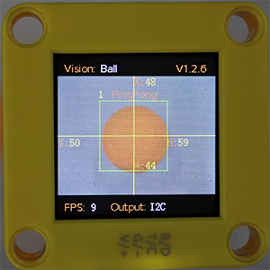

# 4.3 Ball Recognition

## 4.3.1 Algorithm

It determines whether there is an orange ping-pong ball or a green tennis ball in the image. If yes, it returns their coordinates, size and label value.

----------

## 4.3.2 Classification Label

| Label ID |     Definition     |
| :------: | :----------------: |
|    1     | ping pong (orange) |
|    2     |   tennis (green)   |

Ping pong:

Tennis:

## 4.3.3 Code Blocks

1.  recognizes the detected ball is 'Table Tennis' or 'Tennis'.

----------

## 4.3.4 Test Code

1. In the code start-up, set the serial port baud rate to `9600`, and then set the communication mode of the AI vision module to `I2C`, and finally set it to run in `Ball` mode.

2. The if block determines the number of detections. Only when the number of detections is greater than 0 will the data be output. Note to choose `Ball`.

3. The serial port outputs the `label` value of the detected ball without wrapping.

4.  recognizes the detected ball and the serial monitor outputs the ball name.

**Complete code:**

-----------

## 4.3.5 Test Result

After uploading the code, the module will detect the area captured by the camera. If an orange ping pong or a green tennis is detected, it will be recognized, and its label value and name will be displayed on the serial monitor.

