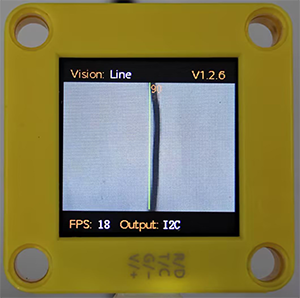
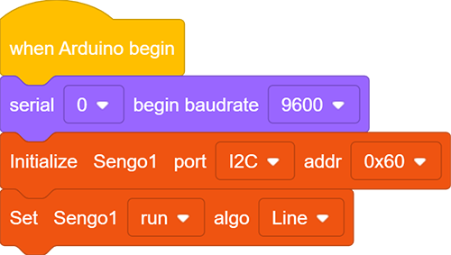
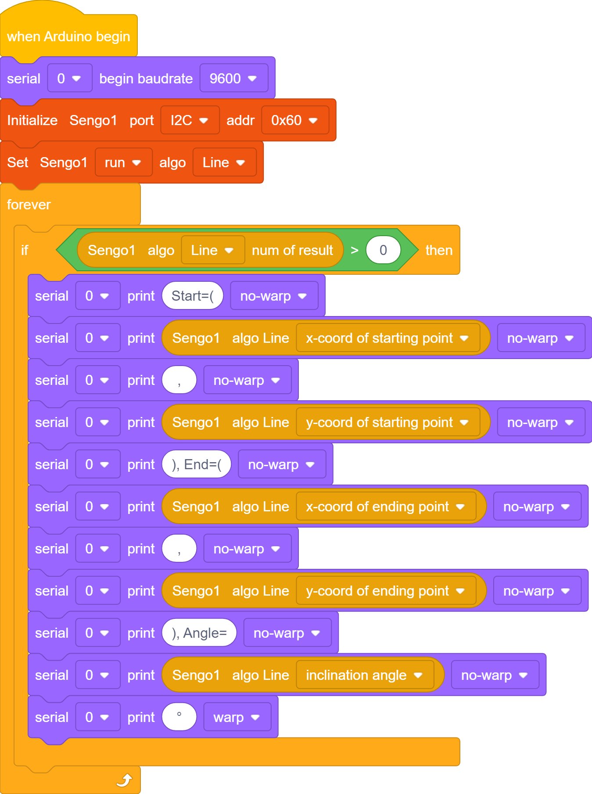
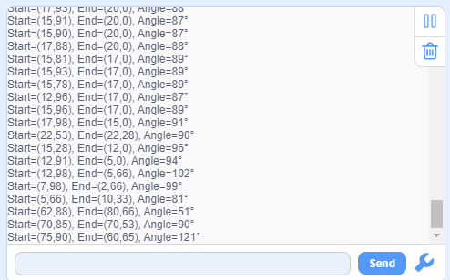

# 4.4 Line Detection

## 4.4.1 Algorithm

It will determine whether there are line segments in the image. If there are, it will return the coordinates of the two endpoints of the line segment and the inclination angle. If it is a curve, it will return the inclination angle of the straight line formed by the connection of the starting and the ending point of the curve.

-----------

## 4.4.2 Code Blocks

1.  returns the data of lines.

|         Parameter         |                          Definition                          |
| :-----------------------: | :----------------------------------------------------------: |
|  x-coord of ending point  | x-coordinate of the end point (distal end) of the line segment |
|  y-coord of ending point  | y-coordinate of the end point (distal end) of the line segment |
| x-coord of starting point | x-coordinate of the starting point (proximal end) of the line segment |
| y-coord of starting point | y-coordinate of the starting point (proximal end) of the line segment |
|     inclination angle     |            inclination angle of the line segment             |

Note: The inclination angle increases counterclockwise. When it is horizontally tilted to the right, the angle is 0°; when it is vertically tilted upwards, it is 90°; and when it is horizontally tilted to the left, it is 180°. The algorithm does not detect the angle downward.

---------------

## 4.4.3 Tips of Line Detection Algorithm

1. Do not use glossy maps to avoid reflect light which may lead to detection failure.
2. The line boundaries should be clear and with obvious color differences from background, such as a white background with black lines;
3. The background should be as simple as possible, for example, containing a single color. If it is messy, lines of the background may be detected.
4. The thickness of the lines should be moderate. Both being too thin and too wide will affect the detection.
5. When traversing, the first line segment is always the one first detected at the bottom of the screen.

--------------

## 4.4.4 Test Code

1. In the code start-up, set the serial port baud rate to `9600`, and then set the communication mode of the AI vision module to `I2C`, and finally set it to run in `Line` mode.

2. The if block determines the number of detections. Only when the number of detections is greater than 0 will the data be output. Note to choose `Line`.

	The serial port prints the recognized line data.

**Complete code:**

--------------------

## 4.4.5 Test Result

After uploading the code, the module will detect the area captured by the camera. If there is a line, it will be recognized and its starting and ending coordinates and its angle will be printed in the serial monitor (the angle is 90 degrees for vertical lines and 180 degrees for horizontal lines).

