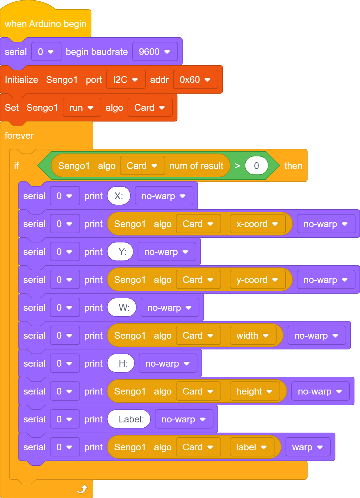
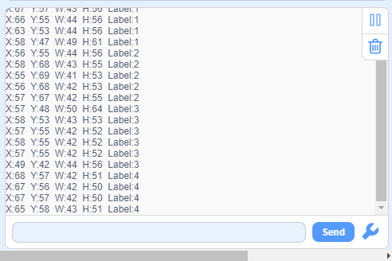

# 4.5 Card Recognition

## 4.5.1 Algorithm

It can identify whether there are corresponding traffic cards in the image. If yes, it will return information including the coordinates, size, and label values of the cards.

--------

## 4.5.2 Classification Label

| Label | Definition  |           Pic           |
| :---: | :---------: | :---------------------: |
|   1   | go forward  |  |
|   2   |  turn left  |  |
|   3   | turn right  |  |
|   4   | turn around |  |
|   5   |    stop     |  |

Note: The algorithm can only recognize one card at a time. The card can still be recognized within a certain rotation, deflection and pitch angle. When using, please make the card face the camera as directly as possible for better recognition.

------------

## 4.5.3 Test Code

1. In the code start-up, set the serial port baud rate to `9600`, and then set the communication mode of the AI vision module to `I2C`, and finally set it to run in `Card` mode.

2. The if block determines the number of detections. Only when the number of detections is greater than 0 will the data be output. Note to choose `Card`.
2. The serial port prints the recognized card data.

**Complete code:**

## 4.5.4 Test Result

After uploading the code, the AI vision module will scan the area captured by the camera. If there is a card, it will be recognized and its coordinate(x, y), width(w), height(h) and label value will be printed in the serial monitor. 

