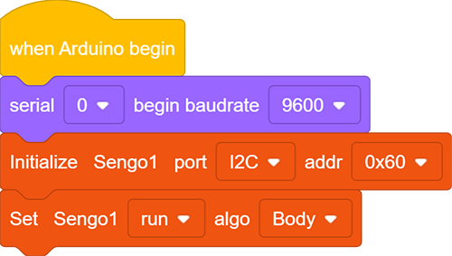
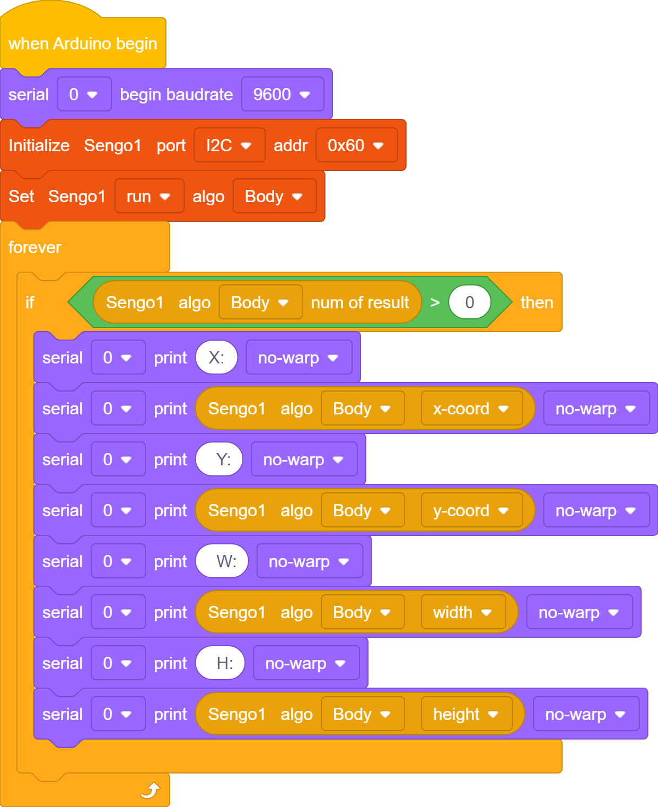
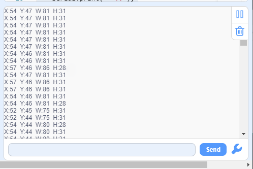

# 4.6 Body Detection

## 4.6.1 Algorithm

It determines whether there is a person in the image according to the outlines of the head and shoulders. If yes, it returns its coordinates and size.

---------------

## 4.6.2 Returned Values

When the controller acquires the recognition result, the algorithm will return the followings:

|  Parameter   |      Definition      |
| :----------: | :------------------: |
|   kXValue    | Central coordinate x |
|   kYValue    | Central coordinate y |
| kWidthValue  |       Width w        |
| kHeightValue |       Height h       |

----------

## 4.6.3Tips of Body Algorithm

1. Compared with a human facing from the side and back, the detection results will be more accurate when the person faces Sengo1 head-on.
2. The detection results will be more accurate when the color of the background is simple and obviously difference from that of the body dress.

-------

## 4.6.4 Test Code

1. In the code start-up, set the serial port baud rate to `9600`, and then set the communication mode of the AI vision module to `I2C`, and finally set it to run in `Body`.

2. The if block determines the number of detections. Only when the number of detections is greater than 0 will the data be output. Note to choose `Body`.

**Complete code:**

-----------

## 4.6.5 Test Result

After uploading the code, the AI vision module will scan the area captured by the camera. If there is a human body, it will be recognized and its coordinates, width and height will be printed on the monitor.

