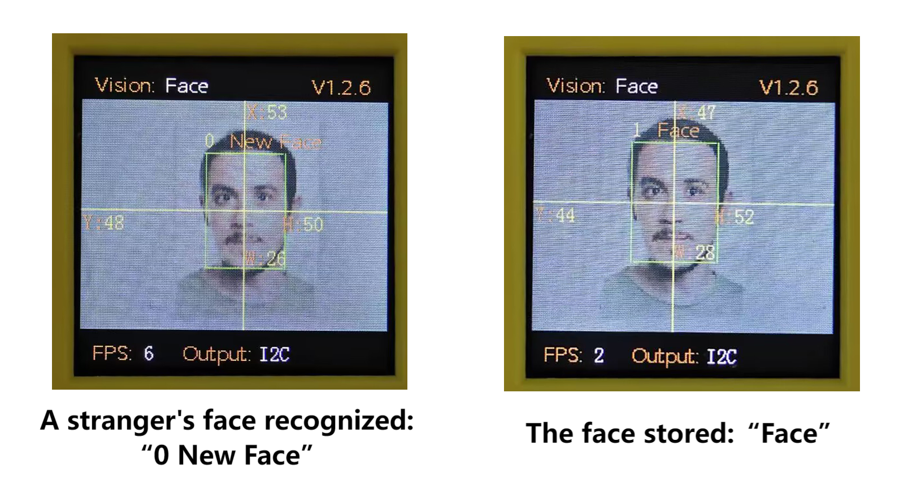
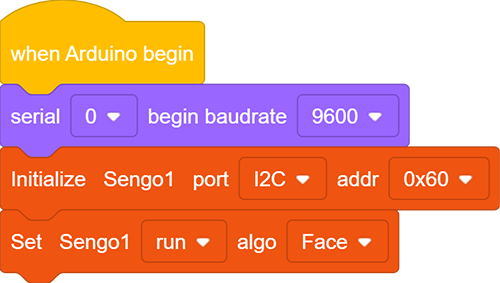
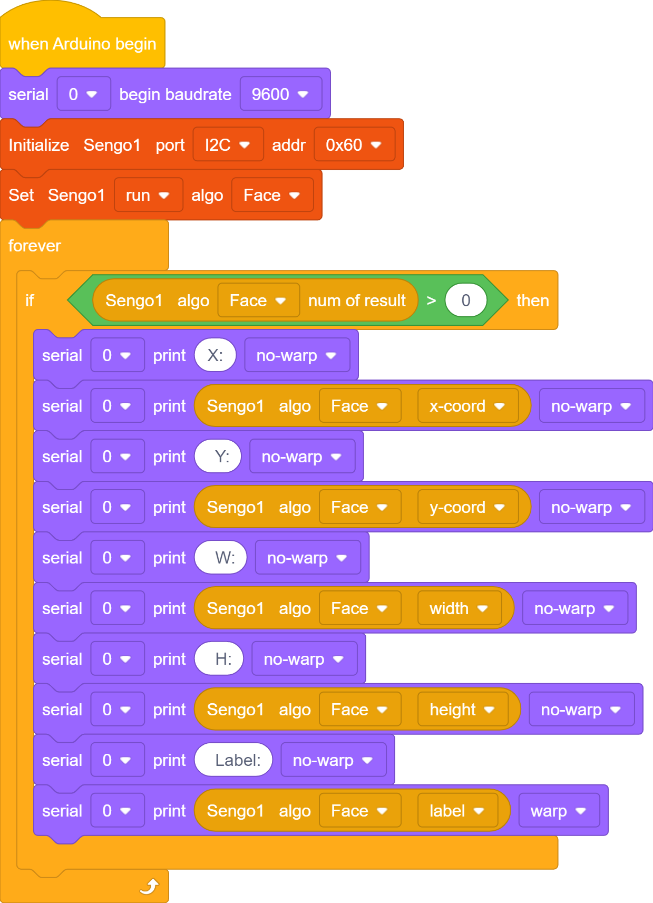
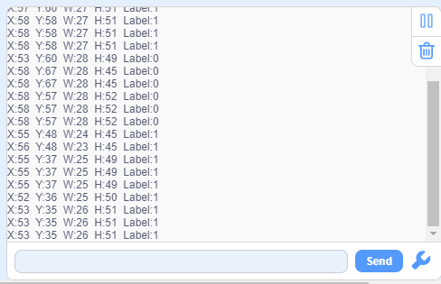

# 4.7 Face Recognition

## 4.7.1 Algorithm

It detects and recognizes human face in the image. Users can train to store or delete facial data by the function button. Sengo1 can store 10 faces at most.

-----------------

## 4.7.2 Classification Label

Sengo1 defines 11 classification labels for human faces:

| Label value | Meaning  | Label value |                Meaning                 |
| :---------: | :------: | :---------: | :------------------------------------: |
|      0      | New face |    1-10     | Classification number for stored faces |

New face (label value 0):

Stored face (label value 1-10):

---------------

## 4.7.3 Save Data

After enabling the face recognition algorithm, point the camera at the face, press the function button for 5 seconds and then release it. Sengo1 will start recording the face. After about 3 frames of data, the current facial data in the image will be saved in Flash and assigned an ID number.

The smallest number among the currently available numbers will be assigned to the label value. If there are no vacant numbers, Sengo1 will prompt a storage failure.

----------------

## 4.7.4 Delete Data

After storing, press the function button for about 10 seconds and then release it to delete the data just stored. Press it again for 10 seconds, and all the stored faces will be cleared. If no face has been stored after enabling the algorithm, all storage of faces will be directly cleared when you press the function button for 10 seconds.

------------------

## 4.7.5 Tips of Face Recognition Algorithm

1. When the ambient light is sufficient, the complete face is directly facing the camera and occupies a large field of view, the module can recognize it much better.
2. When wearing glasses or covered by hair/masks, the human face may not be detected.

----------------

## 4.7.6 Test Code

1. In the code start-up, set the serial port baud rate to `9600`, and then set the communication mode of the AI vision module to `I2C`, and finally set it to run in `Face` mode.

2. The if block determines the number of detections. Only when the number of detections is greater than 0 will the facial data be output. Note to choose `Face`.

**Complete code:**

--------------------

## 4.7.7 Test Result

After uploading the code, press and hold the function button for 5 seconds, and then the module will starts to learn and record the face on the screen. When encountering new faces, prompts will be given on it.

