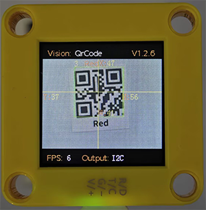
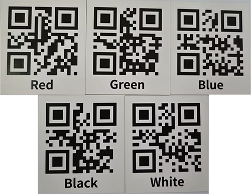
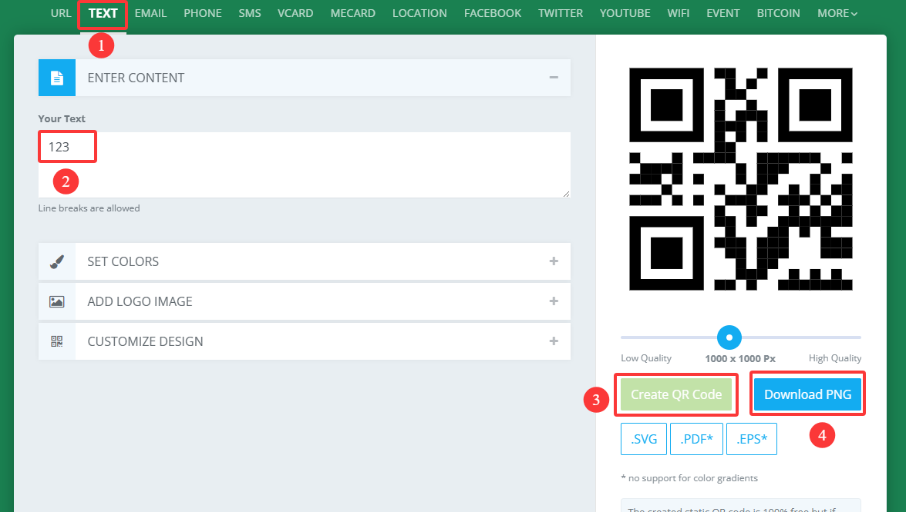
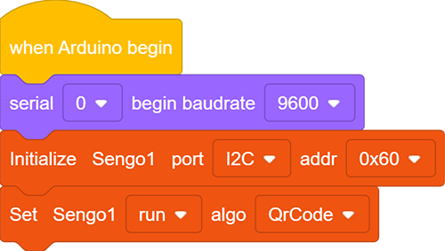
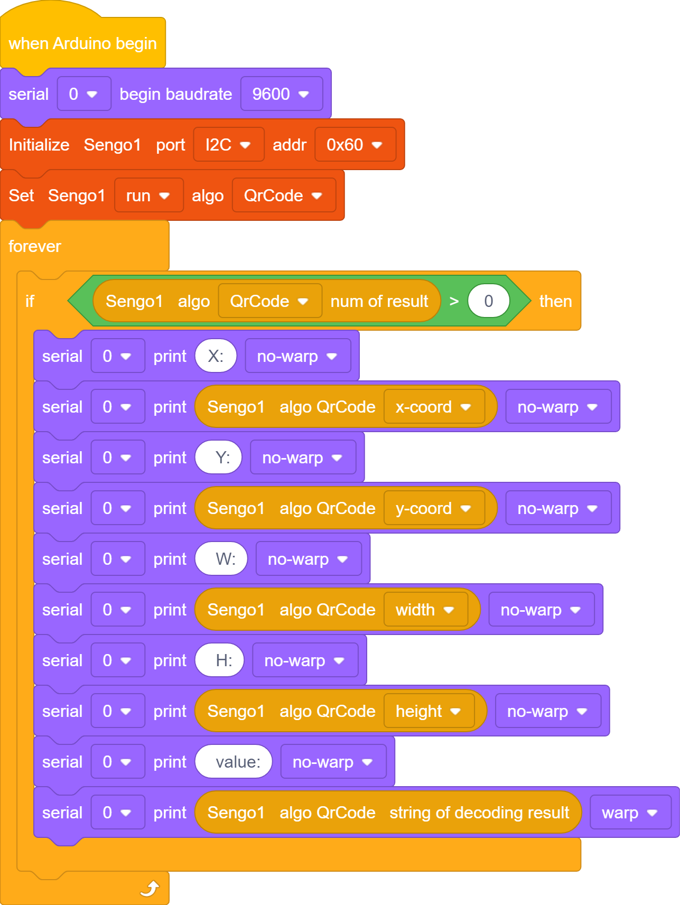
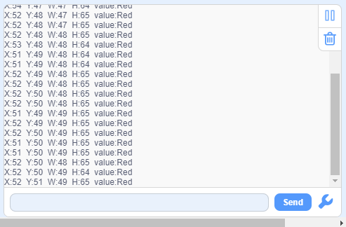

# 4.8 QR Code Recognition

## 4.8.1 Algorithm

It can recognize a simple QR code and return its coordinates, size and text content, but the QR code information should not exceed 10 bytes. ASCII code characters can be displayed on the screen. Note that if it is a Chinese QR code, it cannot be displayed, but the recognition result can still be read by the main control.

-------------

## 4.8.2 Code Blocks

1.  reads the coordinates x, y and sizes w, h of the QR code, as shown in the following table:

| Parameter |          Attribute           |
| :-------: | :--------------------------: |
|  x-coord  | QR code central coordinate x |
|  y-coord  | QR code central coordinate y |
|   width   |       QR code width w        |
|  height   |       QR code height h       |

2.  reads the content stored in the QR code, such as “Red”, “Green” …

----------

## 4.8.3 Generate a QR Code

We provide 5 paper QR code cards, with the contents of “Red”, “Green”, “Blue”, “White”, “Black” respectively.

If these QR codes do not meet your needs, you can search for “QR code generation for free” in your browser. There will be many links for generating QR codes online. Just find the one you like and use it. Here we also provide a generator:

[Online QR code generator](https://www.qrcode-monkey.com/#text)

After entering the link:

① Select the TEXT format

② Input the text to be generated (no Chinese characters, no more than 10 characters)

③ Click to generate a QR code

④ Download the QR code image

------------

## 4.8.4 Test Code

1. In the code start-up, set the serial port baud rate to `9600`, and then set the communication mode of the AI vision module to `I2C`, and finally set it to run in `QrCode` mode.

2. The if block determines the number of detections. Only when the number of detections is greater than 0 will the data be output. Note to choose `QrCode`.

**Complete code:**

-------

## 4.8.5 Test Result

After uploading the code, the AI vision module will detect the area captured by the camera. If there is a QR code, it will be recognized and its size and content will be printed on the serial monitor.

