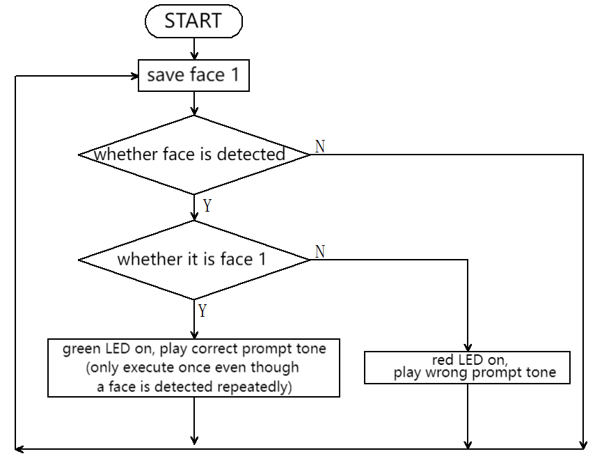
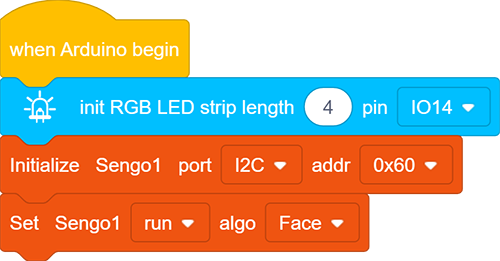
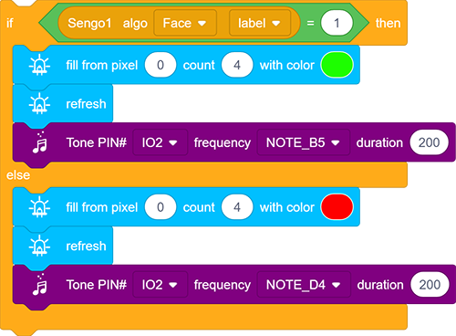
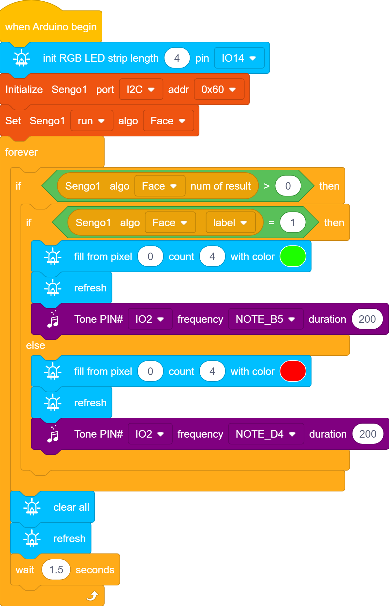

# 5.1 Face Unlock

## 5.1.1 Overview

For face unlock, the module determines whether the face is a stored one. If it is, a correct prompt tone will be played with the green LED on; if not, an error prompt tone will be played with a red LED on. We can train and store faces by long-pressing the function button of the module, and then it will recognize the face by code.

## 5.1.2 Code Flow

## 5.1.3 Test Code

Since the AI vision module interacts with the KS5002 car robot, the functional blocks of the car will be used. So please load the extension of this robot for direct use if you want to build blocks manually. 

1.In the code start-up, initialize the RGB LED, and then set the communication mode of the AI vision module to `I2C`, and finally set it to run in `Face` mode.

2.The if block determines the number of detections. Only when the number of detections is greater than 0 will the facial data be output. Note to choose `Face`. 

Determine whether face `lebel` = 1. If yes, the speaker makes a sound to indicate correctness and RGB LED turns on in green. If not, RGB LED will emit red light with buzzer playing a wrong prompt sound.

3. At last, add blocks to turn the RGB LED off and delay for 1.5s.

**Complete code:**

## 5.1.4 Test Result

After uploading the code, the AI vision module will detect the image captured by the camera to determine if there is a face. If there is, it will judge whether it is the one we set. If yes, the car will emit a correct prompt tone with green LED on. If not, the car will emit a wrong prompt sound with red LED on.

