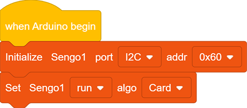
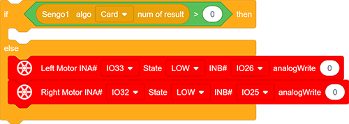
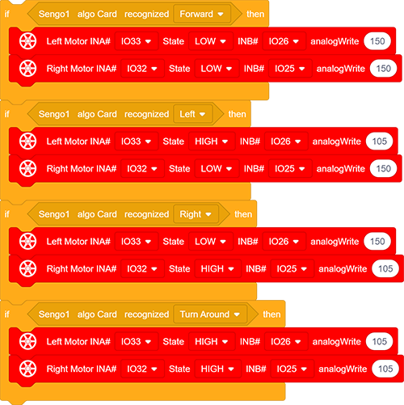
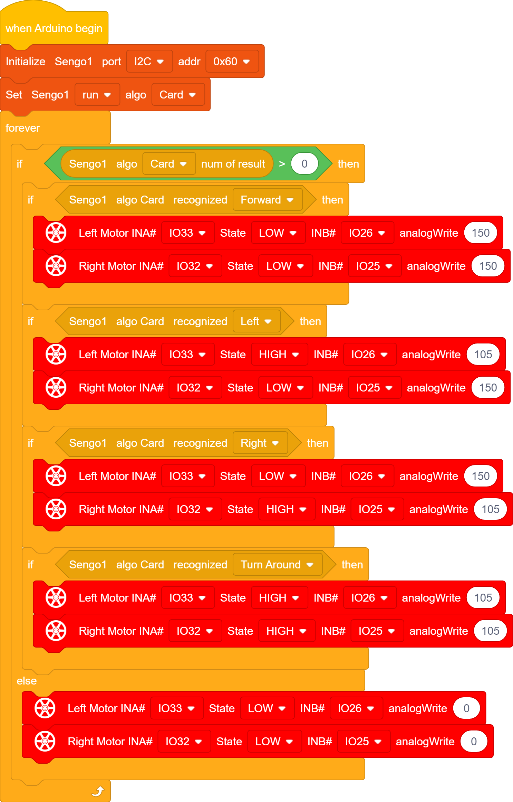

# 5.2 Card Control Car

## 5.2.1 Overview

In this project, we control the car through traffic cards, including “forward”, “turn left”, “turn right”, “turn around(back)” and “stop”. The AI vision module can recognize them and control the car to perform corresponding actions based on the cards.

## 5.2.2 Code Flow

## 5.2.3 Test Code

Since the AI vision module interacts with the KS5002 car robot, the functional blocks of the car will be used. So please load the extension of this robot for direct use if you want to build blocks manually. 

1.In the code start-up, set the communication mode of the AI vision module to `I2C`, and set it to run in `Card` mode. 

2.The if block determines the number of detections. Only when the number of detections is greater than 0 will the data be output. Note to choose `Card`. Add the code for the car to stop below the else.

3.The if block detects the card `label`. You can check card label values in the project Card Recognition, such as, label =1: forward, label = 2: turn left; label = 3: turn right; label = 4: turn around(backward). 

After recognition, the car will perform corresponding actions.

**Complete code:**

## 5.2.4 Test Result

After uploading the code, the AI vision module will detect the captured image to determine if there is a traffic card. If there is, the module controls the car to perform corresponding actions, including `Forward`(going forward), `Left`(turning left), `Right`(turning right), and `Turn around`(going back).

