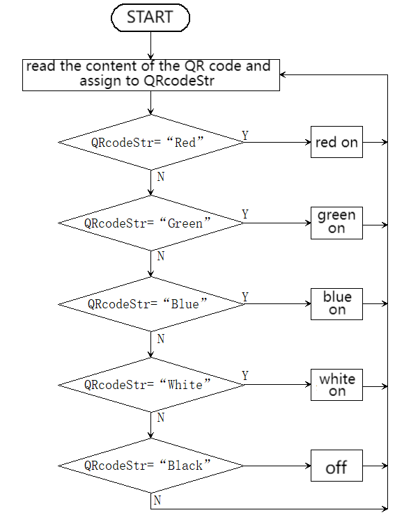
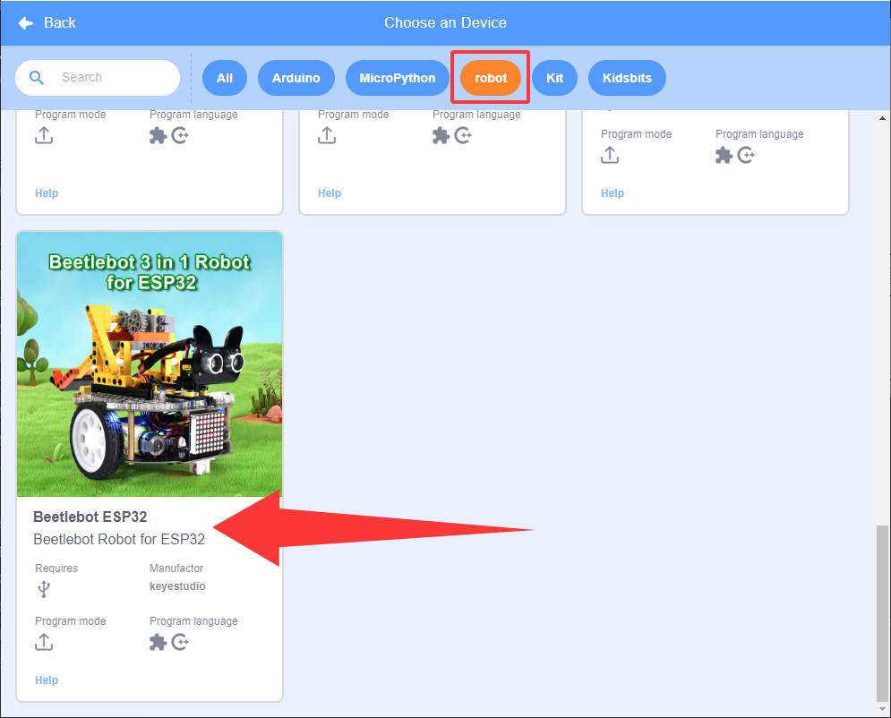
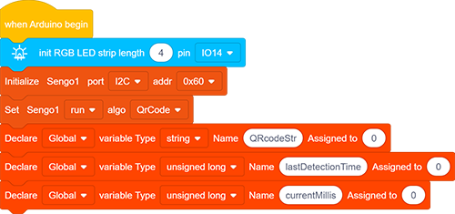
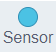
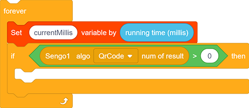
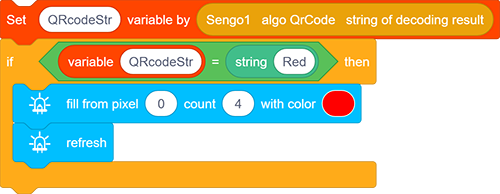
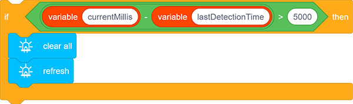
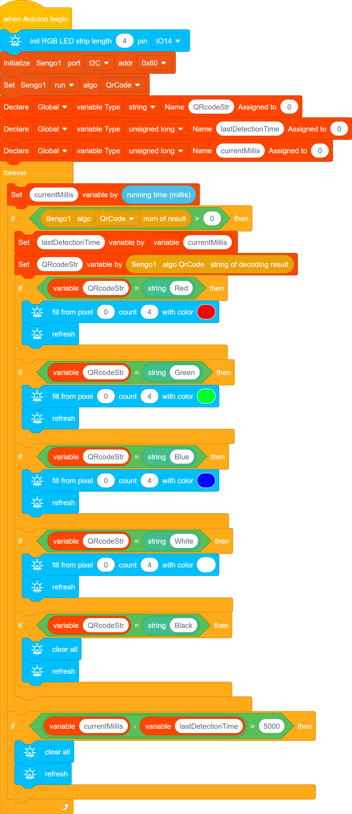

# 5.4 QR Code Control Light

## 5.4.1 Overview

In this project, we control the car light by QR codes. Herein, the AI vision module will recognize QR codes and read their content(color information) to light up the WS2812 in corresponding colors, including red, green, blue, black(off), and white. If you want to generate a brand-new QR code, please refer to the tutorial in `4.8 QR Code Recognition`.

## 5.4.2 Code Flow

## 5.4.3 Test Code

Since the AI vision module interacts with the KS5002 car robot, the functional blocks of the car will be used. So please load the extension of this robot for direct use if you want to build blocks manually. 

1.In the code start-up, initialize the RGB LED, and then set the communication mode of the AI vision module to `I2C`, and set it to run in `QrCode`. 

Define three variables, namely a String variable `QRcodeStr`, an unsigned long variable `lastDetectionTime`, and another unsigned long variable `currentMillis`.

2.Assign the running time(m) to `currentMillis`. In ,  returns the running time calculated from the time the development board is powered on (unit: mS).

3.Assign the start time obtained from `currentMillis` to `lastDetectionTime`, and assign the content of the QR code read by the AI vision module to `QRcodeStr`. 

The if block checks whether the value of `QRcodeStr` is equal to the corresponding character “Red” in the QR code. If yes, light up in red. If not, compare whether it is any other included characters. If none of them match, the LED remains off.

4.Similarly, add if blocks to include “Green”, “Blue”, “White”, “Black”.

5.Add a timing code to the outermost loop block. Its function is that, when the last time the AI vision module recognizes the content of the QR code, the RGB LED will light up and then go off after 5 seconds (if QR codes are always being recognized, it will not turn off).

**Complete code:**

## 5.4.4 Test Result

After uploading the code, the AI vision module will detect the captured image to determine if there is a QR code. If there is, the content of the QR code will be assigned to a variable, and the module will check whether it is the corresponding content. Then, the WS2812 will turn on in the color given by the QR code, including “Red”, “Green”, “Blue” and “White”, and it will turn off if QR code says “Black”. If the QR code is not detected within 5 seconds, the WS2812 will also turn off.