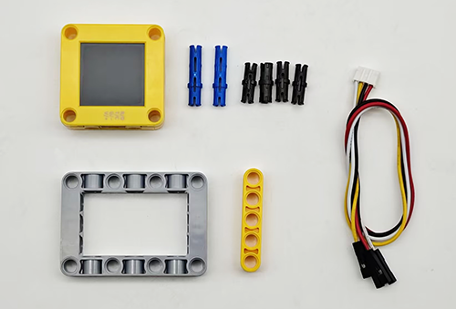
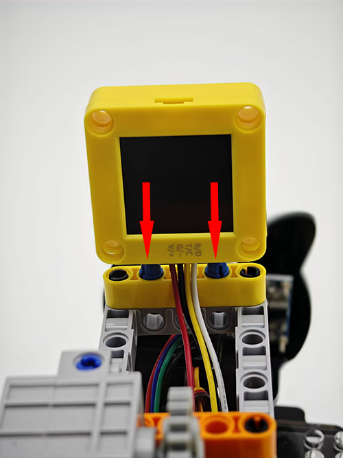
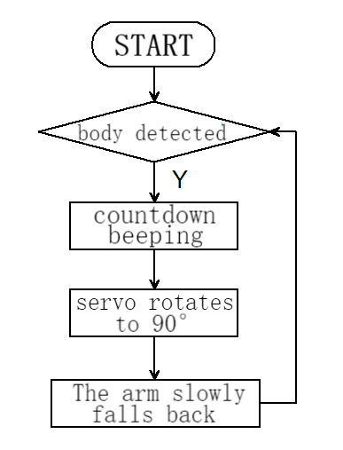
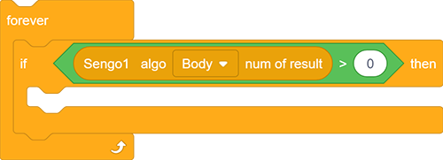
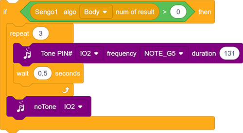
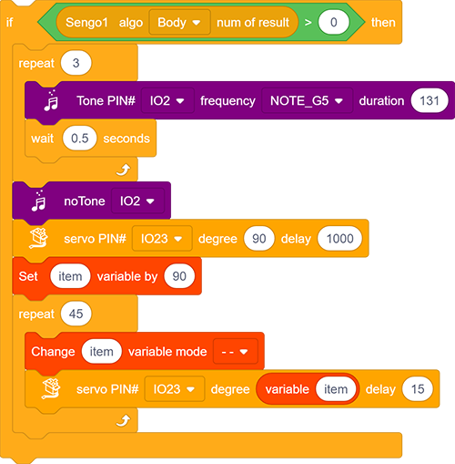
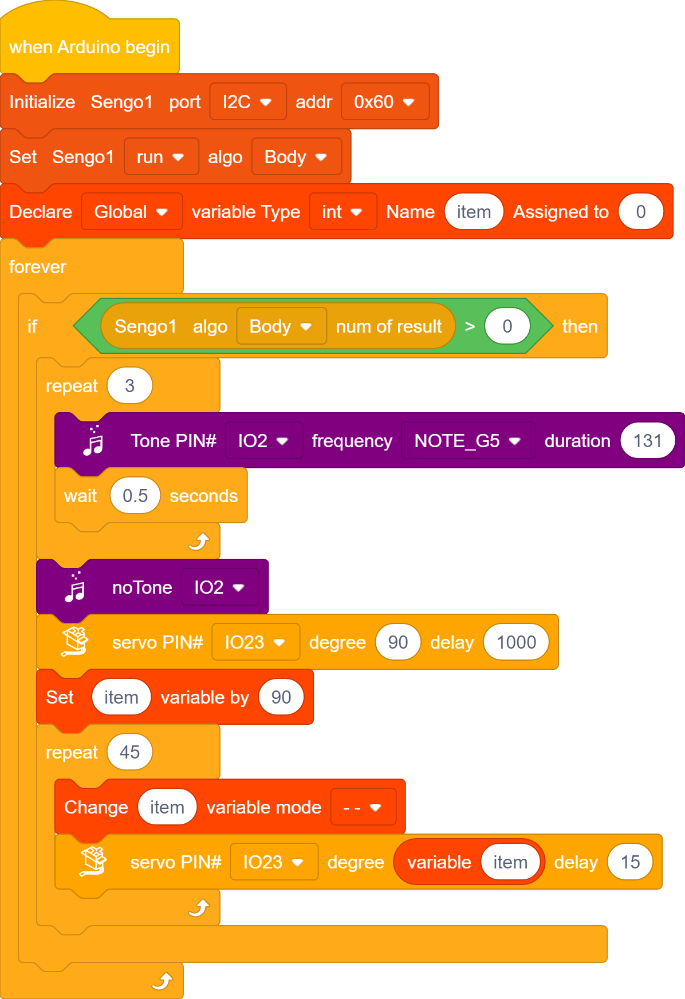

# 5.5 Smart Stone Thrower

## 5.5.1 Overview

In this project, we build an interesting stone thrower car with automatic recognition by the AI vision module. We first need to mount the module on the car to enable its recognition function. If a human body is detected, the buzzer will emit a countdown beeping from three and then the car will perform a throw. After that, the throwing arm will slowly lower down to wait for the next recognition of a body.

## 5.5.2 Mount the AI module to the stone thrower car

Note: Please install the "Stone Thrower" first according to the robot car tutorial, and then follow the installation steps below.

**Required Parts**

**Step 1**

**Step 2**

**Step 3**

**Step 4**

| AI vision module | Car interface |
| :--------------: | :-----------: |
|   T/C (yellow)   |      SCL      |
|   R/D (white)    |      SDA      |
|    V/+ (red)     |      5V       |
|   G/- (black)    |       G       |

**Completed**

## 5.5.3 Code Flow

## 5.5.4 Test Code

If you want to build the code blocks by yourself, please load the functions of KS5002 robot car. Since the AI vision module needs to interact with this car, its functions will be used. After loading, we can directly drag its code blocks without adding them one by one.

1. Set the communication mode of the AI vision module to `I2C`, and set it to run in `Body` mode. Define a global int variable “item”.

2. The if block determines the number of detections. Only when the number of detections is greater than 0 will the data be output. Note to choose `BOdy`.

   

3. If “body” is detected, the buzzer emit countdown beeping of three times with an interval of  0.5S.

4. When the countdown ends, it throws the bottle: Set the servo to rotate to 90° with a delay of 1000ms. 

	After that, the throwing arm slowly puts down back: First set variable “item” to 90, and then repeat 45 times and subtract 1 from “item” in each loop; Set “item” as angle value followed by a 15ms delay. In this way, the servo will control the arm to slowly fall back once per loop.

**Complete code:**

## 5.5.5 Test Result

After uploading the code, the AI vision module will activate the “Body” mode and then recognize the captured images to determine if there is a human. If yes, it will perform a throw. Before the throw, there will be three prompt sounds as a countdown. Once the countdown ends, the throw will proceed. After that, the throwing arm will slowly fall back to wait for the next instruction.
