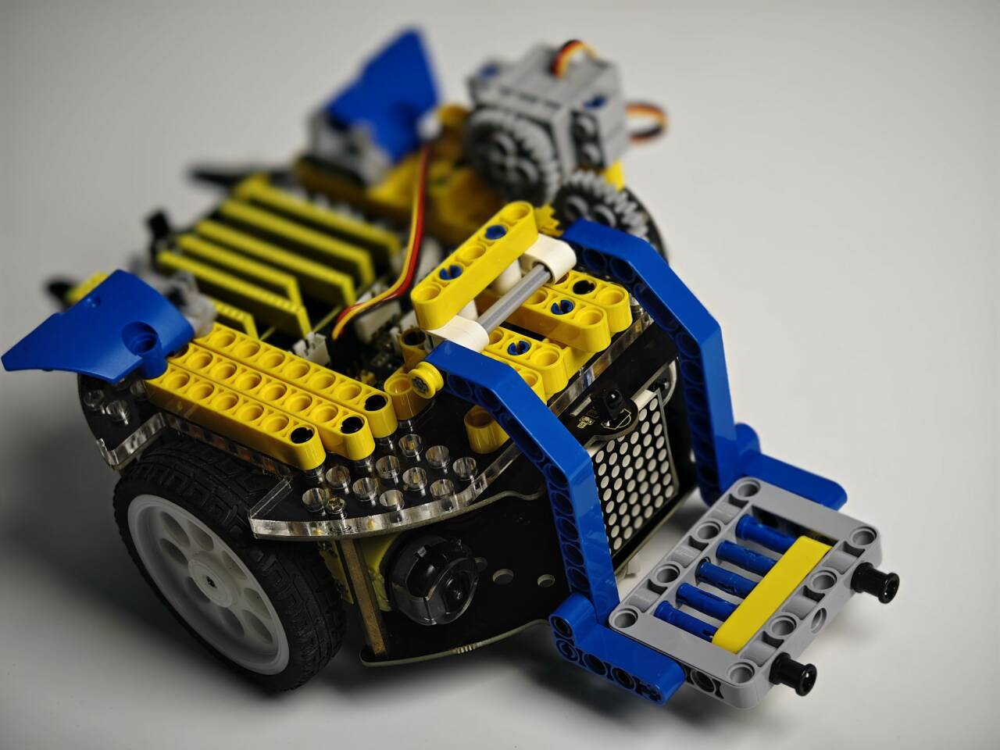
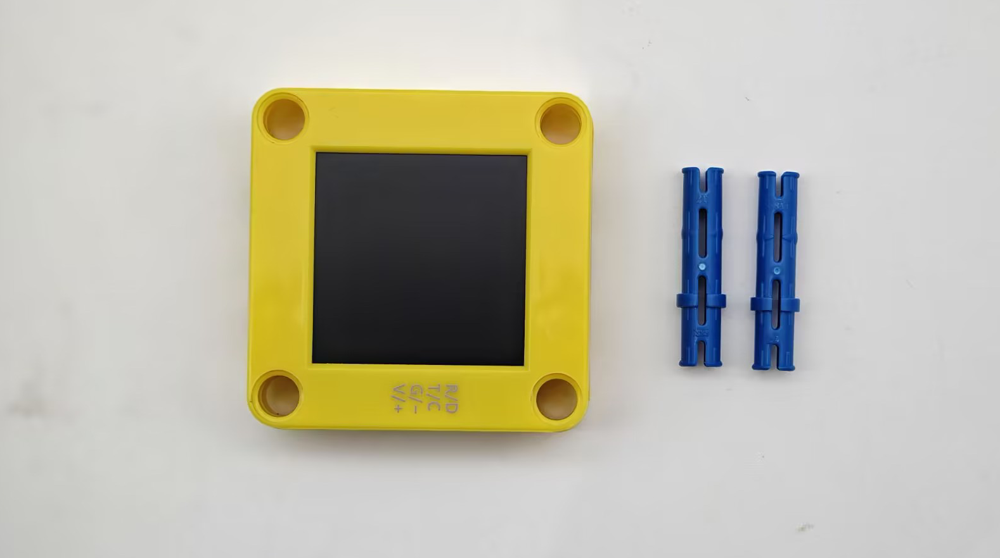
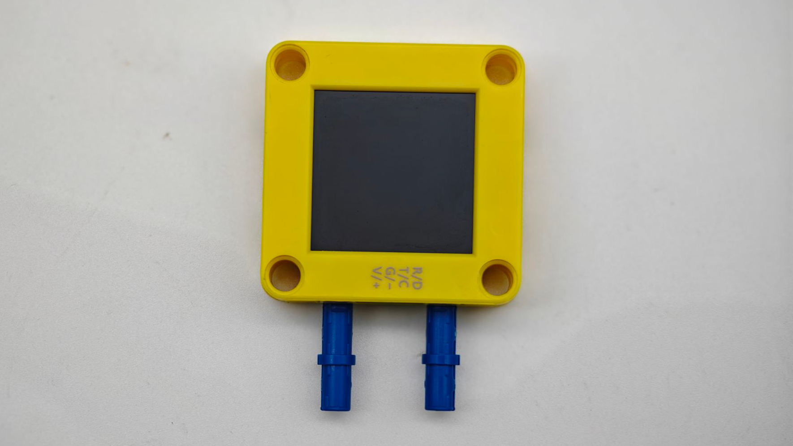
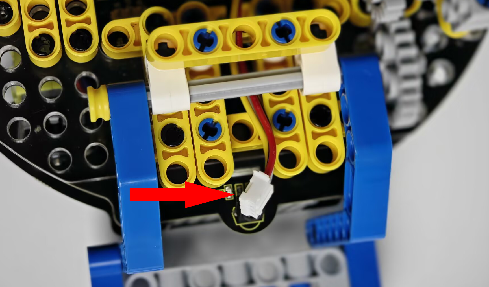
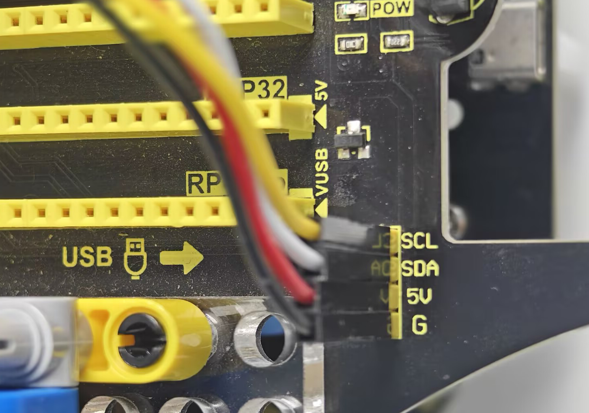

# Mount the AI Vision Module onto the KS5002 Car

Here we demonstrate how to mount this module on the `Handling Robot`, a Lego mini car of our KS5002 product as shown below:

Get the vision module and Lego long pins ready:

Insert the Lego pins into the Lego holes on both sides of the module interface.

Pass the wires of the module through the Lego gap of the car for wiring.

Connect the AI terminal to this module and then mount it to the car via Lego, as shown below:

Finally, connect the wire to the I2C interface. Be careful not to connect the wires wrongly:

| AI vision module | Car interfaces |
| :--------------: | :------------: |
|   T/C (yellow)   |      SCL       |
|   R/D (white)    |      SDA       |
|    V/+ (red)     |       5V       |
|   G/- (black)    |       G        |

