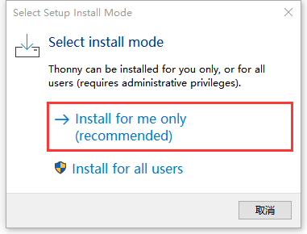
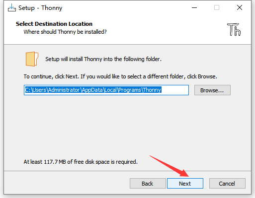
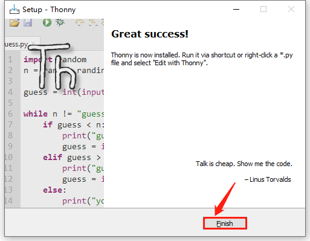
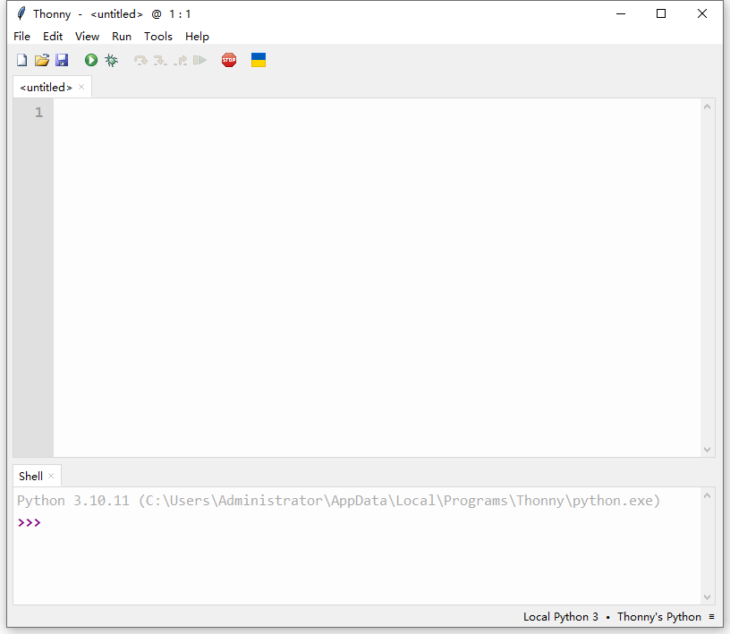

MicroPython is a streamlined implementation of the Python 3 language, which includes a small part of the Python standard library and is optimized to run in microcontrollers and restricted environments. Here are the main features of MicroPython:

1. **Compatibility** : MicroPython strives to be as compatible as possible with regular Python (referred to as CPython), which means that if you know Python, you have already mastered the basics of MicroPython.
2. **Hardware Access** : In addition to implementing a series of core Python libraries, MicroPython also includes modules such as “machines” for accessing low-level hardware, enabling developers to directly control the hardware resources of microcontrollers.
3. **Interactive Prompt (REPL)** : MicroPython offers an interactive prompt (REPL) that enables users to execute commands directly from a desktop computer on an embedded platform. This is very useful for the rapid real-time testing and debugging of embedded systems.
4. **Multi-threading support** : The MicroPython firmware supports multi-threading functionality, which enables a single microcontroller to handle multiple embedded tasks simultaneously, thereby accelerating the execution of embedded applications.
5. **Open-source Project** : MicroPython is an open-source project, and its source code can be obtained on Github. It follows the MIT license and can be used freely for educational and commercial purposes.
6. **Wide Support** : MicroPython supports a variety of microcontroller boards and RTOS (Real-time Operating System), such as ESP32, ESP8266, STM32, Pico, etc. In addition, it also offers a rich library and modules to meet different development needs.

# 2.1 Download Thonny

## 2.1.1 For Windows

**Operating System: Windows 10**

Enter [Thonny IDE official](https://thonny.org) to download the Thonny for Windows version. 

## 2.1.2 For MAC

Please refer to Windows.

# 2.2 Install Thonny

Thonny supports two installation methods:

- Thonny+Python package

	Python IDE and Thonny are packaged together and can be directly installed and used. It is fast and easy so is recommended for beginners. There are also two ways to install this package:

	- Installer

		

	- Portable variant

	  

- Thonny only

  Thonny is actually a package of python. When the user already has a python environment, click `pip install thonny` to install Thonny only, which is more suitable for developers.

  

Please download the corresponding version according to your requirements.

## 2.2.1 Installer

Download the app according to your operation system. Here we demonstrate under 64bit Windows 10 to download `Installer with 64-bit Python 3.10`.

(1) Click  and you will see “Select Setup Install Mode”. Choose **Install for me only**.

(2) **Next**.

(3) Tick **I accept the agreement** and Click **Next**.

(4) The default installation path is in Disk C. You may click **Browse...** to choose another disk. And then click **Next**.

(5) By default, a shortcut to the program is created in the Start menu folder. Click **Browse...** to set another path for the shortcut and **Next**.

(6) Tick **Create desktop icon** and **Next**.

(7) Install.

(8) “**Finish**”!

(9) Back to the desktop and start Thonny to choose a language.

(10) Done.

## 2.2.2 Portable Variant

Download the app according to your operation system. Here we demonstrate under 64bit Windows 10 to download `Installer with 64-bit Python 3.10`.

(1) Click  to start Thonny and choose a language.

(2) Done.

# 2.3 Burn Firmware (Important)

To run MicroPython code on Pico, it is necessary to burn MicroPython firmware to Pico.

A. Connect the board to your computer via Micro USB.

B. Press and hold the white button (BOOTSEL) on “Raspberry Pi Pico”. Then, connect the Raspberry Pi Pico to the computer via a microUSB cable.

C. Release the button. After connection, open [Device Manager] and your computer will automatically recognize the removable disk (RPI-RP2) as follows:

D. Copy the `RPI_PICO-20250809-v1.26.0.uf2` file from the “Firmware” folder to the removable disk (RPI-RP2), just like copying a file to a USB flash drive, and then wait for it to complete.

E. After burning the firmware, Raspberry Pi Pico will restart. After that, you can run Micropython.

# 2.4 Homepage

Click **View** and tick **Files** to open the file manager.

# 2.5 Toolbar

|              Icon              |       Function       |
| :----------------------------: | :------------------: |
|  |         New          |
|  |       Open...        |
|  |         Save         |
|  |  Run current script  |
|  | Debug current script |
|  |      Step over       |
|  |      Step into       |
|  |       Step out       |
|  |        Resume        |
|  | Stop/Restart backend |

# 2.6 Connect Pico to Thonny

Connect the Pico development board to the computer, then set the development board to Pico and select the port. 

Click `Tools`-->`Options...`

Select `Interpreter` , then set the development board to `MicroPython(Raspberry Pi Pico)`, and choose the ports automatically recognized, and click `OK`.

After connection, “Raspberry Pi Pico” will appear on the left side of Thonny and there will also be a prompt in the lower right corner.

# 2.7 Load Code from Computer

Note: You need to download the required data files from `1.Download code and library files` and extract them to your desktop.

Click Files –> This computer, open the file `Resources`.

Enter `codes` and you can see the codes. Click it to open the file in Thonny.

# 2.8 Upload Library to Pico

Errors may be reported during running code without saving the library to Pico.

**Add library:** 

In Files, open `Resources` –> `lib` to check library:

Choose `Sengo1.py` to “Upload to/”.

After that, `Sengo1.py` is displayed in “Raspberry Pi Pico”.

# 2.9 Online Running

Here we take code file “4_1Color.py” as an example to run online.

Open “4_1Color.py” in Files and click . Note that wrong wiring of Sengo1 AI and Pico will cause errors in output. If you want to stop current run, just click .

# 2.10 Offline Running

Here we use “4_1Color.py” again. 

Click  followed by “Raspberry Pi Pico” and select “New file...”.

Name it to `main.py`. (Note: It must be `main.py`. This name cannot be changed or entered incorrectly.)

The file was created successfully.

Open the “4_1Color.py” code file and then press “Ctrl + A” and “Ctrl + C”. Open “main.py” to “Ctrl + V” in it.

Click Save.

Saved successfully. Now, when the Pico development board is powered on again, the code in `main.py` will run automatically. (Note: When saving, you need to stop the running of the online code; otherwise, it may fail to be saved.)

