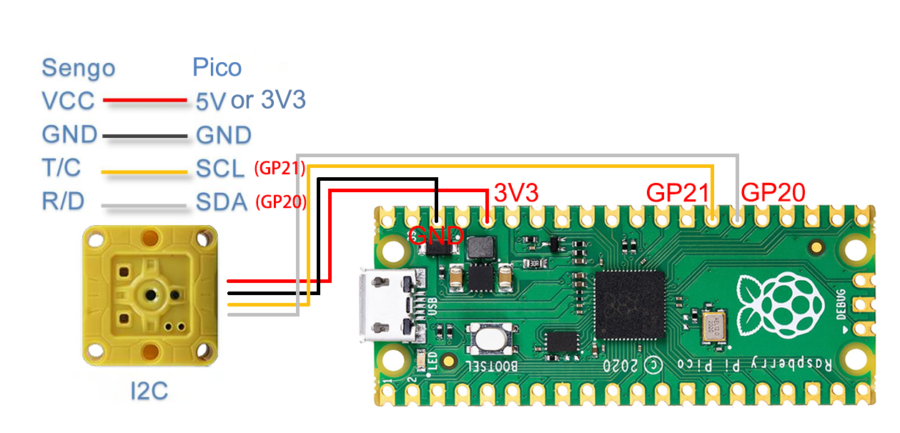

# 3.1 Wiring

This kit code is applicable to the Pico development board (it can be used as a reference for other development boards because the AI vision module is used as an I2C slave, so as long as the I2C is used for reading, the relevant data can be read).

Note: The AI vision module requires a considerable amount of power during operation. It is recommended to connect to an external power supply!

