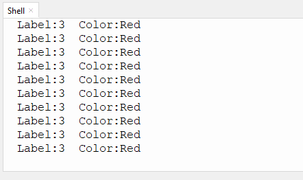
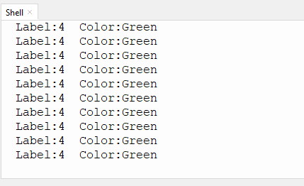

# 4.1 Color Recognition

## 4.1.1 Algorithm


It will specify one or more recognition areas, whose positions and sizes can be set as needed, and then it will return the color label of this area as well as the red component value R, green component value G and blue component value B.

---------------------

## 4.1.2 Color Label

Sengo1 defines 7 colors of labels:

|  Label value   | Meaning |   Label value   | Meaning |
| :------------: | :-----: | :-------------: | :-----: |
| 1(kColorBlack) |  Black  | 2(kColorWhite)  |  White  |
|  3(kColorRed)  |   Red   | 4(kColorGreen)  |  Green  |
| 5(kColorBlue)  |  Blue   | 6(kColorYellow) | Yellow  |

<span style="color:red;font-size:20px;">Note: Common colors not listed in the table, such as purple, cyan(blue-green), orange, and gray, have relatively low color discrimination and are easily misidentified as the colors in the table. Therefore, they are classified as unknown ones. If you need to recognize the above colors, you can make your own judgment based on the returned RGB values.</span>

Sample 1:


The serial port outputs the label values:



Sample 2:


The serial port outputs the label values:



-------------------------

## 4.1.3 Configuration Parameters

Users can set the coordinates of the recognition area and the size of the recognition box. Parameters are defined as follows:

| Parameter |                  Definition                  |
| :-------: | :------------------------------------------: |
|  1（x）   | Central coordinate x of the recognition area |
|  2（y）   | Central coordinate y of the recognition area |
|  3（w）   |       Width w of the recognition area        |
|  4（h）   |       Height h of the recognition area       |
|     5     |                     null                     |

Code: `sengo1.SetParam(sengo1_vision_e.kVisionColor,[x, y, w, h, 1])`

```python
# 3. The aspect ratio of the Sengo1 image is 4:3. When the width-to-height is set to 3:4, the recognition area is a square. When the width-to-height is set to 1:1, the recognition area is rectangular.
sengo1.SetParam(sengo1_vision_e.kVisionColor,[50, 50, 3, 4, 1])
```

---------------

## 4.1.4 Returned Values

When the main controller acquires the detection results, the algorithm will return the followings:

| Formal parameter |                   Definition                   |
| :--------------: | :--------------------------------------------: |
|     kRValue      |  red component value R, with a range of 0-255  |
|     kGValue      | green component value G, with a range of 0-255 |
|     kBValue      | blue component value B, with a range of 0-255  |
|      kLabel      |               color label value                |

Code:

```python
        # Read the value of the color label
        label = sengo1.GetValue(sengo1_vision_e.kVisionColor,sentry_obj_info_e.kLabel)
```

--------------------

## 4.1.6 Tips of Color Recognition Algorithm

1. When the recognition area is relatively small, such as 2x2, although the recognition speed is fast, there will be an impact on results due to the small number of pixels, thus with low credibility. It is only suitable for scenarios with a single controllable background.
2. When the recognition area is large, such as 20x20 with the large number of pixels, the interference of variegated colors will be filtered out, resulting in a relatively high credibility, but the recognition speed is slow.
3. Within the recognition area, when the areas occupied by different colors are approximately the same, the results may repeatedly change.

-----------------------

## 4.1.7 Test Code

```python
from machine import I2C,UART,Pin
from  Sengo1  import *
import time
import random

color_Name = [" ","Black","Whiet","Red","Green","Blue","Yellow"]

# Wait for Sengo1 to initialize the operating system. This waiting time cannot be removed to prevent the situation where the controller has already developed and sent instructions before Sengo1 has been fully initialized
time.sleep(3)

# Select UART or I2C communication mode. Sengo1 is I2C mode by default. You can change it by just pressing the mode button.
# 4 UART communication modes: UART9600(Standard Protocol Instruction); UART57600(Standard Protocol Instruction), UART115200(Standard Protocol Instruction); Simple9600(Simple Protocol Instruction)
# port = UART(2,rx=Pin(16),tx=Pin(17),baudrate=9600)
port = I2C(0,scl=Pin(21),sda=Pin(20),freq=400000)

# Sengo1 communication address: 0x60. If multiple devices are connected to the I2C bus, please avoid address conflicts.
sengo1 = Sengo1(0x60)


err = sengo1.begin(port)
if err != SENTRY_OK:
    print(f"Initialization failed，error code:{err}")
else:
    print("Initialization succeeded")

# 1. The default parameters of the algorithm. If they do not need to be changed, this line of code can be deleted
# 2Only two algorithms, color recognition and color block detection, require parameter settings.
# 3. The aspect ratio of the Sengo1 image is 4:3. When the width-to-height is set to 3:4, the recognition area is a square. When the width-to-height is set to 1:1, the recognition area is rectangular.
sengo1.SetParam(sengo1_vision_e.kVisionColor,[50, 50, 3, 4, 1])
time.sleep(0.1)

# Sengo1 can only run one recognition algorithm at a time.
err = sengo1.VisionBegin(sengo1_vision_e.kVisionColor)
if err != SENTRY_OK:
    print(f"Starting algo Color failed，error code:{err}")
else:
    print("Starting algo Color succeeded")

       
while True:   
    # Sengo1 does not actively return the detection and recognition results; it requires the main control board to send instructions for reading.
    # The reading process: 1.read the number of recognition results. 2.After receiving the instruction, Sengo1 will refresh the result data. 3.If the number of results is not zero, the board will then send instructions to read the relevant information. (Please be sure to build the program according to this process.)
    # Sengo can output at most one recognition result.
    obj_num = (sengo1.GetValue(sengo1_vision_e.kVisionColor, sentry_obj_info_e.kStatus))
    if obj_num:
        # Read the value of the color label
        label = sengo1.GetValue(sengo1_vision_e.kVisionColor,sentry_obj_info_e.kLabel)
        # Output the label value and color name
        print(f"Label:{label}  Color:{color_Name[label]}")
        time.sleep(0.2)
```

----------------

## 4.1.8 Test Result

After uploading the code, align the recognition box on the module with the color to be recognized, and the it will change to the same color as the recognized one. Then, its label value and the color name will be printed on the serial monitor.


