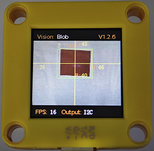
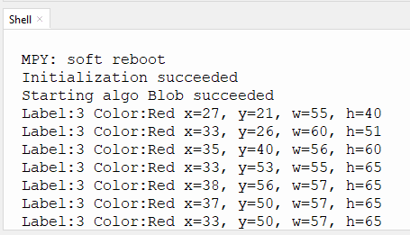

# 4.2 Color Block Detection

## 4.2.1 Algorithm



We specify a certain detection color, and it will determine whether there is a block of that color in the image. If yes, it will return its coordinates and size. The color label is the same as that in color recognition algorithm.

---------------------------

## 4.2.2 Configuration Parameters

The minimum detected color block size is configured here. You can modify the values of width and height:

Users can set the size and the label value of the color to be recognized. Parameters are defined as follows(It can only recognize one color):

Code:

```python
# The '#' symbol comments out the color blocks that do not need to be recognized
#sengo1.SetParam(sengo1_vision_e.kVisionBlob,[0, 0, 6, 6, color_label_e.kColorBlack], 1)  #black
#sengo1.SetParam(sengo1_vision_e.kVisionBlob,[0, 0, 6, 6, color_label_e.kColorWhite], 1)  #white
sengo1.SetParam(sengo1_vision_e.kVisionBlob,[0, 0, 6, 8, color_label_e.kColorRed], 1)    #red
#sengo1.SetParam(sengo1_vision_e.kVisionBlob,[0, 0, 6, 8, color_label_e.kColorGreen], 1)  #green
#sengo1.SetParam(sengo1_vision_e.kVisionBlob,[0, 0, 8, 8, color_label_e.kColorBlue], 1)   #blue
#sengo1.SetParam(sengo1_vision_e.kVisionBlob,[0, 0, 8, 6, color_label_e.kColorYellow], 1) #yellow
```

-------------------

## 4.2.3 Returned Values

When the main controller acquires the detection results, the algorithm will return the followings:

| Formal parameter |            Definition            |
| :--------------: | :------------------------------: |
|     kXValue      | color block central coordinate x |
|     kYValue      | color block central coordinate y |
|   kWidthValue    |       color block width w        |
|   kHeightValue   |       color block height h       |
|      kLabel      |           color label            |

Code:

```python
        # Read the coordinates and size of the color block
        x = sengo1.GetValue(sengo1_vision_e.kVisionBlob, sentry_obj_info_e.kXValue)
        y = sengo1.GetValue(sengo1_vision_e.kVisionBlob, sentry_obj_info_e.kYValue)
        w = sengo1.GetValue(sengo1_vision_e.kVisionBlob, sentry_obj_info_e.kWidthValue)
        h = sengo1.GetValue(sengo1_vision_e.kVisionBlob, sentry_obj_info_e.kHeightValue)
        # Read the color label value of the color block
        label = sengo1.GetValue(sengo1_vision_e.kVisionBlob,sentry_obj_info_e.kLabel)
```

---------------------

## 4.2.4 Test Code

```python
from machine import I2C,UART,Pin
from  Sengo1  import *
import time
import random

color_Name = [" ","Black","Whiet","Red","Green","Blue","Yellow"]

# Wait for Sengo1 to initialize the operating system. This waiting time cannot be removed to prevent the situation where the controller has already developed and sent instructions before Sengo1 has been fully initialized
time.sleep(3)

# Select UART or I2C communication mode. Sengo1 is I2C mode by default. You can change it by just pressing the mode button.
# 4 UART communication modes: UART9600(Standard Protocol Instruction); UART57600(Standard Protocol Instruction), UART115200(Standard Protocol Instruction); Simple9600(Simple Protocol Instruction)
# Refer to the "Simple Protocol Instructions"
# port = UART(2,rx=Pin(16),tx=Pin(17),baudrate=9600)
port = I2C(0,scl=Pin(21),sda=Pin(20),freq=400000)

# Sengo1 communication address: 0x60. If multiple devices are connected to the I2C bus, please avoid address conflicts.
sengo1 = Sengo1(0x60)


err = sengo1.begin(port)
if err != SENTRY_OK:
    print(f"Initialization failed，error code:{err}")
else:
    print("Initialization succeeded")


# The '#' symbol comments out the color blocks that do not need to be recognized
#sengo1.SetParam(sengo1_vision_e.kVisionBlob,[0, 0, 6, 6, color_label_e.kColorBlack], 1)  #black
#sengo1.SetParam(sengo1_vision_e.kVisionBlob,[0, 0, 6, 6, color_label_e.kColorWhite], 1)  #white
sengo1.SetParam(sengo1_vision_e.kVisionBlob,[0, 0, 6, 8, color_label_e.kColorRed], 1)    #red
#sengo1.SetParam(sengo1_vision_e.kVisionBlob,[0, 0, 6, 8, color_label_e.kColorGreen], 1)  #green
#sengo1.SetParam(sengo1_vision_e.kVisionBlob,[0, 0, 8, 8, color_label_e.kColorBlue], 1)   #blue
#sengo1.SetParam(sengo1_vision_e.kVisionBlob,[0, 0, 8, 6, color_label_e.kColorYellow], 1) #yellow

# Wait for the recognition result to be produced after the new parameter takes effect. This time interval must not be less than the time it takes for the algorithm to recognize one frame. It can be estimated through the frame rate at the bottom of the screen after the algorithm is enabled
time.sleep(0.1)

# During normal use, the main controller sends commands to control the on and off of Sengo1 algorithm, rather than manual operation by joystick.
err = sengo1.VisionBegin(sengo1_vision_e.kVisionBlob)
if err != SENTRY_OK:
    print(f"Starting algo Blob failed，error code:{err}")
else:
    print("Starting algo Blob succeeded")


while True:
    # Sengo1 does not actively return the detection and recognition results; it requires the main control board to send instructions for reading.
    # The reading process: 1.read the number of recognition results. 2.After receiving the instruction, Sengo1 will refresh the result data. 3.If the number of results is not zero, the board will then send instructions to read the relevant information. (Please be sure to build the program according to this process.)
    obj_num = sengo1.GetValue(sengo1_vision_e.kVisionBlob, sentry_obj_info_e.kStatus)
    if obj_num:
        # Read the coordinates and size of the color block
        x = sengo1.GetValue(sengo1_vision_e.kVisionBlob, sentry_obj_info_e.kXValue)
        y = sengo1.GetValue(sengo1_vision_e.kVisionBlob, sentry_obj_info_e.kYValue)
        w = sengo1.GetValue(sengo1_vision_e.kVisionBlob, sentry_obj_info_e.kWidthValue)
        h = sengo1.GetValue(sengo1_vision_e.kVisionBlob, sentry_obj_info_e.kHeightValue)
        # Read the color label value of the color block
        label = sengo1.GetValue(sengo1_vision_e.kVisionBlob,sentry_obj_info_e.kLabel)
        # Print the label value and color name of the color block
        print(f"Label:{label} Color:{color_Name[label]}",end='')
        # Print the coordinates and size of the color block
        print(" x=%d, y=%d, w=%d, h=%d"%(x, y, w, h))
        time.sleep(0.2)  
```

----------------------------

## 4.2.5 Test Result

After uploading the code, the module will detect red blocks in the area captured by the camera. If there are red blocks, they will be selected and marked. Then, their color name and  label value, position coordinates x and y, width and height will be printed on the serial monitor. (The color label is the same as that in color recognition algorithm.)




