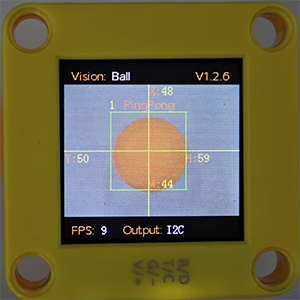
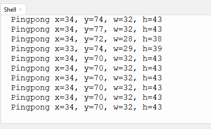
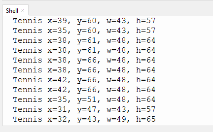

# 4.3 Ball Recognition

## 4.3.1 Algorithm



It determines whether there is an orange ping-pong ball or a green tennis ball in the image. If yes, it returns their coordinates, size and label value.

----------

## 4.3.2 Classification Label

| Label ID |     Definition     |
| :------: | :----------------: |
|    1     | ping pong (orange) |
|    2     |   tennis (green)   |

Ping pong:



Tennis:



---------------

## 4.3.3Returned Values

When the controller acquires the recognition result, the algorithm will return the followings:

|  Parameters  |         Definition         |
| :----------: | :------------------------: |
|   kXValue    | label central coordinate x |
|   kYValue    | label central coordinate y |
| kWidthValue  |       label width w        |
| kHeightValue |       label height h       |
|    kLabel    |          label ID          |

Code:

```python
        # Ball central coordinate x
        x = sengo1.GetValue(sengo1_vision_e.kVisionBall, sentry_obj_info_e.kXValue)
        # Ball central coordinate y
        y = sengo1.GetValue(sengo1_vision_e.kVisionBall, sentry_obj_info_e.kYValue)
        # Ball size w
        w = sengo1.GetValue(sengo1_vision_e.kVisionBall, sentry_obj_info_e.kWidthValue)
        # Ball size h
        h = sengo1.GetValue(sengo1_vision_e.kVisionBall, sentry_obj_info_e.kHeightValue)
        
        # Determine whether it is a Ping pong by the obtained label
        if ((sengo1.GetValue(sengo1_vision_e.kVisionBall,sentry_obj_info_e.kLabel)) == 1):
          print("Pingpong",end='')
        # Determine whether it is a Tennis by the obtained label
        if (sengo1.GetValue(sengo1_vision_e.kVisionBall,sentry_obj_info_e.kLabel)==ball_label_e.kBallTennis):
          print("Tennis",end='')
```

--------------

## 4.3.4 Test Code

```python
from machine import I2C,UART,Pin
from  Sengo1  import *
import time

# Wait for Sengo1 to initialize the operating system. This waiting time cannot be removed to prevent the situation where the controller has already developed and sent instructions before Sengo1 has been fully initialized
time.sleep(2)

# Select UART or I2C communication mode. Sengo1 is I2C mode by default. You can change it by just pressing the mode button.
# 4 UART communication modes: UART9600(Standard Protocol Instruction); UART57600(Standard Protocol Instruction), UART115200(Standard Protocol Instruction); Simple9600(Simple Protocol Instruction)
# Refer to the "Simple Protocol Instructions"
# port = UART(2,rx=Pin(16),tx=Pin(17),baudrate=9600)
port = I2C(0,scl=Pin(21),sda=Pin(20),freq=400000)

# Sengo1 communication address: 0x60. If multiple devices are connected to the I2C bus, please avoid address conflicts.
sengo1 = Sengo1(0x60)


err = sengo1.begin(port)
if err != SENTRY_OK:
    print(f"Initialization failed，error code:{err}")
else:
    print("Initialization succeeded")


# During normal use, the main controller sends commands to control the on and off of Sengo1 algorithm, rather than manual operation by joystick.
err = sengo1.VisionBegin(sengo1_vision_e.kVisionBall)
if err != SENTRY_OK:
    print(f"Starting algo Ball failed，error code:{err}")
else:
    print("Starting algo Ball succeeded")


while True:
    # Sengo1 does not actively return the detection and recognition results; it requires the main control board to send instructions for reading.
    # The reading process: 1.read the number of recognition results. 2.After receiving the instruction, Sengo1 will refresh the result data. 3.If the number of results is not zero, the board will then send instructions to read the relevant information. (Please be sure to build the program according to this process.)
    obj_num = sengo1.GetValue(sengo1_vision_e.kVisionBall, sentry_obj_info_e.kStatus)
    if obj_num:
        # Ball central coordinate x
        x = sengo1.GetValue(sengo1_vision_e.kVisionBall, sentry_obj_info_e.kXValue)
        # Ball central coordinate y
        y = sengo1.GetValue(sengo1_vision_e.kVisionBall, sentry_obj_info_e.kYValue)
        # Ball size w
        w = sengo1.GetValue(sengo1_vision_e.kVisionBall, sentry_obj_info_e.kWidthValue)
        # Ball size h
        h = sengo1.GetValue(sengo1_vision_e.kVisionBall, sentry_obj_info_e.kHeightValue)
        
        # Determine whether it is a Ping pong by the obtained label
        if ((sengo1.GetValue(sengo1_vision_e.kVisionBall,sentry_obj_info_e.kLabel)) == 1):
          print("Pingpong",end='')
        # Determine whether it is a Tennis by the obtained label
        if (sengo1.GetValue(sengo1_vision_e.kVisionBall,sentry_obj_info_e.kLabel)==ball_label_e.kBallTennis):
          print("Tennis",end='')
          
        print(" x=%d, y=%d, w=%d, h=%d"%(x, y, w, h))
        time.sleep(0.2)   
```

-----------

## 4.3.5 Test Result

After uploading the code, the module will detect the area captured by the camera. If an orange ping pong or a green tennis is detected, it will be recognized, and its coordinate x and y, width, height and the ball name will be displayed on the serial monitor.


