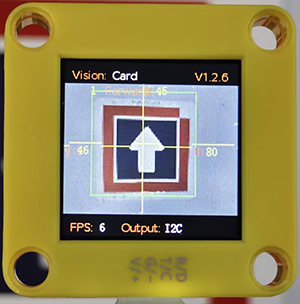

# 4.5 Card Recognition

## 4.5.1 Algorithm



It can identify whether there are corresponding traffic cards in the image. If yes, it will return information including the coordinates, size, and label values of the cards.

## 4.5.2 Classification Label

| Label | Definition  |           Pic           |
| :---: | :---------: | :---------------------: |
|   1   | go forward  |  |
|   2   |  turn left  |  |
|   3   | turn right  |  |
|   4   | turn around |  |
|   5   |    stop     |  |

Note: The algorithm can only recognize one card at a time. The card can still be recognized within a certain rotation, deflection and pitch angle. When using, please make the card face the camera as directly as possible for better recognition.

----------------------

## 4.5.3 Returned Values

When the controller acquires the recognition result, the algorithm will return the followings:

|  Parameter   |        Definition         |
| :----------: | :-----------------------: |
|   kXValue    | Card central coordinate x |
|   kYValue    | Card central coordinate y |
| kWidthValue  |       Card width w        |
| kHeightValue |       Card height h       |
|    kLabel    |     Card label value      |

Code:

```python
        # Card central coordinate x 
        x = sengo1.GetValue(sengo1_vision_e.kVisionCard, sentry_obj_info_e.kXValue)
        # Card central coordinate y
        y = sengo1.GetValue(sengo1_vision_e.kVisionCard, sentry_obj_info_e.kYValue)
        # Card width w
        w = sengo1.GetValue(sengo1_vision_e.kVisionCard, sentry_obj_info_e.kWidthValue)
        # Card height h
        h = sengo1.GetValue(sengo1_vision_e.kVisionCard, sentry_obj_info_e.kHeightValue)
        
        # Card label value
        cardType = sengo1.GetValue(sengo1_vision_e.kVisionCard,sentry_obj_info_e.kLabel)      
```

------------

## 4.5.4 Test Code

```python
from machine import I2C,UART,Pin
from  Sengo1  import *
import time
import random

# Wait for Sengo1 to initialize the operating system. This waiting time cannot be removed to prevent the situation where the controller has already developed and sent instructions before Sengo1 has been fully initialized
time.sleep(3)

# Select UART or I2C communication mode. Sengo1 is I2C mode by default. You can change it by just pressing the mode button.
# 4 UART communication modes: UART9600(Standard Protocol Instruction); UART57600(Standard Protocol Instruction), UART115200(Standard Protocol Instruction); Simple9600(Simple Protocol Instruction)
#########################################################################################################
# port = UART(2,rx=Pin(16),tx=Pin(17),baudrate=9600)
port = I2C(0,scl=Pin(21),sda=Pin(20),freq=400000)

# Sengo1 communication address: 0x60. If multiple devices are connected to the I2C bus, please avoid address conflicts.
sengo1 = Sengo1(0x60)


err = sengo1.begin(port)
if err != SENTRY_OK:
    print(f"Initialization failed，error code:{err}")
else:
    print("Initialization succeeded")
 
 
err = sengo1.VisionBegin(sengo1_vision_e.kVisionCard)
if err != SENTRY_OK:
    print(f"Starting algo Card failed，error code:{err}")
else:
    print("Starting algo Card succeeded")
    

# The card names, 1-5 correspond to the card label values
cardName = ["unknown","Forward","Left","Right","TurnAround","Park"]

while True:
    # Sengo1 does not actively return the detection and recognition results; it requires the main control board to send instructions for reading.
    # The reading process: 1.read the number of recognition results. 2.After receiving the instruction, Sengo1 will refresh the result data. 3.If the number of results is not zero, the board will then send instructions to read the relevant information. (Please be sure to build the program according to this process.)
    obj_num = sengo1.GetValue(sengo1_vision_e.kVisionCard, sentry_obj_info_e.kStatus)
    if obj_num:
        # Card central coordinate x 
        x = sengo1.GetValue(sengo1_vision_e.kVisionCard, sentry_obj_info_e.kXValue)
        # Card central coordinate y
        y = sengo1.GetValue(sengo1_vision_e.kVisionCard, sentry_obj_info_e.kYValue)
        # Card width w
        w = sengo1.GetValue(sengo1_vision_e.kVisionCard, sentry_obj_info_e.kWidthValue)
        # Card height h
        h = sengo1.GetValue(sengo1_vision_e.kVisionCard, sentry_obj_info_e.kHeightValue)
        
        # Card label value
        cardType = sengo1.GetValue(sengo1_vision_e.kVisionCard,sentry_obj_info_e.kLabel)      
        print("x=%d, y=%d, w=%d, h=%d, Type=%s"%(x, y, w, h,cardName[cardType]))
        time.sleep(0.2)
```

## 4.5.5 Test Result

After uploading the code, the AI vision module will scan the area captured by the camera. If there is a card, it will recognize the card and print its type (forward, turn around, turn left, turn right, and stop) in the serial monitor. 


