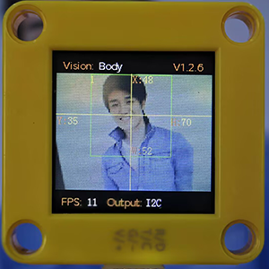

# 4.6 Body Detection

## 4.6.1 Algorithm



It determines whether there is a person in the image according to the outlines of the head and shoulders. If yes, it returns its coordinates and size.

---------------

## 4.6.2 Returned Values

When the controller acquires the recognition result, the algorithm will return the followings:

|  Parameter   |      Definition      |
| :----------: | :------------------: |
|   kXValue    | Central coordinate x |
|   kYValue    | Central coordinate y |
| kWidthValue  |       Width w        |
| kHeightValue |       Height h       |

Code:

```python
        # Obtain the coordinate x of the human body on the screen
        x = sengo1.GetValue(sengo1_vision_e.kVisionBody, sentry_obj_info_e.kXValue)
        # Obtain the coordinate y of the human body on the screen
        y = sengo1.GetValue(sengo1_vision_e.kVisionBody, sentry_obj_info_e.kYValue)
        # Obtain the width of the human body on the screen
        w = sengo1.GetValue(sengo1_vision_e.kVisionBody, sentry_obj_info_e.kWidthValue)
        # Obtain the height of the human body on the screen
        h = sengo1.GetValue(sengo1_vision_e.kVisionBody, sentry_obj_info_e.kHeightValue)
```

----------

## 4.6.3 Tips of Body Algorithm

1. Compared with a human facing from the side and back, the detection results will be more accurate when the person faces Sengo1 head-on.
2. The detection results will be more accurate when the color of the background is simple and obviously difference from that of the body dress.

-------

## 4.6.4 Test Code

```python
from machine import I2C,UART,Pin
from  Sengo1  import *
import time

# Wait for Sengo1 to initialize the operating system. This waiting time cannot be removed to prevent the situation where the controller has already developed and sent instructions before Sengo1 has been fully initialized
time.sleep(3)

# Select UART or I2C communication mode. Sengo1 is I2C mode by default. You can change it by just pressing the mode button.
# 4 UART communication modes: UART9600(Standard Protocol Instruction); UART57600(Standard Protocol Instruction), UART115200(Standard Protocol Instruction); Simple9600(Simple Protocol Instruction)
# port = UART(2,rx=Pin(16),tx=Pin(17),baudrate=9600)
port = I2C(0,scl=Pin(21),sda=Pin(20),freq=400000)

# Sengo1 communication address: 0x60. If multiple devices are connected to the I2C bus, please avoid address conflicts.
sengo1 = Sengo1(0x60)


err = sengo1.begin(port)
if err != SENTRY_OK:
    print(f"Initialization failed，error code:{err}")
else:
    print("Initialization succeeded")


# During normal use, the main controller sends commands to control the on and off of Sengo1 algorithm, rather than manual operation by its buttons.
err = sengo1.VisionBegin(sengo1_vision_e.kVisionBody)
if err != SENTRY_OK:
    print(f"Starting algo Body failed，error code:{err}")
else:
    print("Starting algo Body succeeded")


while True:
    # Sengo1 does not actively return the detection and recognition results; it requires the main control board to send instructions for reading.
    # The reading process: 1.read the number of recognition results. 2.After receiving the instruction, Sengo1 will refresh the result data. 3.If the number of results is not zero, the board will then send instructions to read the relevant information. (Please be sure to build the program according to this process.)
    obj_num = sengo1.GetValue(sengo1_vision_e.kVisionBody, sentry_obj_info_e.kStatus)
    if obj_num:
        # Obtain the coordinate x of the human body on the screen
        x = sengo1.GetValue(sengo1_vision_e.kVisionBody, sentry_obj_info_e.kXValue)
        # Obtain the coordinate y of the human body on the screen
        y = sengo1.GetValue(sengo1_vision_e.kVisionBody, sentry_obj_info_e.kYValue)
        # Obtain the width of the human body on the screen
        w = sengo1.GetValue(sengo1_vision_e.kVisionBody, sentry_obj_info_e.kWidthValue)
        # Obtain the height of the human body on the screen
        h = sengo1.GetValue(sengo1_vision_e.kVisionBody, sentry_obj_info_e.kHeightValue)
        # Output the data of human body recognition
        print("body: x=%d, y=%d, w=%d, h=%d"%(x, y, w, h))
        time.sleep(0.2)  
```

-----------

## 4.6.5 Test Result

After uploading the code, the AI vision module will scan the area captured by the camera. If there is a human body, it will be recognized and its coordinates, width and height will be printed on the monitor.


