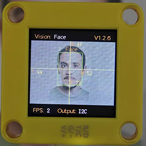
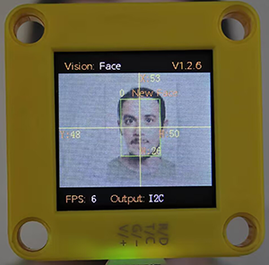
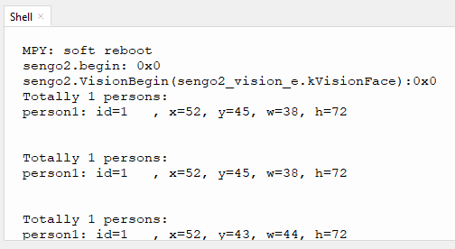

# 4.7 Face Recognition

## 4.7.1 Algorithm



It detects and recognizes human face in the image. Users can train to store or delete facial data by the function button. Sengo1 can store 10 faces at most.

-----------------

## 4.7.2 Classification Label

Sengo1 defines 11 classification labels for human faces:

| Label value | Meaning  | Label value |                Meaning                 |
| :---------: | :------: | :---------: | :------------------------------------: |
|      0      | New face |    1-10     | Classification number for stored faces |

New face (label value 0):



Stored face (label value 1-10):


---------------

## 4.7.3 Save Data

After enabling the face recognition algorithm, point the camera at the face, press the function button for 5 seconds and then release it. Sengo1 will start recording the face. After about 3 frames of data, the current facial data in the image will be saved in Flash and assigned an ID number.

The smallest number among the currently available numbers will be assigned to the label value. If there are no vacant numbers, Sengo1 will prompt a storage failure.

----------------

## 4.7.4 Delete Data

After storing, press the function button for about 10 seconds and then release it to delete the data just stored. Press it again for 10 seconds, and all the stored faces will be cleared. If no face has been stored after enabling the algorithm, all storage of faces will be directly cleared when you press the function button for 10 seconds.

------------------

## 4.7.5 Returned Values

When the controller acquires the recognition result, the algorithm will return the followings:

|  Parameter   |        Definition         |
| :----------: | :-----------------------: |
|   kXValue    | Face central coordinate x |
|   kYValue    | Face central coordinate y |
| kWidthValue  |       Face width w        |
| kHeightValue |       Face height h       |
|    kLabel    |     Face label value      |

Code:

```python
        # Read the label value of the human face. 1 to 10 represent stored facial data, and 0 represents an unfamiliar face that has not been stored.
        l = sengo1.GetValue(sengo1_vision_e.kVisionFace,sentry_obj_info_e.kLabel)
        # Face central coordinate x
        x = sengo1.GetValue(sengo1_vision_e.kVisionFace, sentry_obj_info_e.kXValue)
        # Face central coordinate y
        y = sengo1.GetValue(sengo1_vision_e.kVisionFace, sentry_obj_info_e.kYValue)
        # Face width w
        w = sengo1.GetValue(sengo1_vision_e.kVisionFace, sentry_obj_info_e.kWidthValue)
        # Face height h
        h = sengo1.GetValue(sengo1_vision_e.kVisionFace, sentry_obj_info_e.kHeightValue)
```

---------------

## 4.7.6Tips of Face Recognition Algorithm

1. When the ambient light is sufficient, the complete face is directly facing the camera and occupies a large field of view, the module can recognize it much better.
2. When wearing glasses or covered by hair/masks, the human face may not be detected.

----------------

## 4.7.7 Test Code

```python
from machine import I2C,UART,Pin
from  Sengo1  import *
import time

# Wait for Sengo1 to initialize the operating system. This waiting time cannot be removed to prevent the situation where the controller has already developed and sent instructions before Sengo1 has been fully initialized
time.sleep(3)

# Select UART or I2C communication mode. Sengo1 is I2C mode by default. You can change it by just pressing the mode button.
# 4 UART communication modes: UART9600(Standard Protocol Instruction); UART57600(Standard Protocol Instruction), UART115200(Standard Protocol Instruction); Simple9600(Simple Protocol Instruction)
# port = UART(2,rx=Pin(16),tx=Pin(17),baudrate=9600)
port = I2C(0,scl=Pin(21),sda=Pin(20),freq=400000)

# Sengo1 communication address: 0x60. If multiple devices are connected to the I2C bus, please avoid address conflicts.
sengo1 = Sengo1(0x60)


err = sengo1.begin(port)
if err != SENTRY_OK:
    print(f"Initialization failed，error code:{err}")
else:
    print("Initialization succeeded")

# 1. Sengo1 can recognize 10 faces, corresponding to label values 1-10.
# 2. The label value of a stranger's face is 0.
# 3. It can remember or delete facial data by the joystick or through code instructions.
# 4. Common applications of face recognition algorithms: Access control systems, Smart home, Intelligent traffic light.
# 5. Sengo1 can only run one recognition algorithm at a time.
# 6. During normal use, the main controller sends commands to control the on and off of Sengo1 algorithm, rather than manual operation by joystick.
err = sengo1.VisionBegin(sengo1_vision_e.kVisionFace)
if err != SENTRY_OK:
    print(f"Starting algo Face failed，error code:{err}")
else:
    print("Starting algo Face succeeded")


while True:
    # Sengo1 does not actively return the detection and recognition results; it requires the main control board to send instructions for reading.
    # The reading process: 1.read the number of recognition results. 2.After receiving the instruction, Sengo1 will refresh the result data. 3.If the number of results is not zero, the board will then send instructions to read the relevant information. (Please be sure to build the program according to this process.)
    obj_num = sengo1.GetValue(sengo1_vision_e.kVisionFace, sentry_obj_info_e.kStatus)
    if obj_num:
        # Read the label value of the human face. 1 to 10 represent stored facial data, and 0 represents an unfamiliar face that has not been stored.
        l = sengo1.GetValue(sengo1_vision_e.kVisionFace,sentry_obj_info_e.kLabel)
        # Face central coordinate x
        x = sengo1.GetValue(sengo1_vision_e.kVisionFace, sentry_obj_info_e.kXValue)
        # Face central coordinate y
        y = sengo1.GetValue(sengo1_vision_e.kVisionFace, sentry_obj_info_e.kYValue)
        # Face width w
        w = sengo1.GetValue(sengo1_vision_e.kVisionFace, sentry_obj_info_e.kWidthValue)
        # Face height h
        h = sengo1.GetValue(sengo1_vision_e.kVisionFace, sentry_obj_info_e.kHeightValue)
        # Output facial data
        print("person: id=%d, x=%d, y=%d, w=%d, h=%d"%(l, x, y, w, h))
        time.sleep(0.2)
```

--------------------

## 4.7.8 Test Result

After uploading the code, press and hold the function button for 5 seconds, and then the module will starts to learn and record the face on the screen. When encountering new faces, prompts will be given on it.


