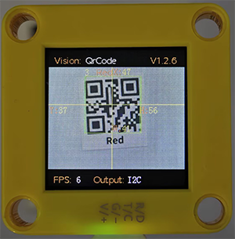

# 4.8 QR Code Recognition

## 4.8.1 Algorithm



It can recognize a simple QR code and return its coordinates, size and text content, but the QR code information should not exceed 10 bytes. ASCII code characters can be displayed on the screen. Note that if it is a Chinese QR code, it cannot be displayed, but the recognition result can still be read by the main control.

-------------

## 4.8.2 Returned Values

The returned values of this algorithm include the position coordinates and size of the QR code.

|        Parameter         |          Definition          |
| :----------------------: | :--------------------------: |
|         kXValue          | QR code central coordinate x |
|         kYValue          | QR code central coordinate y |
|       kWidthValue        |       QR code width w        |
|       kHeightValue       |       QR code height h       |
| sengo1.GetQrCodeString() |     Qr code content text     |

Code:

```python
        # Get the coordinate of the QR code x
        x = sengo1.GetValue(sengo1_vision_e.kVisionQrCode, sentry_obj_info_e.kXValue)
        # Get the coordinate of the QR code y
        y = sengo1.GetValue(sengo1_vision_e.kVisionQrCode, sentry_obj_info_e.kYValue)
        # Get the width of the QR code w
        w = sengo1.GetValue(sengo1_vision_e.kVisionQrCode, sentry_obj_info_e.kWidthValue)
        # Get the height of the QR code h
        h = sengo1.GetValue(sengo1_vision_e.kVisionQrCode, sentry_obj_info_e.kHeightValue)
        # Get the content of the QR code
        text = sengo1.GetQrCodeString()
```

----------

## 4.8.3 Generate a QR Code

We provide 5 paper QR code cards, with the contents of “Red”, “Green”, “Blue”, “White”, “Black” respectively.


If these QR codes do not meet your needs, you can search for “QR code generation for free” in your browser. There will be many links for generating QR codes online. Just find the one you like and use it. Here we also provide a generator:

[Online QR code generator](https://www.qrcode-monkey.com/#text)

After entering the link:

① Select the TEXT format

② Input the text to be generated (no Chinese characters, no more than 10 characters)

③ Click to generate a QR code

④ Download the QR code image


------------

## 4.8.4 Test Code

```python
from machine import I2C,UART,Pin
from  Sengo1  import *
import time

# Wait for Sengo1 to initialize the operating system. This waiting time cannot be removed to prevent the situation where the controller has already developed and sent instructions before Sengo1 has been fully initialized
time.sleep(3)

# Select UART or I2C communication mode. Sengo1 is I2C mode by default. You can change it by just pressing the mode button.
# 4 UART communication modes: UART9600(Standard Protocol Instruction); UART57600(Standard Protocol Instruction), UART115200(Standard Protocol Instruction); Simple9600(Simple Protocol Instruction)
# port = UART(2,rx=Pin(16),tx=Pin(17),baudrate=9600)
port = I2C(0,scl=Pin(21),sda=Pin(20),freq=400000)

# Sengo1 communication address: 0x60. If multiple devices are connected to the I2C bus, please avoid address conflicts.
sengo1 = Sengo1(0x60)


err = sengo1.begin(port)
if err != SENTRY_OK:
    print(f"Initialization failed，error code:{err}")
else:
    print("Initialization succeeded")


err = sengo1.VisionBegin(sengo1_vision_e.kVisionQrCode)
if err != SENTRY_OK:
    print(f"Starting algo QrCode failed，error code:{err}")
else:
    print("Starting algo QrCode succeeded")
    
while True:
    # Sengo1 does not actively return the detection and recognition results; it requires the main control board to send instructions for reading.
    # The reading process: 1.read the number of recognition results. 2.After receiving the instruction, Sengo1 will refresh the result data. 3.If the number of results is not zero, the board will then send instructions to read the relevant information. (Please be sure to build the program according to this process.)
    obj_num = sengo1.GetValue(sengo1_vision_e.kVisionQrCode, sentry_obj_info_e.kStatus)
    if obj_num:
        # Get the coordinate of the QR code x
        x = sengo1.GetValue(sengo1_vision_e.kVisionQrCode, sentry_obj_info_e.kXValue)
        # Get the coordinate of the QR code y
        y = sengo1.GetValue(sengo1_vision_e.kVisionQrCode, sentry_obj_info_e.kYValue)
        # Get the width of the QR code w
        w = sengo1.GetValue(sengo1_vision_e.kVisionQrCode, sentry_obj_info_e.kWidthValue)
        # Get the height of the QR code h
        h = sengo1.GetValue(sengo1_vision_e.kVisionQrCode, sentry_obj_info_e.kHeightValue)
        # Get the content of the QR code
        text = sengo1.GetQrCodeString()
        # Print the content of the QR code 
        print(text,end='')
        # Print the position and size of the QR code
        print(" x=%d, y=%d, w=%d, h=%d"%(x, y, w, h))
        time.sleep(0.2) 
```

-------

## 4.8.5 Test Result

After uploading the code, the AI vision module will detect the area captured by the camera. If there is a QR code, it will be recognized and its size and content will be printed on the serial monitor.


