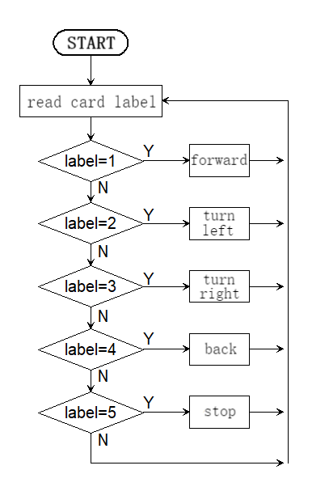

# 5.2 Card Control Car

## 5.2.1 Overview

In this project, we control the car through traffic cards, including “forward”, “turn left”, “turn right”, “turn around(back)” and “stop”. The AI vision module can recognize them and control the car to perform corresponding actions based on the cards.

## 5.2.2 Code Flow



## 5.2.3 Test Code

```python
from machine import I2C,UART,Pin,PWM
from Sengo1 import *
import time

# Wait for Sengo1 to initialize the operating system. This waiting time cannot be removed to prevent the situation where the controller has already developed and sent instructions before Sengo1 has been fully initialized
time.sleep(3)

# Select UART or I2C communication mode. Sengo1 is I2C mode by default. You can change it by just pressing the mode button.
# 4 UART communication modes: UART9600(Standard Protocol Instruction); UART57600(Standard Protocol Instruction), UART115200(Standard Protocol Instruction); Simple9600(Simple Protocol Instruction)
#########################################################################################################
# port = UART(2,rx=Pin(16),tx=Pin(17),baudrate=9600)
port = I2C(0,scl=Pin(21),sda=Pin(20 ),freq=400000)

# Sengo1 communication address: 0x60. If multiple devices are connected to the I2C bus, please avoid address conflicts.
sengo1 = Sengo1(0x60)

err = sengo1.begin(port)
print("sengo1.begin: 0x%x"% err)
 
# Define the visual processing type as a machine card recognition mode
err = sengo1.VisionBegin(sengo1_vision_e.kVisionCard)
print("sengo1.VisionBegin(sengo1_vision_e.kVisionCard):0x%x"% err)

# right wheel
pin1=Pin(14,Pin.OUT)
pin2=PWM(Pin(16))
pin2.freq(50)

# left wheel
pin3=Pin(15,Pin.OUT)
pin4=PWM(Pin(17))
pin4.freq(50)

# speed variable
right_speed = 30000
left_speed = 30000

# As a function of the car going forward.
def car_forward(): 
  pin1.value(0)
  pin2.duty_u16(right_speed) 
  pin3.value(0)
  pin4.duty_u16(left_speed)

# As a function of the car going backwards.
def car_back(): 
  pin1.value(1)
  pin2.duty_u16(50000 - right_speed)  
  pin3.value(1)
  pin4.duty_u16(50000 - left_speed)

# As a function of the car going left.
def car_left(): 
  pin1.value(0)
  pin2.duty_u16(25000)  
  pin3.value(1)
  pin4.duty_u16(25000)
# As a function of the car going right.
def car_right(): 
  pin1.value(1)
  pin2.duty_u16(25000)  
  pin3.value(0)
  pin4.duty_u16(25000)

# As a function of the car stopping.
def car_stop(): 
  pin1.value(0)
  pin2.duty_u16(0)  
  pin3.value(0)
  pin4.duty_u16(0)

while True:
    # Sengo1 does not actively return the detection and recognition results; it requires the main control board to send instructions for reading.
    # The reading process: 1.read the number of recognition results. 2.After receiving the instruction, Sengo1 will refresh the result data. 3.If the number of results is not zero, the board will then send instructions to read the relevant information. (Please be sure to build the program according to this process.)
    obj_num = (sengo1.GetValue(sengo1_vision_e.kVisionCard, sentry_obj_info_e.kStatus))
    # Avoid confusion when multiple cards are recognized
    if obj_num == 1:
        for i in range(1,obj_num+1):
            # Get the label value of the card 
            Tags = sengo1.GetValue(sengo1_vision_e.kVisionCard,sentry_obj_info_e.kLabel,i)
            # The forward card recognized
            if Tags == 1:
                # The car moves forward.
                car_forward()
            # The left-turn card recognized
            elif Tags == 2:
                # The car turns left.
                car_left()
            # The right-turn card recognized
            elif Tags == 3:
                # The car turns right.
                car_right()
            # The backward card recognized
            elif Tags == 4:
                # The car moves backward.
                car_back()
            # The stop card recognized
            elif Tags == 5:
                # The car stops.
                car_stop()
    # If no card is recognized, the car stops
    else : car_stop()
    time.sleep(0.2)
```

## 5.2.4 Test Result

After uploading the code, the AI vision module will detect the captured image to determine if there is a traffic card. If there is, assign the card label value to the variable “label”. 

Tags = 1: the car moves forward; Tags = 2: the car turns left; Tags = 3: the car turns right; Tags = 4: the car moves backward; Tags = 5: the car stops.

