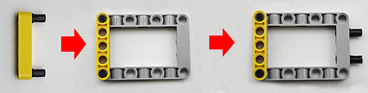
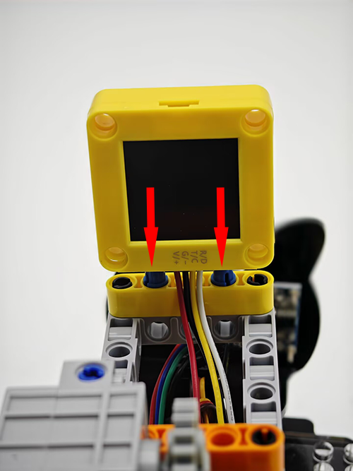
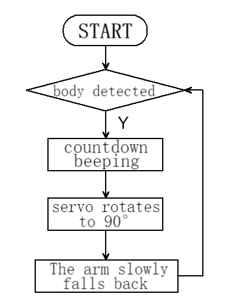

# 5.5 Smart Stone Thrower

## 5.5.1 Overview

In this project, we build an interesting stone thrower car with automatic recognition by the AI vision module. We first need to mount the module on the car to enable its recognition function. If a human body is detected, the buzzer will emit a countdown beeping from three and then the car will perform a throw. After that, the throwing arm will slowly lower down to wait for the next recognition of a body.

## 5.5.2 Mount the AI module to the stone thrower car

<p style="color:red;font-size:25px;">Note: Please install the "Stone Thrower" first according to the robot car tutorial, and then follow the installation steps below.</p>

**Required Parts**


**Step 1**



**Step 2**


**Step 3**




**Step 4**

| AI vision module | Car interface |
| :--------------: | :-----------: |
|   T/C (yellow)   |      SCL      |
|   R/D (white)    |      SDA      |
|    V/+ (red)     |      5V       |
|   G/- (black)    |       G       |


**Completed**


## 5.5.3 Code Flow



## 5.5.4 Test Code

```python
from machine import I2C,UART,Pin,PWM
from Sengo1 import *
import time

# servo pin GPIO 3
servo_pin = Pin(3)
servo = PWM(servo_pin)

# buzzer pin GPIO12
buzzer = PWM(Pin(12))

# Set the PWM frequency to 50Hz (standard servo frequency)
servo.freq(50)

# Wait for Sengo1 to initialize the operating system. This waiting time cannot be removed to prevent the situation where the controller has already developed and sent instructions before Sengo1 has been fully initialized
time.sleep(3)

# Select UART or I2C communication mode. Sengo1 is I2C mode by default. You can change it by just pressing the mode button.
# 4 UART communication modes: UART9600(Standard Protocol Instruction); UART57600(Standard Protocol Instruction), UART115200(Standard Protocol Instruction); Simple9600(Simple Protocol Instruction)
#########################################################################################################
# port = UART(2,rx=Pin(16),tx=Pin(17),baudrate=9600)
port = I2C(0,scl=Pin(21),sda=Pin(20),freq=400000)

# Sengo1 communication address: 0x60. If multiple devices are connected to the I2C bus, please avoid address conflicts.
sengo1 = Sengo1(0x60)
 
err = sengo1.begin(port)
print("sengo1.begin: 0x%x"% err)
 
# During normal use, the main controller sends commands to control the on and off of Sengo1 algorithm, rather than manual operation by joystick.
err = sengo1.VisionBegin(sengo1_vision_e.kVisionBody)
print("sengo1.VisionBegin(sengo1_vision_e.kVisionBody):0x%x"% err)


def tone(pin, frequency, duration):
    """Play the sound of the specified frequency"""
    if frequency > 0:
        pin.freq(frequency)
        pin.duty_u16(32768)  # 50% duty cycle
    time.sleep_ms(duration)
    pin.duty_u16(0)  # stop play tone

def no_tone(pin):
    """no tone"""
    pin.duty_u16(0)

def countdown(seconds):
    """countdown sound"""
    for i in range(seconds, 0, -1):
        # The ticking of the countdown
        tone(buzzer, 800, 100)
        time.sleep_ms(200)
        no_tone(buzzer)
        
        # Interval time
        time.sleep_ms(500)

# Define the conversion function from the servo angle to the duty cycle
def set_servo_angle(angle):
    # Make sure the angle is within 0 to 270 degrees
    if angle < 0:
        angle = 0
    elif angle > 270:
        angle = 270
    
    # Convert the angle to the duty cycle
    # For a 270-degree servo, a 0.5ms pulse usually corresponds to 0 degrees, and a 2.5ms pulse corresponds to 270 degrees
    min_duty = 1638  # A duty cycle of 0.5ms (0.5/20 * 65535)
    max_duty = 8192  # A duty cycle of 2.5ms (2.5/20 * 65535)
    
    # Calculate the duty cycle of the corresponding angle
    duty = int(min_duty + (max_duty - min_duty) * angle / 270)
    servo.duty_u16(duty)


while True:
  # Sengo1 does not actively return the detection and recognition results; it requires the main control board to send instructions for reading.
  # The reading process: 1.read the number of recognition results. 2.After receiving the instruction, Sengo1 will refresh the result data. 3.If the number of results is not zero, the board will then send instructions to read the relevant information. (Please be sure to build the program according to this process.)
    obj_num = (sengo1.GetValue(sengo1_vision_e.kVisionBody, sentry_obj_info_e.kStatus))
    # Determine whether a human body is detected
    if obj_num:
        # Countdown from 3 for throwing
        countdown(3)
        # Throw
        set_servo_angle(90)
        time.sleep(1)
        # Slowly put down the arm
        for j in range(90,0,-1):
            set_servo_angle(j)
            time.sleep(0.01)
```

## 5.5.5 Test Result

After uploading the code, the AI vision module will activate the “Body” mode and then recognize the captured images to determine if there is a human. If yes, it will perform a throw. Before the throw, there will be three prompt sounds as a countdown. Once the countdown ends, the throw will proceed. After that, the throwing arm will slowly fall back to wait for the next instruction.
