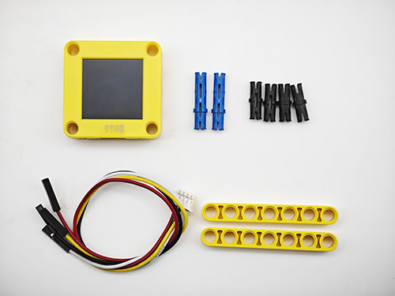
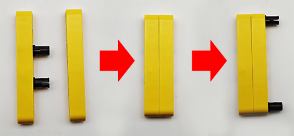
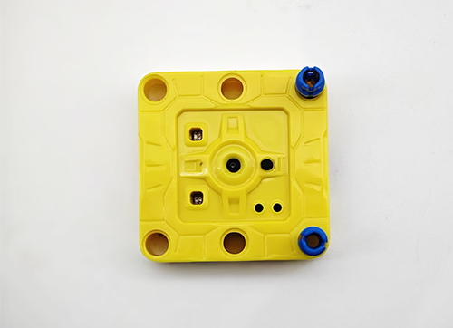
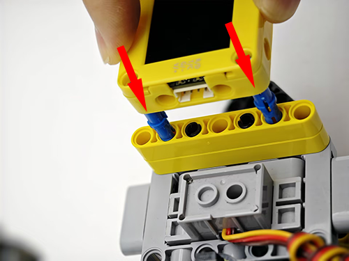
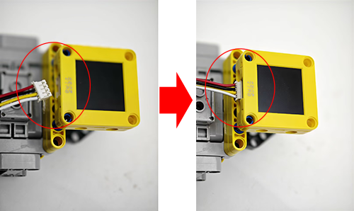
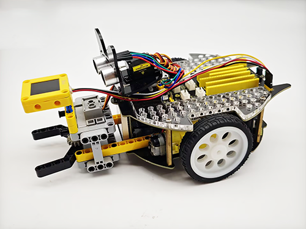
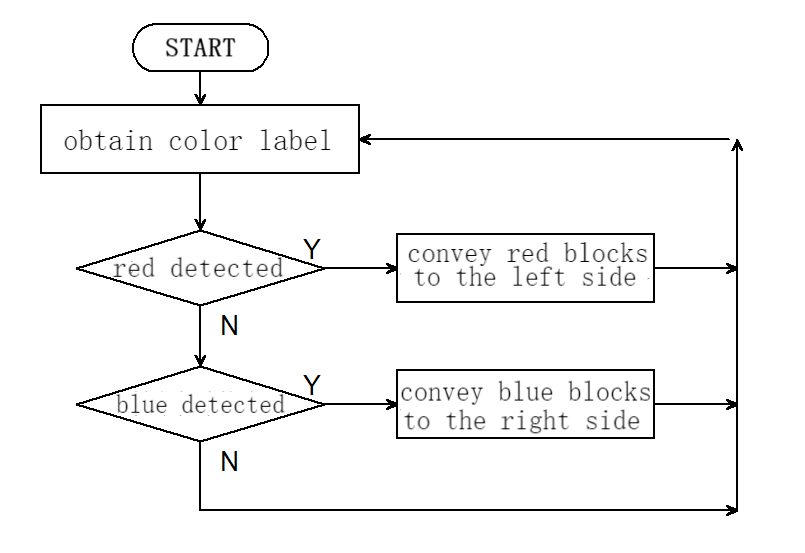

# 5.6 Red and Blue Sorting Car

## 5.6.1 Overview

In this project, we build an interesting color block sorting car by the AI vision module. We first need to mount the module on the soccer robot car to enable its recognition function. If a red block is detected, the car will convey it to the left side and return to its original position along the same path. If a blue one is detected, it will convey it to the right and come back.

## 5.6.2 Mount the AI module to the soccer robot car

<p style="color:red;font-size:25px;">Note: Please install the "Football Robot" first according to the robot car tutorial, and then follow the installation steps below.</p>

**Required Parts**



**Step 1**



**Step 2**


**Step 3**



**Step 4**



**Step 5**



**Step 6**

| AI vision module | Car interface |
| :--------------: | :-----------: |
|   T/C (yellow)   |      SCL      |
|   R/D (white)    |      SDA      |
|    V/+ (red)     |      5V       |
|   G/- (black)    |       G       |


**Completed**




## 5.6.3 Code Flow




## 5.6.4 Test Code

```python
from machine import I2C, Pin, PWM
import time
import random
from Sengo1 import *

# Initialize the PWM object and set the control pin GPIO3
servo_pin = Pin(3)
servo = PWM(servo_pin)

# Set the PWM frequency to 50Hz (standard servo frequency)
servo.freq(50)

# Initialize I2C (adjust the pins according to the actual wiring)
port = I2C(0, scl=Pin(21), sda=Pin(20), freq=400000)  # Use the pins in the reference code

# Wait for Sengo1 to initialize the operating system.
time.sleep(2)

# Create a Sengo1 object
sengo1 = Sengo1()

# Start sensor
err = sengo1.begin(port)
if err != SENTRY_OK:
    print(f"Initialization failed，error code:{err}")
else:
    print("Initialization succeeded")

# Color recognition function configuration
sengo1.SetParam(sengo1_vision_e.kVisionColor,[50, 50, 20, 20, 1])
time.sleep(0.1)

# Sengo1 can only run one recognition algorithm at a time.
err = sengo1.VisionBegin(sengo1_vision_e.kVisionColor)
if err != SENTRY_OK:
    print(f"Starting algo Color failed，error code:{err}")
else:
    print("Starting algo Color succeeded")
    
    
# Define the conversion function from the servo angle to the duty cycle
def set_servo_angle(angle):
    # Make sure the angle is within 0 to 270 degrees
    if angle < 0:
        angle = 0
    elif angle > 270:
        angle = 270
    
    # Convert the angle to the duty cycle
    # For a 270-degree servo, a 0.5ms pulse usually corresponds to 0 degrees, and a 2.5ms pulse corresponds to 270 degrees
    min_duty = 1638  # A duty cycle of 0.5ms (0.5/20 * 65535)
    max_duty = 8192  # A duty cycle of 2.5ms (2.5/20 * 65535)
    
    # Calculate the duty cycle of the corresponding angle
    duty = int(min_duty + (max_duty - min_duty) * angle / 270)
    servo.duty_u16(duty)
    
# right wheel
pin1=Pin(14,Pin.OUT)
pin2=PWM(Pin(16))
pin2.freq(50)

# left wheel
pin3=Pin(15,Pin.OUT)
pin4=PWM(Pin(17))
pin4.freq(50)

# As a function of the car going forward.
def car_forward(): 
  pin1.value(0)
  pin2.duty_u16(20000)
  pin3.value(0)
  pin4.duty_u16(20000)

# As a function of the car going backwards.
def car_back(): 
  pin1.value(1)
  pin2.duty_u16(40000)  
  pin3.value(1)
  pin4.duty_u16(40000)

# As a function of the car going left.
def car_left(): 
  pin1.value(0)
  pin2.duty_u16(10000)  
  pin3.value(1)
  pin4.duty_u16(45000)
# As a function of the car going right.
def car_right(): 
  pin1.value(1)
  pin2.duty_u16(45000)
  pin3.value(0)
  pin4.duty_u16(10000)

# As a function of the car stopping.
def car_stop(): 
  pin1.value(0)
  pin2.duty_u16(0)  
  pin3.value(0)
  pin4.duty_u16(0)
    
# Color block sorting code
def sorting(val):
    # grab the color block
    set_servo_angle(270)
    time.sleep(1)
    # Determine the value of val. If it is 0, it is a red block; if it is 1, it is a blue block
    if val == 0:
        # The car turns left.
        car_left()
    else :
        # The car turns right.
        car_right()
    time.sleep(0.3)
    # The car moves forward for 0.3 seconds
    car_forward()
    time.sleep(0.3)
    car_stop()
    time.sleep(0.3)
    # Loosen the color block
    set_servo_angle(240)
    time.sleep(0.5)
    # The car moves backward for 0.3 seconds
    car_back()
    time.sleep(0.3)
    # Determine the value of val. If it is 0, it is a red block; if it is 1, it is a blue block
    if val == 0:
        # The car turns right.
        car_right()
    else :
        # The car turns left.
        car_left()
    time.sleep(0.3)

# loop
try:
    while True:
    # Sengo1 does not actively return the detection and recognition results; it requires the main control board to send instructions for reading.
    # The reading process: 1.read the number of recognition results. 2.After receiving the instruction, Sengo1 will refresh the result data. 3.If the number of results is not zero, the board will then send instructions to read the relevant information. (Please be sure to build the program according to this process.)
    # Sengo can output at most one recognition result.
        obj_num = sengo1.GetValue(sengo1_vision_e.kVisionColor,sentry_obj_info_e.kStatus)
        if obj_num:
            # Obtain the color label
            color_label = sengo1.GetValue(sengo1_vision_e.kVisionColor,sentry_obj_info_e.kLabel)
            # Determine whether a red block is detected
            if color_label == color_label_e.kColorRed:
                sorting(0)
            # Determine whether a blue block has been detected
            elif color_label == color_label_e.kColorBlue:
                sorting(1)
            else :
                car_stop()
        time.sleep(0.1)  # delay

except KeyboardInterrupt:
    sentry.VisionEnd(sengo1_vision_e.kVisionColor)
    # Turn off PWM when the program is interrupted
    servo.duty_u16(0)
    servo.deinit()
    print("The program has stopped")
```

## 5.6.5 Test Result

After uploading the code, the AI vision module will enable the “Color” mode to recognize the captured image to determine red or blue. If a red block is detected, the car will hold the red block and send it to the left side, and then it will return to its original position along the same path. If a blue one is detected, the car will convey it to the right side and come back. (There may be a slight deviation from the original position after the car moves back because it was set based on the car driving time.)
