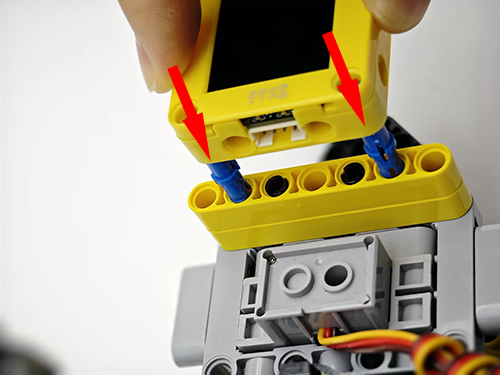
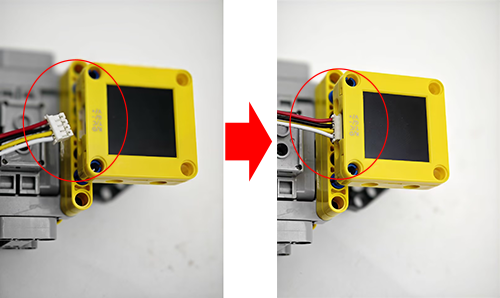
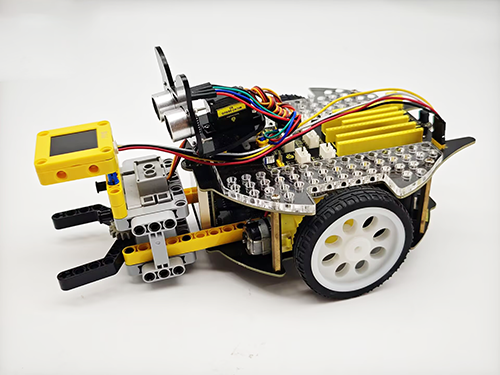
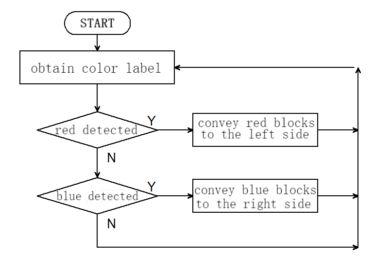

# 5.6 Red and Blue Sorting Car

## 5.6.1 Overview

In this project, we build an interesting color block sorting car by the AI vision module. We first need to mount the module on the soccer robot car to enable its recognition function. If a red block is detected, the car will convey it to the left side and return to its original position along the same path. If a blue one is detected, it will convey it to the right and come back.

## 5.6.2 Mount the AI module to the soccer robot car

**Required Parts**


**Step 1**


**Step 2**


**Step 3**


**Step 4**



**Step 5**



**Step 6**

| AI vision module | Car interface |
| :--------------: | :-----------: |
|   T/C (yellow)   |      SCL      |
|   R/D (white)    |      SDA      |
|    V/+ (red)     |      5V       |
|   G/- (black)    |       G       |


**Completed**




## 5.6.3 Code Flow



## 5.6.4 Test Code

```c
#include <Arduino.h>
#include <Sentry.h>  // Sentry machine vision sensor library
#include <Servo.h>   //Servo control library

Servo servo;  // Create a servo object to control the servo system

typedef Sengo1 Sengo;  // Create an alias Sengo for the Sengo1 type to simplify subsequent usage

// Communication method (currently enabled I2C)
#define SENGO_I2C
// #define SENGO_UART   // UART alternative options (annotated as disabled)

#ifdef SENGO_I2C
#include <Wire.h>  // Libraries required for I2C communication
#endif

#ifdef SENGO_UART
#include <SoftwareSerial.h>               // Soft serial port library (for non-hardware serial ports)
#define TX_PIN 11       // Customize the TX pin
#define RX_PIN 10       // Customize the RX pin
SoftwareSerial mySerial(RX_PIN, TX_PIN);  // Create a soft serial port object
#endif

#define VISION_TYPE Sengo::kVisionColor  // Blob detection (color block recognition)
Sengo sengo;                             // Create a Sengo sensor object

// Motor drive pins
#define ML 4
#define ML_PWM 6
#define MR 2
#define MR_PWM 5

void setup() {
  sentry_err_t err = SENTRY_OK;  // Error status variable

  Serial.begin(9600);  // Initialize the serial port for debugging the output
  Serial.println("Waiting for sengo initialize...");

// Initialize the sensor according to the selected communication mode
#ifdef SENGO_I2C
  Wire.begin();  // Initialize I2C bus
  // Keep trying to connect until succeed
  while (SENTRY_OK != sengo.begin(&Wire)) {
    yield();  // Allow other tasks to run while waiting
  }
#endif

#ifdef SENGO_UART
  mySerial.begin(9600);  // Initialize the soft serial port
  while (SENTRY_OK != sengo.begin(&mySerial)) {
    yield();
  }
#endif

  sentry_object_t param;  // Parametric structure
  Serial.println("Sengo begin Success.");
  // Set the x-coordinate of the recognition box position
  param.x_value = 50;
  // Set the y-coordinate of the recognition box position
  param.y_value = 50;
  // Set the width of the recognition box position
  param.width = 20;
  // Set the height of the recognition box position
  param.height = 20;
  // Write the parameters into the sensor
  err = sengo.SetParam(VISION_TYPE, &param);
  // Error handling
  if (err) {
    Serial.print("sengo.SetParam ");
    if (err) {
      Serial.print("Error: 0x");
    } else {
      Serial.print("Success: 0x");
    }
    Serial.println(err, HEX);  // Print the hexadecimal error code
    for (;;)
      ;  // Infinite loop blocking (manual restart required)
  }

  // Activate the visual recognition algorithm
  err = sengo.VisionBegin(VISION_TYPE);
  Serial.print("sengo.VisionBegin(kVisionColor) ");
  if (err) {
    Serial.print("Error: 0x");
  } else {
    Serial.print("Success: 0x");
  }
  Serial.println(err, HEX);  // Output the initialization result

  servo.attach(A0);
  servo.write(160);

  pinMode(ML, OUTPUT);      //Set the left motor direction control pin to output
  pinMode(ML_PWM, OUTPUT);  //Set the left motor pwm pin to output
  pinMode(MR, OUTPUT);      //Set the right motor direction control pin to output
  pinMode(MR_PWM, OUTPUT);  //Set the right motor pwm pin to output
}

void loop() {
  // Read the total number of detected objects (kStatus indicates the acquisition status)
  int obj_num = sengo.GetValue(VISION_TYPE, kStatus);

  if (obj_num > 0) {        // If an object is detected
    int l = sengo.GetValue(VISION_TYPE, kLabel);  // color lable
    // If red block is detected
    if (l == 3) {
      sorting(l);
      // If blue block is detected
    } else if (l == 5) {
      sorting(l);
    } else car_stop();
  } else car_stop();
}


// Color block sorting code (aimed at reducing the amount of repetitive code)
void sorting(int val) {
  // grab the color block
  servo.write(180);
  delay(500);
  // Distinguish the sorting directions of the red blocks and the blue blocks by "if"
  if (val == 3) {
    // turn left
    car_left();
  } else {
    // turn right
    car_right();
  }
  delay(300);
  // go forward
  car_forward();
  delay(300);
  car_stop();
  delay(300);
  // Loosen the color block
  servo.write(160);
  delay(300);
  // go back
  car_back();
  delay(300);
  // Distinguish the sorting directions of the red blocks and the blue blocks by "if"
  if (val == 3) {
    // turn right
    car_right();
  } else {
    // turn left
    car_left();
  }
  delay(300);
}


// car goes forward
void car_forward() {
  digitalWrite(ML, LOW);
  analogWrite(ML_PWM, 100);
  digitalWrite(MR, LOW);
  analogWrite(MR_PWM, 100);
}

// car comes back
void car_back() {
  digitalWrite(ML, HIGH);
  analogWrite(ML_PWM, 150);
  digitalWrite(MR, HIGH);
  analogWrite(MR_PWM, 150);
}

// car turns left
void car_left() {
  digitalWrite(ML, HIGH);
  analogWrite(ML_PWM, 155);
  digitalWrite(MR, LOW);
  analogWrite(MR_PWM, 100);
}

// car turns right
void car_right() {
  digitalWrite(ML, LOW);
  analogWrite(ML_PWM, 100);
  digitalWrite(MR, HIGH);
  analogWrite(MR_PWM, 155);
}

// car stops
void car_stop() {
  digitalWrite(ML, LOW);
  analogWrite(ML_PWM, 0);
  digitalWrite(MR, LOW);
  analogWrite(MR_PWM, 0);
}
```

## 5.6.5 Test Result

After uploading the code, the AI vision module will enable the “Color” mode to recognize the captured image to determine red or blue. If a red block is detected, the car will hold the red block and send it to the left side, and then it will return to its original position along the same path. If a blue one is detected, the car will convey it to the right side and come back. (There may be a slight deviation from the original position after the car moves back because it was set based on the car driving time.)
