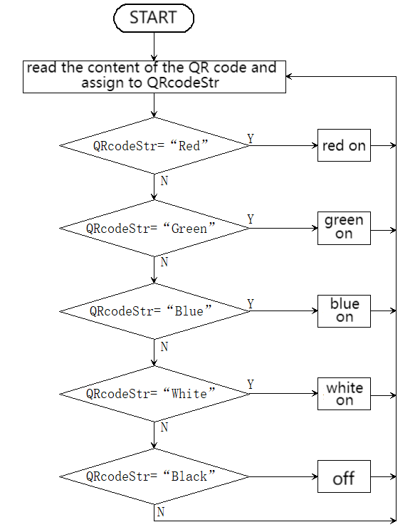

# 5.4 QR Code Control Light

## 5.4.1 Overview

In this project, we control the car light by QR codes. Herein, the AI vision module will recognize QR codes and read their content(color information) to light up the WS2812 in corresponding colors, including red, green, blue, black(off), and white. If you want to generate a brand-new QR code, please refer to the tutorial in `4.8 QR Code Recognition`.

## 5.4.2 Code Flow



## 5.4.3 Test Code

```c
// Arduino core library
#include <Arduino.h>
// Sentry machine vision sensor library
#include <Sentry.h>
#include <Adafruit_NeoPixel.h>

#define PIN A3
Adafruit_NeoPixel strip = Adafruit_NeoPixel(4, PIN, NEO_GRB + NEO_KHZ800);

// Create an alias Sengo for the Sengo1 type to simplify subsequent usage
typedef Sengo1 Sengo;

// Communication mode (currently enabled I2C).
#define SENGO_I2C
// #define SENGO_UART  // UART serial communication solution (annotated as disabled)

// Include the corresponding library according to the selected communication mode
#ifdef SENGO_I2C
#include <Wire.h>  // Libraries required for I2C communication
#endif
#ifdef SENGO_UART
#include <SoftwareSerial.h>
#define TX_PIN 11  // Customize the TX pin
#define RX_PIN 10  // Customize the RX pin
SoftwareSerial mySerial(RX_PIN, TX_PIN);  // Create a soft serial port object
#endif

// Define the visual processing type as QR code recognition mode
#define VISION_TYPE Sengo::kVisionQrCode
Sengo sengo;  // Create a Sengo sensor object

String QRcodeStr = "";
unsigned long lastDetectionTime = 0;

// Fill the dots one after the other with a color
void colorWipe(uint32_t c, uint8_t wait) {
  for (uint16_t i = 0; i < strip.numPixels(); i++) {
    strip.setPixelColor(i, c);
    strip.show();
    delay(wait);
  }
}

// Initialization
void setup() {
  sentry_err_t err = SENTRY_OK;  // error state variable

  Serial.begin(9600);  // Initialize the serial port for debugging the output
  Serial.println("Waiting for sengo initialize...");

  // I2C initialization
#ifdef SENGO_I2C
  Wire.begin();  // Initialize the I2C bus
  // Keep trying to connect until succeed
  while (SENTRY_OK != sengo.begin(&Wire)) {
    yield();  // Give up CPU control during the waiting period
  }
#endif  // SENGO_I2C

  // UART initialization (disabled currently)
#ifdef SENGO_UART
  mySerial.begin(9600);
  while (SENTRY_OK != sengo.begin(&mySerial)) {
    yield();
  }
#endif  // SENGO_UART

  Serial.println("Sengo begin Success.");

  // Activate the QR code recognition
  err = sengo.VisionBegin(VISION_TYPE);

  // Print the initialization result
  Serial.print("sengo.VisionBegin(kVisionQrCode) ");
  if (err) {
    Serial.print("Error: 0x");
  } else {
    Serial.print("Success: 0x");
  }
  Serial.println(err, HEX);  // Print the error code in hexadecimal format

  strip.begin();
  strip.show();  // Initialize all pixels to 'off'
}

// loop
void loop() {
  // Obtain the number of detected QR codes (kStatus is the query status)
  int obj_num = sengo.GetValue(VISION_TYPE, kStatus);
  //Read the running time
  unsigned long currentMillis = millis();

  if (obj_num) {  // If QR code is detected
    lastDetectionTime = currentMillis;
    // Obtain the text content of QR code (character string)
    QRcodeStr = sengo.GetQrCodeValue();
    Serial.print(",value=");
    Serial.println(QRcodeStr);  // Print the content of the QR code

    if (QRcodeStr == "Red") {
      colorWipe(strip.Color(255, 0, 0), 50);  // red
    } else if (QRcodeStr == "Green") {
      colorWipe(strip.Color(0, 255, 0), 50);  // green
    } else if (QRcodeStr == "Blue") {
      colorWipe(strip.Color(0, 0, 255), 50);  // blue
    } else if (QRcodeStr == "Black") {
      colorWipe(strip.Color(0, 0, 0), 50);  // black(off)
    } else if (QRcodeStr == "White") {
      colorWipe(strip.Color(255, 255, 255), 50);  // white
    }
  }
  //If the QR code is not detected within 5 seconds, turn off the WS2812
  if (currentMillis - lastDetectionTime >= 5000) {
    lastDetectionTime = currentMillis;
    colorWipe(strip.Color(0, 0, 0), 50);  // off
  }
}
```

## 5.4.4 Test Result

After uploading the code, the AI vision module will detect the captured image to determine if there is a QR code. If there is, the content of the QR code will be assigned to a variable, and the module will check whether it is the corresponding content. Then, the WS2812 will turn on in the color given by the QR code, including “Red”, “Green”, “Blue” and “White”, and it will turn off if QR code says “Black”. If the QR code is not detected within 5 seconds, the WS2812 will also turn off.