# 2.1 For Windows

## 2.1.1 KidsBlock  Download

* [KidsBlock for Windows](https://xiazai.keyesrobot.cn/KidsBlock.exe)

## 2.1.2 KidsBlock Installation

1\. Click “**KidsBlock.exe**”.

2\. Tick “**Anyone who uses this computer (all users)**”  and “**Next**”.

3\. Click “**Browse...**” to choose an installation position and “**Install**”.

4\. Wait for a while and “**Finish**”.

And you can see:

# 2.2 For MacOS

## 2.2.1 KidsBlock Download

* [KidsBlock for MacOS](https://xiazai.keyesrobot.cn/KidsBlock.dmg)

## 2.2.2 KidsBlock Installation

1\. Open “**KidsBlock.dmg**”.

2\. And you will see:

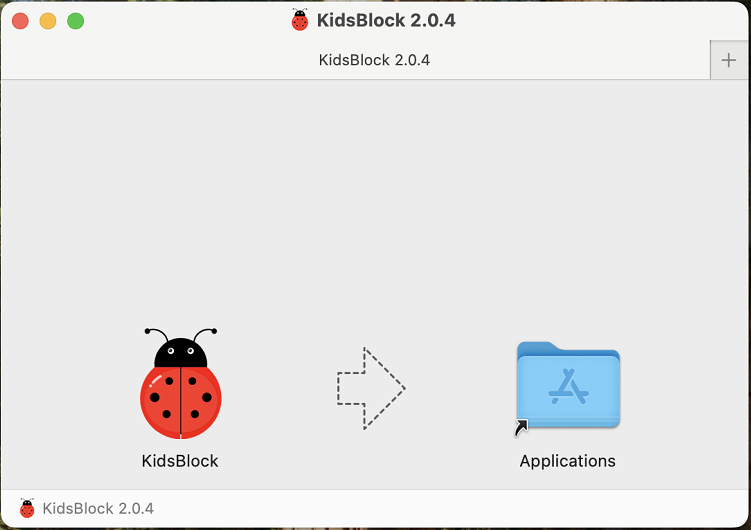

3\. Drag “**KidsBlock**” into **Applications** file.

4\. There will be a “**Safety Prompt**” during copying.

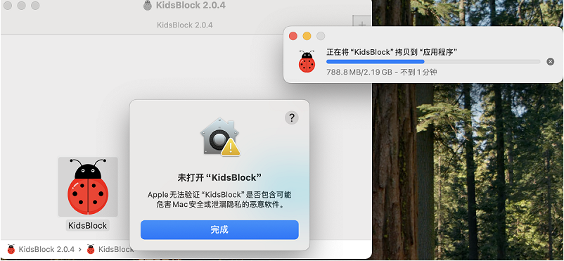

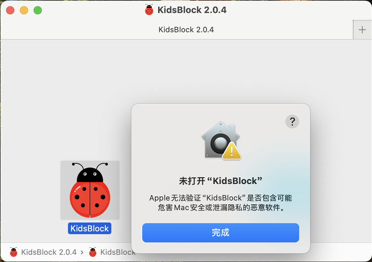

5\.  Click “**Settings**” –> “**Privacy and Security**” to “**open anyway**”. And then “ **Open “KidsBlock”**”.

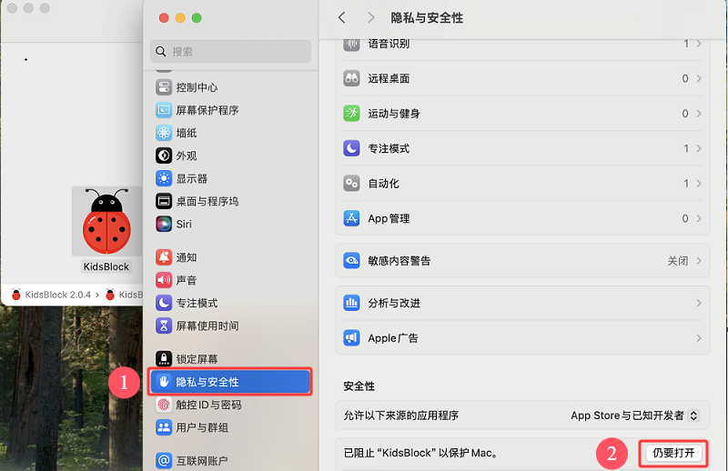

6\. A “**Privacy and Security**” box pops up, and then enter “**user name**” and “**password**”, and “**OK**”.

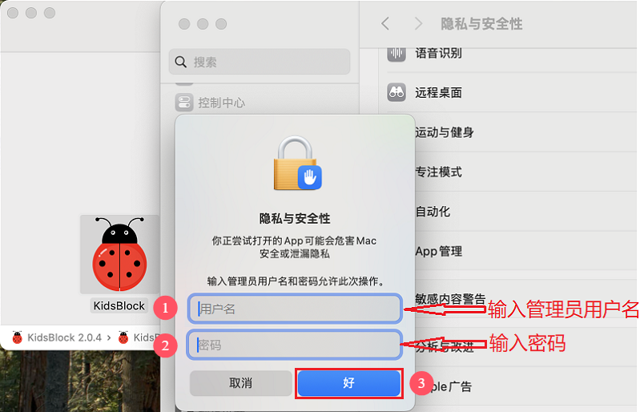

7.After a while, you can open the Kidsblock IDE page.

# 2.3 Use KidsBlock

⚠️ **ATTENTION**: The following is an example for Windows. For MacOS , it can serve as a reference.

## 2.3.1 Connect to Device

1\. Make sure the ESP32 main control board is successfully connected to the computer, and then click “**KidsBlock**” icon  to open it.

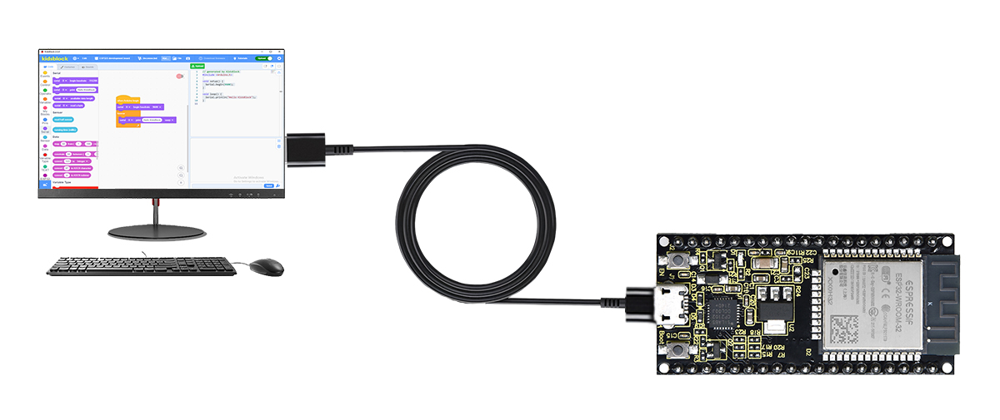

2\. Click :

3\. Since we use ESP32, select “**ESP32S development board**” (search `esp32` and you can see it):

4\. Here the port is (COM7), and click “**Connect**”:

5\. “**Go to Editor**”:

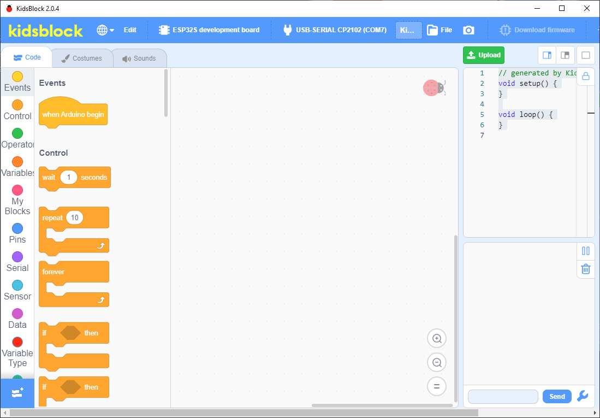

## 2.3.2 Main Page

KidsBlock software interface is shown in the following figure:

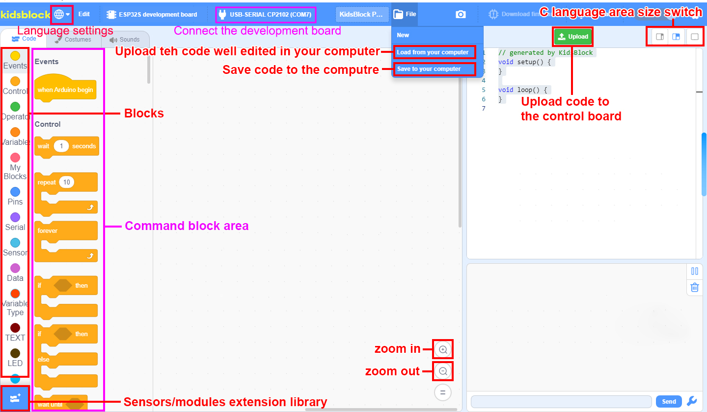

## 2.3.3 Load KidsBlock Library

⚠️ **ATTENTION** : If you drag and build code blocks yourself, you must manually add library files. Without library files, you will not see the corresponding blocks for the function. If you directly import the code file we provide, there is no need to add the library file as it will be automatically added when importing.

We need to add the library `Sengo1`.

Click  to add extensions.

Search `Sengo1` to load it.

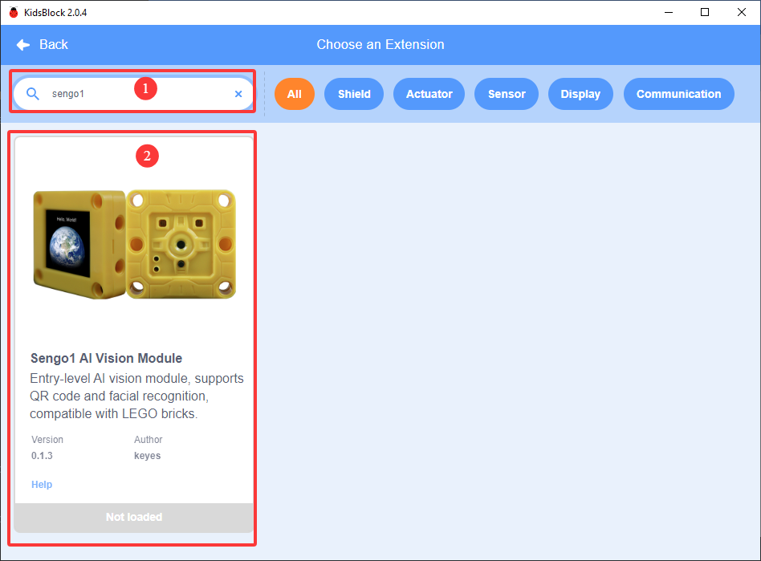

Loaded:

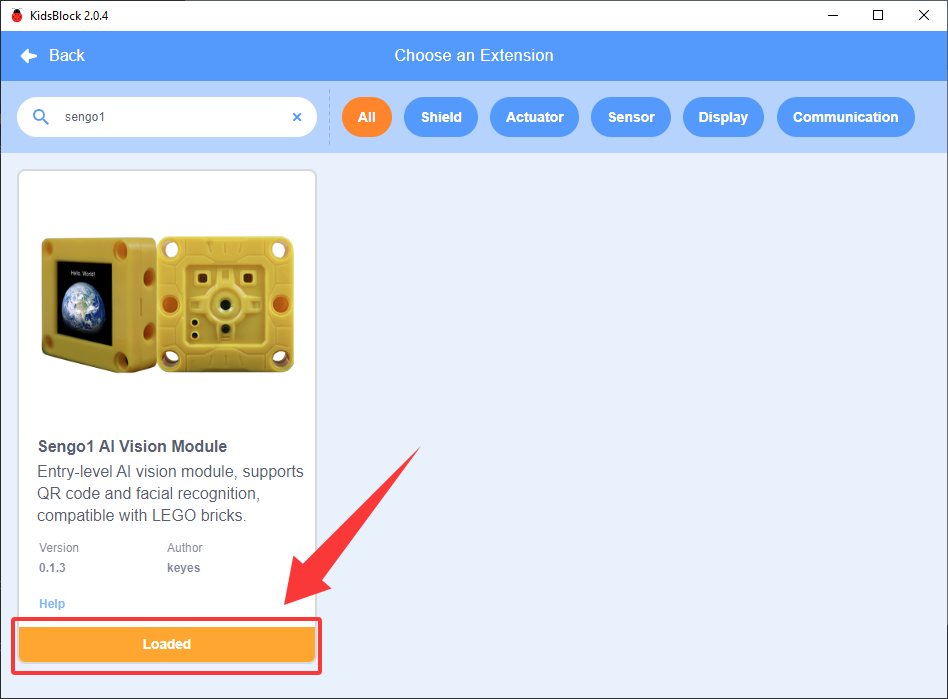

Click  to go to the editor and you can see the functions of “Sengo1”.

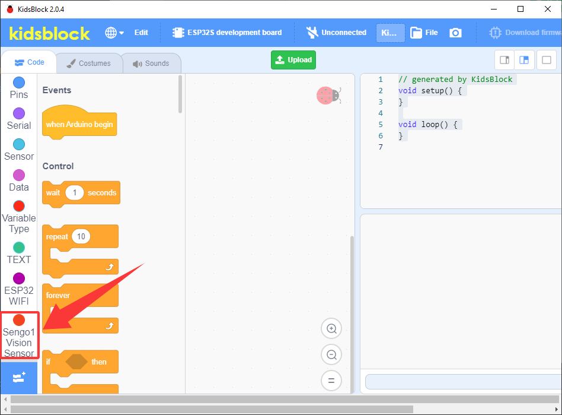

## 2.3.4 Build Blocks / Save and Upload Codes

Make sure the ESP32 main control board is connected to the computer, and then click “**KidsBlock**” to open it.

Drag the code block directly to the code editing area. Now let’s build a program that uses serial printing, as shown in the following figure:

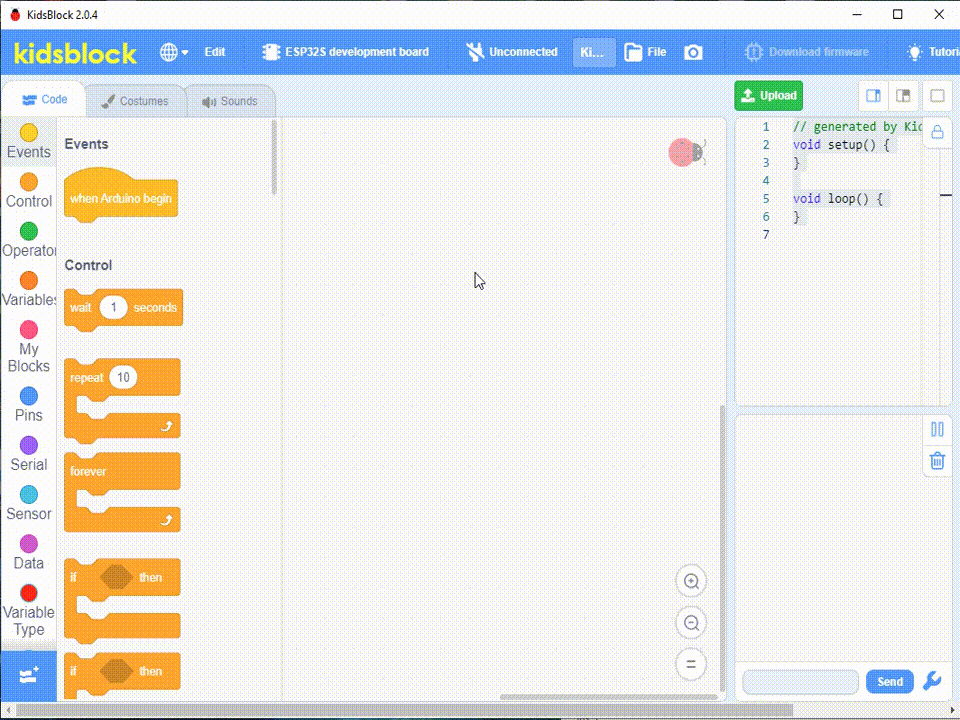

If you want to Save the code to your computer, click `File` –> `Save to your computer`.

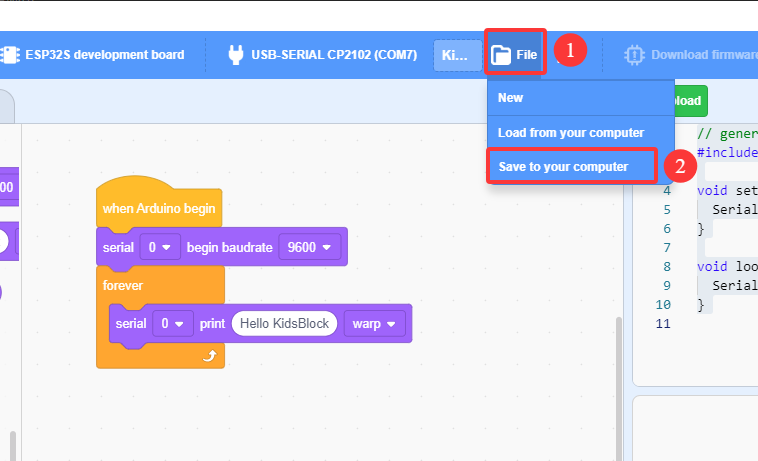

Select a location (preferably one that you can easily find), name it and then `Save`.

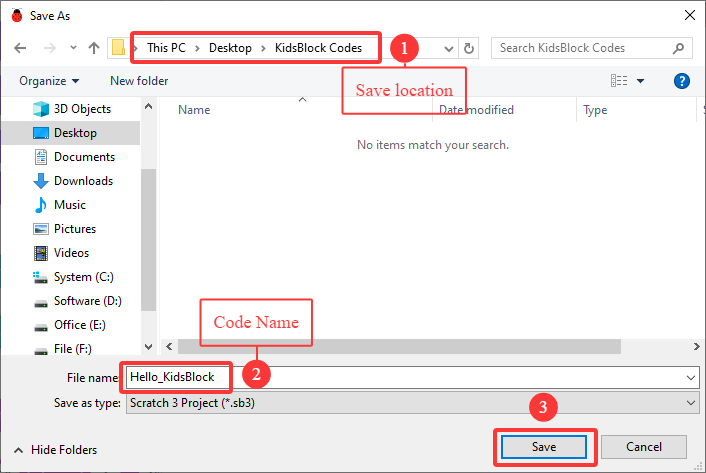

Make sure the development board is connected before uploading the code , Click  to upload the code to the ESP32 board.

After uploading, the serial port will return characters “Hello KidsBlock”.

## 2.3.5 Load Codes from Computer

Load code from computer. 

Here we load “Hello_KidsBlock.sb3” in section `2.3.4 Build Blocks / Save and Upload Codes`. 

Click `File` to `Load from your computer`.

Choose “Hello_KidsBlock.sb3” file path and open it.

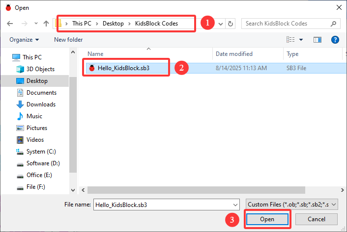

After opening the code file, you need to manually connect the serial port:

“**Go to Editor**”:

Click  to upload the code to ESP32 board:

After uploading, the serial port will return the characters “Hello KidsBlock”.

