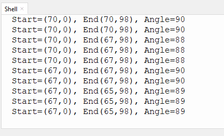

# 4.4 Line Detection

## 4.4.1 Algorithm


It will determine whether there are line segments in the image. If there are, it will return the coordinates of the two endpoints of the line segment and the inclination angle. If it is a curve, it will return the inclination angle of the straight line formed by the connection of the starting and the ending point of the curve.

-----------

## 4.4.2 Returned Values

When the controller acquires the recognition result, the algorithm will return the followings:

|  Parameter   |                          Definition                          |
| :----------: | :----------------------------------------------------------: |
|   kXValue    | x-coordinate of the end point (distal end) of the line segment |
|   kYValue    | y-coordinate of the end point (distal end) of the line segment |
| kWidthValue  | x-coordinate of the starting point (proximal end) of the line segment |
| kHeightValue | y-coordinate of the starting point (proximal end) of the line segment |
|    kLabel    |            inclination angle of the line segment             |

<span style="color:red;font-size:20px;">Note: The inclination angle increases counterclockwise. When it is horizontally tilted to the right, the angle is 0°; when it is vertically tilted upwards, it is 90°; and when it is horizontally tilted to the left, it is 180°. The algorithm does not detect the angle downward.</span>

Code:

```python
     # Obtain the line angle
     angle = sengo1.GetValue(sengo1_vision_e.kVisionLine,sentry_obj_info_e.kLabel)
     # Obtain the starting point of the line x1
     x1 = sengo1.GetValue(sengo1_vision_e.kVisionLine,sentry_obj_info_e.kXValue)
     # Obtain the starting point of the line y1
     y1 = sengo1.GetValue(sengo1_vision_e.kVisionLine,sentry_obj_info_e.kYValue)
     # Obtain the ending point of the line x2
     x2 = sengo1.GetValue(sengo1_vision_e.kVisionLine,sentry_obj_info_e.kWidthValue)
     # Obtain the ending point of the line y2
     y2 = sengo1.GetValue(sengo1_vision_e.kVisionLine,sentry_obj_info_e.kHeightValue)
     # Print line data
     print("Start=(%d,%d), End(%d,%d), Angle=%d"%(x1,y1,x2,y2,angle))
```

---------------

## 4.4.3 Tips of Line Detection Algorithm

1. Do not use glossy maps to avoid reflect light which may lead to detection failure.
2. The line boundaries should be clear and with obvious color differences from background, such as a white background with black lines;
3. The background should be as simple as possible, for example, containing a single color. If it is messy, lines of the background may be detected.
4. The thickness of the lines should be moderate. Both being too thin and too wide will affect the detection.
5. When traversing, the first line segment is always the one first detected at the bottom of the screen.

--------------

## 4.4.4 Test Code

```python
from machine import I2C,UART,Pin
from  Sengo1  import *
import time

# Wait for Sengo1 to initialize the operating system. This waiting time cannot be removed to prevent the situation where the controller has already developed and sent instructions before Sengo1 has been fully initialized
time.sleep(3)

# Select UART or I2C communication mode. Sengo1 is I2C mode by default. You can change it by just pressing the mode button.
# 4 UART communication modes: UART9600(Standard Protocol Instruction); UART57600(Standard Protocol Instruction), UART115200(Standard Protocol Instruction); Simple9600(Simple Protocol Instruction)
# port = UART(2,rx=Pin(16),tx=Pin(17),baudrate=9600)
port = I2C(0,scl=Pin(21),sda=Pin(20),freq=400000)

# Sengo1 communication address: 0x60. If multiple devices are connected to the I2C bus, please avoid address conflicts.
sengo1 = Sengo1(0x60)

err = sengo1.begin(port)
if err != SENTRY_OK:
    print(f"Initialization failed，error code:{err}")
else:
    print("Initialization succeeded")

# During normal use, the main controller sends commands to control the on and off of Sengo1 algorithm, rather than manual operation by joystick.
err = sengo1.VisionBegin(sengo1_vision_e.kVisionLine)
if err != SENTRY_OK:
    print(f"Starting algo Line failed，error code:{err}")
else:
    print("Starting algo Line succeeded")

while True:
  obj_num = sengo1.GetValue(sengo1_vision_e.kVisionLine, sentry_obj_info_e.kStatus)
  # Sengo1 does not actively return the detection and recognition results; it requires the main control board to send instructions for reading.
  # The reading process: 1.read the number of recognition results. 2.After receiving the instruction, Sengo1 will refresh the result data. 3.If the number of results is not zero, the board will then send instructions to read the relevant information. (Please be sure to build the program according to this process.)
  # Sengo1 can output at most one recognition result.
  if obj_num:
     # Obtain the line angle
     angle = sengo1.GetValue(sengo1_vision_e.kVisionLine,sentry_obj_info_e.kLabel)
     # Obtain the starting point of the line x1
     x1 = sengo1.GetValue(sengo1_vision_e.kVisionLine,sentry_obj_info_e.kXValue)
     # Obtain the starting point of the line y1
     y1 = sengo1.GetValue(sengo1_vision_e.kVisionLine,sentry_obj_info_e.kYValue)
     # Obtain the ending point of the line x2
     x2 = sengo1.GetValue(sengo1_vision_e.kVisionLine,sentry_obj_info_e.kWidthValue)
     # Obtain the ending point of the line y2
     y2 = sengo1.GetValue(sengo1_vision_e.kVisionLine,sentry_obj_info_e.kHeightValue)
     # Print line data
     print("Start=(%d,%d), End(%d,%d), Angle=%d"%(x1,y1,x2,y2,angle))
```

--------------------

## 4.4.5 Test Result

After uploading the code, the module will detect the area captured by the camera. If there is a line, it will be recognized and its starting and ending coordinates and its angle will be printed in the serial monitor (the angle is 90 degrees for vertical lines and 180 degrees for horizontal lines).




